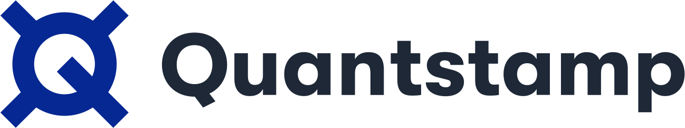

# Rollup Security Framework

*This research was carried out by the researchers at Quantstamp funded by Quantstamp and the Ethereum Foundation Grant ID FY23-0898 (Rollup Security Framework)*

#### Version
0.1.0. July 21, 2023.

#### Authors
- Adrian Koegl, Audit Engineer @ Quantstamp, [adrian@quantstamp.com](mailto:adrian@quantstamp.com?subject=Rollup%20Security%20Framework)
- Zeeshan Meghji, Audit Engineer @ Quantstamp, [zeeshan@quantstamp.com](mailto:zeeshan@quantstamp.com?subject=Rollup%20Security%20Framework)
- Donato Pellegrino, Blockchain Generalist @ Quantstamp, [donato@quantstamp.com](mailto:donato@quantstamp.com?subject=Rollup%20Security%20Framework)
- Jan Gorzny, Ph.D., Head of L2 Scaling @ Quantstamp, [jan@quantstamp.com](mailto:jan@quantstamp.com?subject=Rollup%20Security%20Framework)
- Martin Derka, Ph.D., Head of New Initiatives @ Quantstamp, [martin@quantstamp.com](mailto:martin@quantstamp.com?subject=Rollup%20Security%20Framework)

#### Table of Contents
- [Introduction](#introduction)
    - [How to use this Framework](#how-to-use-this-framework)
    - [Topics Covered](#topics-covered)
- [Rollups](#rollups)
    - [Escape Hatches](#escape-hatches)
    - [Built-In Bridges](#built-in-bridges)
- [Attacks and Risks](#attacks-and-risks)
    - [Censorship Attack](#censorship-attack)
    - [Delay Attack](#delay-attack)
    - [Denial of Service Attack](#denial-of-service-attack)
    - [Forged Transaction Attack](#forged-transaction-attack)
    - [Reorganization Attack](#reorganization-attack)
    - [Soft Finality Attack](#soft-finality-attack)
    - [Sybil Attack](#sybil-attack)
    - [Client Vulnerability Risk](#client-vulnerability-risk)
    - [Compatibility Risk](#compatibility-risk)
    - [Operational Risk](#operational-risk)
    - [Third-Party Risk](#third-party-risk)
    - [Unauthorized Access of Privileged Functionality Risk](#unauthorized-access-of-privileged-functionality-risk)
- [Scores](#scores)
    - [Centralization](#centralization)
    - [Escape Hatch Feasibility](#escape-hatch-feasibility)
    - [Incentive Compatibility](#incentive-compatibility)
- [Maturity, Transparency, and Security Posture Concerns](#maturity-transparency-and-security-posture-concerns)
    - [Outcomes](#outcomes)
- [Network Configuration Concerns](#network-configuration-concerns)
    - [Outcomes](#outcomes-1)
- [Interoperability and Compatibility Concerns](#interoperability-and-compatibility-concerns)
    - [Outcomes](#outcomes-2)
- [Canonical Bridge Concerns](#canonical-bridge-concerns)
    - [Outcomes](#outcomes-3)
- [State Proposer Concerns](#state-proposer-concerns)
    - [State Proposer Questions](#state-proposer-questions)
    - [ZK Rollups: Outcomes](#zk-rollups-outcomes)
        - [Outcomes: Single Entity State Proposer](#outcomes-single-entity-state-proposer)
        - [Outcomes: Permissioned State Proposer](#outcomes-permissioned-state-proposer)
        - [Outcomes: Permissionless State Proposers](#outcomes-permissionless-state-proposers)
    - [Validator Questions](#validator-questions)
    - [Optimistic Rollups: Outcomes](#optimistic-rollups-outcomes)
        - [Outcomes: No Fraud Proofs](#outcomes-no-fraud-proofs)
        - [Outcomes: Permissioned State Proposer](#outcomes-permissioned-state-proposer-1)
        - [Outcomes: Permissionless State Proposers](#outcomes-permissionless-state-proposers-1)
- [Sequencer Concerns](#sequencer-concerns)
    - [Outcomes](#outcomes-4)
        - [Outcomes: Single Entity Sequencer](#outcomes-single-entity-sequencer)
        - [Outcomes: Permissioned Sequencers](#outcomes-permissioned-sequencers)
        - [Outcomes: Permissionless Sequencers](#outcomes-permissionless-sequencers)
- [Smart Contract Concerns](#smart-contract-concerns)
    - [Outcomes](#outcomes-5)
- [Data Availability Concerns](#data-availability-concerns)
    - [Outcomes](#outcomes-6)
- [Client Diversity Concerns](#client-diversity-concerns)
    - [Outcomes](#outcomes-7)
- [Other Concerns](#other-concerns)
    - [Superchains](#superchains)
- [Improvements & Suggestions](#improvements-&-suggestions)
    - [Escape Hatch Improvements](#escape-hatch-improvements)
        - [Always-On Escape Hatches](#always-on-escape-hatches)
        - [Increase Escape Hatch Scalability](#increase-escape-hatch-scalability)
        - [Increase Escape Hatch Accessibility](#increase-escape-hatch-accessibility)
        - [Improve Resistance to Ordering and Frontrunning Attacks](#improve-resistance-to-ordering-and-frontrunning-attacks)
        - [Improve Compatibility of Escape Hatches With Protocols](#improve-compatibility-of-escape-hatches-with-protocols)
        - [Faster Inclusion Commitment & MEV Mitigation](#faster-inclusion-commitment-&-mev-mitigation)
        - [Dispute Resolution is Expensive](#dispute-resolution-is-expensive)
        - [Force Withdrawal Escape Hatches](#force-withdrawal-escape-hatches)
    - [Clear Documentation of Access Control Scope](#clear-documentation-of-access-control-scope)
    - [Operator Onboarding Process](#operator-onboarding-process)
    - [Parallel or “All-vs-All” Challenges](#parallel-or-all-vs-all-challenges)
    - [A More Transparent Narrative](#a-more-transparent-narrative)
- [Future Work](#future-work)

## Introduction
As Ethereum moves towards a multi-chain future consisting of various layer two protocols like rollups, securing these systems will be paramount to keeping users on them. Given the recent issues related to bridges (i.e., [over $2 billion USD lost](https://arxiv.org/abs/2210.16209)), and the necessity of these networks to be coupled to bridging functionality, it is only a matter of time before issues arise in these systems. The best approach to this problem is to start thinking about it now and to aim for preventative measures.

This framework explores security issues that are closely related to rollups. The framework explores unique features of these systems, like fraud proof validation, escape hatches, and approaches to data availability. These features have also often been left to the end of the development cycle for prominent projects, as [previous work on escape hatches](https://dl.acm.org/doi/abs/10.1145/3565383.3566107) has revealed. As rollups and these features mature, the time to review and understand these features -- both at a high level and at the code level -- is now. This framework aims to provide questions that can be used to evaluate these features and the security of rollups at large.

This framework aims to establish a foundation for basic best practices and transparency for rollups in order to assist new developers of these systems and enable the community to assess the security risks of a particular rollup before they use one. This framework is similar to those that are available for [smart contract development](https://consensys.github.io/smart-contract-best-practices/) and high-level overviews of rollup security like [L2Beat](https://l2beat.com/scaling/summary), but aims to be more fine-grained. The framework will discuss concerns and details of rollup development, operational risks for end-users and developers, and establish a consistent language for features and concerns of these systems.

In the ideal case, both technical and non-technical users are able to use this framework to evaluate whether a rollup is operating securely, honestly, and can be trusted with funds, with various levels of detail. The framework is intended to outline what information the rollup operators should expose to the community in order to justify that their operation implements features that users may take for granted.

## How to use this Framework
The goal of this framework is to provide a risk assessment of different attack vectors and evaluate rollup properties. For any rollup, this framework evaluates its components and returns the possible consequences for different design decisions and properties.  

The evaluation consists of several questions that interested parties can ask. Each question is accompanied by context and has several potential answers. Each answer implies a consequence and, wherever possible, includes examples of rollups to which this answer applies. Examples are accurate at the time of writing but may become inaccurate as these systems are constantly changing. 

The set of questions asked for each component is dependent on each other. In this document, the set of questions are arranged based on different properties per component. For each rollup component, there is a flow chart to visualize the set of questions asked and how they depend on each other. For state proposers, there is a set of questions that can be asked for ZK rollups and optimistic rollups, but have identified an additional set of questions only for state proposers on optimistic rollups due to the added risks of these systems. 

An example question is provided below. Each question has a short label in bold so that it can be referenced. Generally speaking, answers at lower levels (earlier in the response table) are less risky than answers at higher levels (later in the response table).

*Example question.*

Which assessment table to use is visualized in the respective flow chart at the beginning of each section. After all the necessary questions have been answered, an outcome table can be constructed, based on some rollup properties. Each outcome table specifies the risk for each attack vector and the score for each property based on answers to selected questions.

## Topics covered
This document will first review known rollup attack vectors and security concerns of rollups. Then, it will explore each rollup component and present the complete set of questions as well as the outcome tables as described in the previous [subsection](#how-to-use-this-framework). This framework aims to be able to assess rollup concerns related to:
* maturity, transparency, and the security posture of the development team;
* centralization of components within a rollup;
* rollup configuration;
* interoperability and compatibility with related chains and smart contracts;
* the rollup’s canonical bridge;
* the rollup’s validator and state proposal mechanisms;
* the rollup’s sequencer(s);
* the rollup’s smart contracts on the underlying network; and
* other topics related to a rollup (e.g., data availability, client diversity, and topics in the roadmaps of various rollups).

Each of these topics are defined more precisely in their respective section. Within each section, questions are proposed that users may want to ask in order to evaluate the concerns raised by a particular rollup for a particular topic. Note that some questions may also relate to concerns in another topic. Wherever possible, examples of real-world rollup code and documentation serve to illustrate a concern or a method to mitigate the concern.

At the end of each section, a description of how the answers to the questions presented may impact a rollup’s risk to particular attack vectors is presented as an outcome table. These attack vectors are defined in detail in the Attack Vector section.  

The outcome tables will use the following levels for each attack vector risk and scoring outcome. 

| Attack Vector Risk | Scoring Outcome |
| --- | --- |
| 🟦🟩 None | 🔵🟢 Excellent |
| 🟩🟩 Low | 🟢🟢 Very Good |
| 🟩🟨 Low - Medium | 🟢🟡 Good |
| 🟨🟨 Medium | 🟡🟡 Fair |
| 🟨🟧 Medium - High | 🟡🟠 Mediocre |
| 🟧🟧 High | 🟠🟠 Poor |
| 🟧🟥 Very High | 🟠🔴 Very Poor  |
| | 🔴🔴 *Special Rating* |

Note that not every attack vector or score will be present in an outcome table, only those which may be impacted by the questions in the section used to construct the table. Furthermore, even if an attack vector risk or score is present in a table, a row for every risk or score level above may not be present. The *Special Rating* scoring outcome is reserved for scoring which may not be possible because a feature is missing; it should be considered the worst outcome for a particular score. For a given set of values, the topmost row which is satisfied by the values should be considered the final result.

## Rollups
A rollup (also known as [commit-chains](https://eprint.iacr.org/2018/642) or [validating bridges](https://eprint.iacr.org/2021/1589)) is a scaling solution that is derived from an underlying blockchain like Ethereum. Such solutions are called “layer 2” or “L2” solutions as they build entirely on top of Ethereum, which is called a “layer 1” or “L1” blockchain. Rollups aim to allow transacting parties to utilize a high-throughput blockchain ecosystem and fall back to the underlying layer 1 if there is a need to dispute behavior on layer 2 (e.g., with respect to their balances) or interact with decentralized applications on layer 1.

A rollup can be broken down into several components: a sequencer, a state proposer, and an (explicit or implicit) verifier. A *sequencer* is responsible for ordering layer 2 transactions and committing, via a transaction to layer 1, to a batch of transactions to be executed. This batch is made up of layer 2 transactions. A *state proposer* executes the transactions in a batch (in the order provided by the sequencer’s commitment) and computes new state roots which are written to layer 1. Verifiers in a rollup ensure that state roots are (eventually) correct. Rollups come in two major types, which may change the responsibilities of these components: *optimistic* and *zero-knowledge*.

An *optimistic* rollup is one in which the state proposer is bonded and proposes new state roots. The state proposer is bonded in the sense that they stake some funds that are lost if they post an incorrect state root. A verifier in an optimistic rollup is an actor who submits *fraud proofs* to challenge an incorrect state root proposed by the state proposer. In an optimistic rollup, state roots are considered correct unless a bonded verifier successfully challenges the state root with a fraud proof within some period of time (e.g., seven days). Such a verifier may need to propose an alternative state root than the one provided by the state proposer. Often, verifiers are part of the state proposer, and the combined entities are called *validators*. A verifier who successfully challenges the state proposer wins the state proposer’s bond; ones that lose the challenge give up their own stake to the state proposer.

A *zero-knowledge* (ZK) rollup is one in which the state proposer generates cryptographic proofs that each new state root is correct. In a ZK rollup, the state proposer performs state transitions within a zero-knowledge proof framework (e.g., [Halo2](https://zcash.github.io/halo2/index.html)), which generates a *validity* proof: an artifact that proves that a particular function was executed with particular inputs, which resulted in the new state. These validity proofs can be verified using layer 1 smart contracts (as a result, the verifier actor is implicit in such rollups). A state proposer for a ZK rollup may have one or more *provers* as a sub-component, which generates the validity proofs given a batch of transactions and a previous state root.

Both optimistic and ZK rollups are operating or in development on the Ethereum blockchain. [Arbitrum](https://arbitrum.io/) is one example of an optimistic rollup, while [zkSync](https://zksync.io/) is an example of a ZK rollup. Note that the “zero-knowledge” aspect of ZK rollups is sometimes helpful for privacy, but mostly these systems are used because the proofs are also succinct. That is, the proofs can be verified in a fraction of the time required to run the computation in the first place, enabling efficient verification directly on a layer 1 blockchain.

### Escape hatches
This framework pays special attention to escape hatches. Escape hatches serve as fail-safe mechanisms, ensuring successful user interaction with the rollup and minimizing the dependence on the sequencer and state proposer. The framework expands [previous work](https://dl.acm.org/doi/abs/10.1145/3565383.3566107) by including detailed distinctions between sequencer and state proposer failures and formally models current escape hatch approaches.

This framework also considers  operational risks for end-users and developers. While these features may be well thought-out and implemented, they might not be feasible. Furthermore, interaction with the rollup through escape hatches may require different levels of technical expertise or sufficient assistance through available tools. For example, a forced withdrawal (defined below) from some ZK rollups requires the user to generate proof; therefore hardware requirements and user knowledge limit such an escape hatch’s feasibility.

This framework differentiates between two different types of escape hatches: *force inclusion* and *force withdrawal*. 

Force *inclusion* escape hatches serve to circumvent the sequencer. If the sequencer is offline or censors a transaction, the user can use such an escape hatch to include their transaction in a block. The risk of being offline and censorship decreases with the decentralization of sequencers, but it is a good practice to implement a force inclusion escape hatch to prevent collusion. To use such an escape hatch, users call a dedicated function in the rollup’s L1 smart contract, often related to an  “Outbox” structure. Using a force inclusion escape hatch inflicts additional gas costs on the user but guarantees (eventual) inclusion in the block. This framework captures nuances in this process. To do so, *force appension* is defined as the process of including a transaction in a queue on L1. This transaction is not in the committed sequence of L2 transactions yet; however, the sequencer can typically only process this queue in order and cannot discard transactions from this queue. Subsequently, *force inclusion* is the process of a user including a transaction from the queue into the sequence of L2 transactions. Some only allow force appension, while others also allow force inclusion. For example, Optimism allows users to force include transactions immediately, while Arbitrum only allows force inclusion at least 24 hours after the force appension was performed. 

*Force withdrawal* escape hatches guarantee the ability to exit funds from the L2 without relying on the state proposer. Such functionality is relevant in case state proposers are offline or censoring transactions in order to guarantee the successful withdrawal of assets from L2. In optimistic rollups, this also protects against malicious (colluding) state proposers refusing to include a transaction in their posted state update. However, if fraud proofs are enabled, and at least one honest party can challenge state updates, the risk of censorship is further reduced.

A subtype of force withdrawal escape hatches with the name *idle proposer escape hatch* is defined as follows. These escape hatches allow anyone to become a state proposer after the state has stopped progressing for a defined period of time, essentially making state proposers permissionless. However, idle proposer escape hatches are only effective against state proposers that are offline - they might not be effective against malicious (colluding) state proposer(s). A nuanced consideration here is whether the protocol is ready to be permissionless when the idle proposer escape hatch is activated. While activation of this escape hatch may cause issues in the protocol, such as increasing the attack surface for delay attacks, this is not considered in the framework at this time — at least it allows users to exit funds eventually.

These escape hatches are meant to be emergency functionalities. The usage of them should, in the best case, never occur and simply be a guarantee for users that they will be able to interact with the L2 and assets will not be locked on the L2. Nevertheless, if such an emergency state ever occurs, it is important that these escape hatches are accessible to users. This implies that there are available services or documentations to assist the user in interacting with the respective escape hatch functions. Furthermore, if any software is required to use the escape hatch, such as generating a proof for force withdrawal, this software must be accessible and well-documented.

An important consideration frequently observed in practice is that these escape hatches can be deactivated. In this framework, escape hatches are considered effective tools for protecting against sequencers and state proposers being offline. Yet if those entities are controlled by the development team which turn malicious, deactivated escape hatches do not serve as effective protection for the user anymore.

To evaluate the impact of escape hatches on a particular rollup, there are interdependent questions in the sequencer and state proposer questionnaire. The outcome is a risk evaluation of different attack vectors dependent on the existence of an escape hatch, the possibility to deactivate it, its feasibility, and any delay incurred when using the escape hatch.

### Built-In Bridges
Rollups have built-in [bridges](https://arxiv.org/abs/2210.16209) in order to transfer digital assets from their underlying L1 to the L2 that they implement. Sometimes these are called the *standard* or *canonical* bridge for the rollup. A bridge is a system or protocol for taking assets or blockchain state from one blockchain (or network) to another. Cryptographic assets cannot be literally moved from one blockchain to another; instead, a bridge creates representations of assets of a *source* blockchain on a *destination* blockchain. Bridges have a smart contract on the source blockchain called the custodian, which locks up the asset to be minted on the destination chain, to avoid minting arbitrary assets. Through an off-chain communicator component, when assets are placed in the custody of the bridge, the corresponding debt issuer on the destination blockchain mints a representation of the asset in custody. The process can be reversed. Advanced bridges can relay instructions to execute arbitrary functions on either blockchain. Bridges are illustrated in Figure 1. 

For simplicity and concreteness, this framework will assume that the source blockchain and layer 1 is Ethereum. 

**Figure 1.** Components of a bridge, in this case from Ethereum to the fictitious “Another Chain” blockchain. The custodian (a smart contract on Ethereum) holds funds, the communicator relays signals between blockchains, and the debt issuer (a smart contract on Another Chain) creates representations of assets held by the custodian. The custodian signals the communicator when an asset is deposited in order to be issued on the destination blockchain, and the communicator relays this by calling a function on the debt issuer contract (or vice-versa, to move assets the other way). In the case of a rollup, “Another Chain” is the rollup chain.

## Attacks and Risks
A key component of this rollup security framework involves the risk rating for several kinds of attack vectors and scoring for important rollup metrics. Such a rating is provided in each section of the framework highlighting the relevant attack vectors and its contextual consequences. These ratings are based on the answers to various questions asked by the framework. In this section, each attack vector and their potential consequences are described. It is worth noting that some of these attack vectors do overlap, such as denial of service, censorship attacks, and delay attacks.

### Censorship Attack
Ideally, L2s would be censorship resistant, just like Ethereum. However, censorship can occur on multiple levels and from several different components in a rollup. Two of these components are the sequencer and the proposer.

Misbehaving sequencers can choose to censor transactions submitted by users. If there is only one sequencer (or a small number of them), then this censorship can be very effective. A vulnerable decentralized sequencer protocol may also allow for censorship. This is partially why many rollups implement force inclusion escape hatches. However, the escape hatches themselves have [varying degrees of effectiveness](https://quantstamp.com/blog/rollup-escape-hatches) and may not completely mitigate censorship by the sequencer.

Some optimistic rollups have not yet fully implemented fraud proofs. Such rollups allow submitting undisputed fraudulent transaction batches to L1. These state proposers may exclude transactions from the state they propose back to L1 in order to censor users. Since there is no way to successfully dispute the fraudulent state, it will likely get finalized on L1.  However, even if fraud proofs are implemented, there is a risk of fraudulent states going unchallenged. This can be achieved by colluding state proposers or simply a lack of incentive to challenge invalid states. To reduce the trust required in state proposers and prevent censorship, some rollups implement a force withdrawal escape hatch.

### Delay Attack
A delay attack involves the delay of state confirmation on L1. This risk assessment considers intentional delays and delays incurred due to a lack of incentive. Multiple misbehaving components of rollups could cause a delay in state confirmation. The simplest version of this attack would be for a misbehaving centralized validator to simply not propose a rollup block to L1. Sequencers could also perform delay attacks by censoring or excluding transactions from the L2 blocks, forcing users to [potentially force the transaction on L1 with a delay](https://developer.arbitrum.io/sequencer#unhappyuncommon-case-sequencer-isnt-doing-its-job).

The risk, feasibility, and impact of delay attacks is higher in optimistic rollups compared to ZK rollups, due to the expanded capabilities of state proposers. In ZK rollups, state proposers can only impede state progression by refraining from submitting states for a designated delay period. They are incapable of delaying individual transactions, as the absence of a specific transaction would cause their validity proof to fail. State proposers on optimistic rollups can instigate transaction delays in two additional ways: they can omit transactions in their state update until this invalid state is contested, or they can delay resolving disputes to instigate fraud proof delays. These two delays form another attack vector which state proposers in optimistic rollups can perform, in addition to the attack vector possible on ZK rollups.

Permissionless validators may introduce additional risk for delays. For example, [malicious validators may sacrifice their stake deliberately by losing challenges](https://research.arbitrum.io/t/solutions-to-delay-attacks-on-rollups/692#evaluation-6) in order to delay the proposal and confirmation of correct L2 batches. The possibility of this attack is what currently prevents Arbitrum from making validators permissionless.

### Denial of Service Attack
A Denial of Service (DoS) attack involves attackers trying to prevent any action from being taken on the protocol. DoS attacks are particularly concerning as many rollups are still highly centralized and provide a single point of failure. If a single centralized sequencer, proposer, validator, or prover no longer functions, the rollup itself could cease to function entirely. 

DoS concerns could be caused in many ways on rollups. The following are some examples of such concerns. 
* Most rollups have some type of pause feature on their primary contracts; a malicious activation of the paused state could prevent the rollup from being used (see also the section on [Unauthorized Access of Privileged Functionality](#unauthorized-access-of-privileged-functionality-risk)).
* For ZK rollups, flooding the network with operations that are expensive or difficult to prove may degrade the quality of service. 
* For Optimistic rollups, preventing a validator from submitting a fraud proof, by spamming L1 transactions with high gas fees such that the fraud proof is never included in a block, will also adversely affect the service of the rollup.
* For rollups with decentralized sequencers, some possible consensus protocols have scalability limits, after which the network will either be unusable or [face unexpected consequences](https://ethresear.ch/t/challenging-periods-reimagined-the-key-role-of-sequencer-decentralization/15110). 

### Forged Transaction Attack
A forged transaction attack involves a validator including a fake transaction into the rollup batch. A fake transaction is a transaction that lacks a valid signature or represents an L1 event, such as a deposit, that did not take place. In many rollups, such an attack should not be possible. However, optimistic rollups which do not have a fraud system active or implement a poor incentive system to challenge illegitimate state updates could be susceptible to such an attack. Currently, such rollups place a high degree of trust in the proposer, which is controlled by a known entity. If such a proposer were compromised or malicious, however, the effects would be devastating and may lead to the loss of user funds. For example, the compromised proposer could submit a transaction which causes the withdrawal of funds to some malicious address on L1 and L2.

### Reorganization attack
Sequencers and validators must be able to account for a [*reorganization*](https://ethereum.org/en/developers/docs/consensus-mechanisms/pos/attack-and-defense/) (or reorg) on L1. Otherwise, problems may occur if the sequencer submits an incorrect batch or if an assumption is made about a block. An L1 reorg may change the state of the L2, as the state roots are posted on the underlying L1. Ideally, users will not have to resubmit transactions to the sequencer when the reorg on L1 occurs.

A reorg may also result in the partial rollback of a challenge completion as well. In this case, the validator must be aware of the reorg to ensure that the challenge is completed and an insecure L2 state is not finalized on L1. 

In either case, the reorg may be malicious if it is triggered by a malicious actor (e.g., if they can control the consensus mechanism of the underlying L1) or if a malicious actor can quickly respond to the short term reorgs common on most L1s because of a poor rollup design.

### Soft Finality Attack
Soft finality can be invalidated by centralized sequencers in a rollup. Sequencers provide soft finality in rollups by returning receipts to users which indicate the transaction order. However, a sequencer may order the transaction batch differently than what was indicated in the receipt. The sequencer may also exclude the transaction despite returning a receipt. The submitter of the transaction may suffer losses due to any assumptions made about the ordering of the transaction based on the fake receipt.

### Sybil Attack
Currently, almost all rollups do not currently have permissionless sequencers and validators. To make these elements permissionless, some form of consensus algorithm must be introduced. Attackers may perform a Sybil attack to control sufficient nodes: an actor may masquerade as several entities in order to take advantage of the consensus mechanism. 

It is essential that the barrier is low for participating as a sequencer or validator in order to sufficiently decentralize the rollup. Otherwise, the few that are capable of participating may collude or create multiple identities to execute a Sybil attack.

### Client Vulnerability Risk
Rollup nodes run their own client, which is distinct from Ethereum clients. [Bugs in the implementation of this client](https://github.com/ethereum-optimism/optimism/blob/develop/technical-documents/postmortems/2022-02-02-inflation-vuln.md) can lead to a loss of funds in the worst case and disruption of the rollup functionality in other cases. The robustness of Ethereum has partially depended on client diversity. Even if one client software has a bug, the nodes running another client may compensate for this. 

Client diversity should extend to L2s for both sequencers and validators. Each client should also be thoroughly tested and audited to ensure that no such bugs are present.

### Compatibility Risk
Ethereum Virtual Machine (EVM) equivalence is one of the most desired properties of an Ethereum rollup. EVM  equivalence allows smart contracts on L1 to be used with no additional complications on L2. At the time of writing, there are no rollups which are fully EVM equivalent. Some rollups do not support all the opcodes, and others implement opcodes differently than Ethereum. Also, several rollups do not support the precompiled contracts on Ethereum.These differences can lead to unexpected behavior when the same contracts from L1 are deployed on L2. This could lead to users’ assets becoming locked or perhaps even stolen in extreme cases. 

Compatibility risk can also extend to differences between the testnet and the mainnet of the rollup. Developers may test their applications successfully on the testnet, mistakenly assuming that they will also work perfectly on the mainnet. However, differences between the testnet and the mainnet limit the effectiveness of testing on the testnet. When it comes to rollups, there are some special differences between the testnet and the mainnet to consider. For example, optimistic rollups have a much higher dispute time on their mainnet compared to their testnet.

### Operational Risk
A rollup’s operation is affected by the developer’s engineering process and the considerations that relate to running the core services of the system, especially in a (partially) centralized rollup. This includes how it was initially developed (to reduce the likelihood of errors), how upgrades are performed, the transparency and honesty of the development team, and which processes exist to handle unforeseen outcomes.

### Third-Party Risk
If a rollup does not include critical features which are difficult to implement securely, developers are forced to either use a third-party solution or develop their own solution. For certain components, such as bridges, custom implementations by lesser-known entities could result in a much higher risk level. It is thus essential an extensible canonical bridging system, among other components, is developed as part of the rollup. Ideally, critical infrastructure components of the rollup, such as bridges, are provided by default, allowing developers to focus on securely implementing application-specific logic.

### Unauthorized Access of Privileged Functionality Risk
Every rollup currently has some form of centralization in the form of privileged accounts. These privileged accounts may singularly control critical functionality. The accounts may also collectively control critical functionality in the form of a multi-signature wallet or committee. Examples of this critical functionality include the pausing of a rollup and the upgrading of rollup contracts. The inappropriate pausing of the rollup may cause a complete denial of service. The malicious upgrading of contracts could result in funds being stolen from bridge contracts and malfunctioning of the rollup. Thus the consequences of abusing or compromising privileged accounts could be devastating for rollups. Similar consequences are possible if such functionality is insufficiently protected or [similar changes can be indirectly made](https://medium.com/@0xriptide/hackers-in-arbitrums-inbox-ca23272641a2).

## Scores
In this section, security-relevant properties of rollups are described which may not be subject to a particular attack. These properties may be concerning nonetheless, and they are defined so that the framework can assign scores to these properties.

### Centralization
A crucial aspect of rollup security is *centralization*. A core principle of Web3 is decentralization, which aims to eliminate dependency on a specific group of entities. It is essential to understand that centralization is not binary but a spectrum: some systems are entirely decentralized, others are completely centralized, and others contain only parts which are centralized. Research has revealed various risks and potential attack avenues throughout this spectrum. A system’s evolution towards decentralization is a process that demands maturity and vigilance, as it may expose new attack possibilities, such as denial of service or delay attacks, stemming from things like inadequate sybil resistance. 

One objective in this framework is to grasp and integrate the nuanced security implications arising from different degrees of centralization concerning the features deployed. However, it is essential to note that the pinnacle of security can only be achieved through complete decentralization that effectively safeguards against all sybil attacks and maligned entities.

This framework introduces a *centralization* score to reflect the degree of trust that the users require. The components that impact *centralization* score for, are the sequencer, state proposer, smart contract access control, upgradeability, and data availability. These scores are nuanced through the presence of an escape hatch, its feasibility, and if it can be deactivated. Furthermore, the centralization of smart contracts is determined by the sensitivity of functions that restricted roles can access. Regarding upgradeability, the score outcome depends on which entities can perform upgrades and how centralized they are. Upgradeability further impacts the centralization score through the presence of an emergency resolution path, which entities can use it, and the length of upgrade delays.

### Escape Hatch Feasibility
Escape hatches are important to circumvent the sequencer and state proposers. However, the existence of escape hatches may not be helpful if it is not feasible to use by the user, e.g., because the force withdrawal escape hatch requires hardware and setting up a complex prover. For some users, interacting with the smart contract may already pose a challenge.

For users to understand how feasible and quick they can use the escape hatch in an emergency, the framework introduces the *escape hatch feasibility score*. This score represents the requirements on the user for interacting with this escape hatch. For sequencers, the score evaluates force inclusion feasibility and for state proposers it assesses force withdrawal feasibility, as defined in the [Escape Hatches section](#escape-hatches). 

It should be noted that this score is more relevant on a permissioned system where trust is required. In a trustless system, a proposer incentive system will ensure that a party will eventually join the network to post transactions, progress state, or challenge states.

### Incentive Compatibility
Incentive compatibility is an important consideration when assessing the security aspects of decentralized systems, including rollups. The reliable progression and security risks of a rollup depend to a large part on its incentive compatibility. Therefore, an *incentive compatibility score* is introduced that reflects how likely protocol participants, such as sequencers and state proposers, will participate in and follow the protocol.

The importance of a protocol-level incentive increases with the system’s decentralization. If anyone can participate, the only mechanisms to ensure correct honest participant behavior are incentives and disincentives (assuming a correct  technical implementation). The protocol needs  to incentivize honest behavior, like a reward for winning a fraud proof challenge, and disincentivize malicious behavior, such as spamming fraud proofs. 

However, the degree of incentive compatibility required also depends on the possible actions an actor can take. In ZK rollups, state proposers can only delay all or no transactions, by either submitting a state update or not submitting a state update. Furthermore, one honest participant is sufficient to ensure correct state progression. As a result, a relatively small incentive should suffice to ensure eventual state progression in a permissionless system, as someone will eventually process the state update to get the reward. The higher the incentive, the more reliable is state progression. The incentive should be large enough that honest behavior is profitable; if a ZK proof costs more to generate than the incentive, then the incentive will not be effective.

In optimistic rollups, state proposers can take a lot more actions: they can construct states as desired and include or exclude any transactions, submit or not submit this state, challenge an invalid state, and submit invalid fraud proofs. Therefore, a proper incentive compatibility is much more important to increase the probability that rollup state progresses, valid states will be submitted, invalid states will be challenged, and no invalid fraud proofs are submitted.

The incentive compatibility score depends on the composition of decentralization, rollup type, and (dis)incentivized actions, so as to capture the nuances above.

## Maturity, Transparency, and Security Posture Concerns
In this section, security concerns related to a rollup’s maturity, as well as the transparency and security posture of the organization or team developing the rollup are considered. The maturity of the rollup relates to how processes are defined and utilized, in addition to determining how feature complete the rollup is. The transparency of the development team is important to assess both the quality and prevalence of procedures, as well as to be able to verify claims about the rollup using its implementation. The security posture indicates how well prepared the organization is to handle critical failures of the system and how the organization manages its secrets, like keys to multi-signature wallets.

All questions should be asked for every rollup.

The first questions asked are related to the maturity of a rollup. In order to assess the maturity of a rollup accurately, as well as to assess a number of other questions presented in this framework, insight into the development process is necessary, without the veil of any marketing claims. The following question is therefore very important.

**MTP1**  Is the source code available?
| Level | Consequences | Example |
| --- | --- | --- |
| 1 - Yes | The system can be thoroughly reviewed. | Optimism is fully [open-source](https://github.com/ethereum-optimism/optimism). |
| 2 - No | The system cannot be reviewed. | No example at this time. |

Many of the questions in this framework assume that source code is available in order to assess security.

In addition to the code necessary, complementary documentation should be present. Rollups are non-trivial software artifacts and terminology is not consistent among projects. It is critical that documentation exists to make the technologies (ideas, libraries, or languages) clear and understandable. If these systems are custom or include custom changes, these should be well documented so that new ideas are presented and changes can be reviewed to ensure that unintended side effects will not occur. This is captured by the next two questions.

**MTP2** Are technologies, libraries, languages, and approaches used in the rollup well documented? Are scientific improvements peer reviewed?
| Level | Consequences | Example |
| --- | --- | --- |
| 1 - Well documented ideas | Ideas and implementations are worthy of a high level of trust. Errors in designs, implementations, and scientific results are possible, but the risk is minimal. | Optimism provides a detailed [specification](https://github.com/ethereum-optimism/optimism/tree/develop/specs) of their Bedrock design, and it does not rely on untrusted mathematical primitives. |
| 2 - Partially documented ideas | Some ideas and implementations are worthy of a high level of trust. Key innovations may be experimental and in flux, while common ideas and helper libraries are not likely to be the source of issues. | [StarkWare](https://starkware.co/) does an excellent job of validating key ZK ideas [academically](https://dl.acm.org/doi/abs/10.1145/3497775.3503675), but are also building Cairo from the ground up, with many changes along the way. |
| 3 - Poorly documented ideas | The system design is novel and built from scratch, except possibly for the most basic libraries. | No example at this time.    In development rollups may fit this category. For example, [Polygon Miden](https://polygon.technology/polygon-miden) uses novel starks on a novel VM, which will run novel code.

**MTP3** Are technologies, libraries, languages, and approaches used in the rollup custom or common?
| Level | Consequences | Example |
| --- | --- | --- |
| 1 - Most are common | Many developers can review the design, understand the interactions between components, and check basic configurations. | The Base [repository](https://github.com/base-org/node) is essentially a configuration file with dependencies. |
| 2 - Some common approaches | Most developers can get a feel for the structure of the system and follow key use cases, even if some subsystems need to be treated as black boxes. | Boba’s [repository](https://github.com/bobanetwork/boba) is a mix of custom folders and services from Optimism. |
| 3 - Most are custom | Only a handful of developers can understand the system and its interactions. | Most folders in the [Miden](https://github.com/0xPolygonMiden/miden-vm) repository are custom. | 

*Note that the examples above take a high level view of the libraries, which may not be sufficient. For example, most Optimism code is still newer than underlying development dependencies. The reader should determine for themselves which level of depth is necessary to answer the question.*

Once static artifacts are evaluated, one can assess processes used by the organization to make changes and responses to security considerations. One can use a framework like the [Capability Maturity Model Integration](https://en.wikipedia.org/wiki/Capability_Maturity_Model_Integration) (CMMI), to appraise processes. The main goal of CMMI is to provide organizations with the essentials of effective processes that ultimately improve their performance. The model is organized into five maturity levels, each with a set of process areas that improve different aspects of an organization's capabilities:
1. Initial (Level 1): At this level, processes are usually ad-hoc and chaotic. There is no stable environment, success depends on individual effort, and is not considered repeatable or scalable.
2. Managed (Level 2): At this level, projects are managed according to their specified processes, which are in place and followed. There are assurances that the processes are planned and executed according to plan.
3. Defined (Level 3): At this level, processes are well characterized and understood. The organization has a set of standard processes, which are followed and can be tailored to each project's needs.
4. Quantitatively Managed (Level 4): At this level, the organization uses metrics and statistical techniques to understand the variation inherent in the process and thus manage the process quantitatively.
5. Optimizing (Level 5): At this level, continuous process improvement is enabled by quantitative feedback from the process and from piloting innovative ideas and technologies.

While source code may be open, the internal processes may not be clear. A complete categorization of a rollup’s organizational processes may not be possible according to a model like the CMMI. However, more pointed questions may be answerable. In particular, one can assess if tests are present for system components and integrated with Continuous Integration (CI) and Continuous Development (CD) processes (**MTP4**), branch merging is guarded by required reviews (**MTP5**), passing tests, and guidelines are provided to describe the changes (**MTP6**). Style guides are also important to ensure that there is consistency and readability in the codebase.

**MTP4** Are tests present? Are CI/CD pipelines present?
| Level | Consequences | Example |
| --- | --- | --- |
| 1 - Tests  are present and CI/CD pipelines are configured | Developers gain confidence in the process used to develop the code. The community gains some trust in the system because these processes reduce the likelihood of errors being introduced to updates and changes. | The Polygon zkEVM [repository](https://github.com/0xPolygonHermez/zkevm-node/pulls) has tests triggered prior to merging pull requests. |
| 2 - Tests  are present but CI/CD pipelines are not configured | Developers gain some confidence in the process used to develop the code. The community gains some trust in the system because tests safeguard against single developers introducing errors. | The DeGate [repository](https://github.com/degatedev/protocols) is a fork from Loopring which includes tests, but the [only open pull request](https://github.com/degatedev/protocols/pulls) does not suggest CI/CD is configured. |
| 3 -Tests are not present and CI/CD pipelines are not configured | The rollup is being tested in production. The code may function, but corner cases may bring the system to a halt or cause loss of funds. This basic requirement of software engineering is not met and the rollup should be considered risky. | The Base [repository](https://github.com/base-org/node) is essentially a configuration file with dependencies; it does not test that these configurations are not breaking; there is no evidence of CI/CD pipelines. |

**MTP5** Are processes for code changes well documented? Is there evidence that pull requests are reviewed prior to merging?
| Level | Consequences | Example |
| --- | --- | --- |
| 1 - Pull requests are reviewed and guidelines are established | Developers gain confidence in the process used to develop the code. The community gains some trust in the system because additional developers can inspect changes as they are suggested. Guidelines simplify the job of these reviewers, enabling them to be more efficient. | Optimism appears to review pull requests and has contribution [guidelines](https://github.com/ethereum-optimism/optimism/blob/develop/CONTRIBUTING.md). |
| 2 - Pull requests are reviewed but they are constructed in an ad-hoc fashion | Developers gain some confidence in the process used to develop the code. The community gains some trust in the system because additional developers can inspect changes as they are suggested. However, as guidelines are missing, pull requests may be unorganized, large, or otherwise hard to effectively review. | Although Boba appears to review pull requests, the “Contributing” header on the repository [README](https://github.com/bobanetwork/boba) is empty, and there is no evidence that internal contributors follow a guide. |
| 3 - Pull requests are not reviewed, or developers push to the main branch at will | A single developer may be able to merge system-breaking changes into the codebase without anyone noticing. This rollup should be considered risky. | No example at this time. |

**MTP6** Are there contribution and code style guides?
| Level | Consequences | Example |
| --- | --- | --- |
| 1 - Yes | Documents, code, and tests are easy to review. Developers can focus on the functionality of the code in a consistent and easy to understand manner. | Optimism has contribution [guidelines](https://github.com/ethereum-optimism/optimism/blob/develop/CONTRIBUTING.md). |
| 2 - No | Documents, code, and tests are not easy to review. The average developer may find themselves lost in minor stylistic issues, rather than focusing on key functionality. | The “Contributing” header on the  Boba repository [README](https://github.com/bobanetwork/boba) is empty, and there is no evidence that internal contributors follow a guide. | 

There are special procedural and transparency concerns for the smart contracts implementing a rollup. Audits are an important part of the smart contract deployment process (**MTP7**), and the rollup contracts should be verified on a public block explorer like [Etherscan](https://etherscan.io/) (**MTP8**).

**MTP7** Is there evidence of a sufficient smart contract audit?
| Level | Consequences | Example |
| --- | --- | --- |
| 1 - Yes | The community gains some confidence in the rollup smart contract behavior. Bugs are possible but the risk is minimized. | Optimism [records](https://github.com/ethereum-optimism/optimism/tree/develop/technical-documents/security-reviews) the results of their security reviews in their repository. |
| 2 - No | The smart contracts may suffer from well-known issues or fail to implement the desired functionality of the rollup. Errors are likely and the rollup should be considered risky. | Scroll does not list any audit reports in the zkEVM [repository](https://github.com/scroll-tech/zkevm-circuits). |

**MTP8** Are smart contracts verified on a layer 1 block explorer?
| Level | Consequences | Example |
| --- | --- | --- |
| 1 - Yes | The community can review the rollup contracts themselves, determining if they match an audit and fully understand the risks with enough effort. | Optimism’s code is available on Etherscan ([example contract](https://etherscan.io/address/0x99c9fc46f92e8a1c0dec1b1747d010903e884be1)). |
| 2 -  No | The functionality of the rollup is not known and the rollup should be considered risky. | No example at this time. |

Turning to the security posture, it is important that secrets are not present in a public repository (**MTP9**) and there is evidence that relevant cryptographic protocols were run honestly (**MTP10**). 

**MTP9** Are secrets published in the repository?
| Level | Consequences | Example |
| --- | --- | --- |
| 1 - No | Privileged accounts and systems are only accessible by the intended parties, provided that secrets are handled correctly by the relevant parties. | [Boba](https://github.com/bobanetwork/boba/pulls) includes a check for secret publishing in their pull request pipeline. |
| 2 -  Yes | Privileged accounts or systems may be accessible by malicious actors; the system should change the secrets as soon as possible. This may require redeploying or instantiating parts of the rollup. | No example at this time. |

**MTP10** Are trusted setups public and open?
| Level | Consequences | Example |
| --- | --- | --- |
| 1 - Yes | The community can verify that the protocol was correctly followed. | No example at this time. |
| 2 - No | The community may not be able to verify that the protocol was correctly followed. | No example at this time. | 

The security posture of the organization may be apparent from previous issues, if any. It is important to review the history of the rollup (**MTP11**) to see if issues occurred and if they were handled well (**MTP12**).

**MTP11** Has there been significant, unintentional downtime in the past?
| Level | Consequences | Example |
| --- | --- | --- |
| 1 - No | The system appears to be functioning as intended. Normal operation does not appear to introduce user risk. | Boba does not have any unintentional downtime on record. |
| 2 - Some | The system occasionally hiccups. End users should consult **MTP12** below to determine if they are comfortable with future risk for this system. | Arbitrum has had some [downtime](https://offchain.medium.com/todays-arbitrum-sequencer-downtime-what-happened-6382a3066fbc). | 
| 3 - Yes | The system has major, disruptive downtime. User funds may have been significantly delayed, or escape hatches may have been necessary. End users should consult **MTP12** below to determine if they are comfortable with future risk for this system. | No example at this time. |

**MTP12** Are there postmortems for prior events?
| Level | Consequences | Example |
| --- | --- | --- |
| 1 - Yes | The developers of the system are understanding and correcting issues as they arise, in order to prevent repeat occurrences. | Arbitrum posts [post-mortems](https://offchain.medium.com/todays-arbitrum-sequencer-downtime-what-happened-6382a3066fbc). |
| 2 - No | The developers of the system are unwilling or unable to identify and correct the problem to prevent repeat occurrences. | No example at this time. | 

Finally, as rollups may not be fully decentralized, it is important to understand if there are any situations in which the operators may intentionally avoid remediation or deviate from expected behavior. In such cases, a disclaimer should be present.

**MTP13** Are legal disclaimers present, if applicable?
| Level | Consequences | Example |
| --- | --- | --- |
| 1 - Yes | End users can get a feel for whether or not the use of this rollup may have legal implications | Base lists its [terms and conditions](https://base.org/terms-of-service). |
| 2 -  No | End users may not be aware of the legal implications of using this rollup. | Boba does not list any specific terms and conditions. |

### Outcomes
The primary considerations for questions regarding maturity, transparency, and security posture are operational risks, dependency on third parties, and access to secrets. 

Note that **MTP13** does not occur in the table, as it present a unique risk for legal implications that typically does not appear elsewhere; users should consider rollups with **MTP13** level 1 as more trustworthy than those with level 2 answers in context of legal implications (like the rollup bridge withholding funds for particular accounts at the request of a government entity).
| Attack Type or Concern | Risk | Levels | Specific Comment | 
| --- | --- | --- | --- |
| **Operational Risk** | 🟩🟩 Low | **MTP1**: Level 1 and   **MTP2**: Level 1 and   **MTP4**: Level 1 and   **MTP5**: Level 1 and   **MTP6**: Level 1 and   **MTP7**: Level 1 and   **MTP8**: Level 1 and   **MTP10**: Level 1 and   **MTP11**: Level 1 and   **MTP12**: Level 1 | Best engineering practices are followed for rollup development, maintenance and operation. Risk exists, but is minimized by good-faith operation. |
| | 🟨🟨 Medium | At least one of, but not all of,   **MTP1** and   **MTP2** and   **MTP4** and   **MTP5** and   **MTP6** and   **MTP7** and   **MTP8** and   **MTP10** and   **MTP11** and   **MTP12** exceed Level 1 | Some best engineering practices are followed for rollup development, maintenance and operation. Risk exists and users should be cautious, especially during network or contract upgrades. |
| | 🟧🟧 High | **MTP1**: Level 2 and   **MTP2**: Level 3 and   **MTP4**: Level 3 and   **MTP5**: Level 3 and   **MTP6**: Level 2 and   **MTP7**: Level 2 and   **MTP8**: Level 2 and   **MTP10**: Level 2 and   **MTP11**: Level 3 and   **MTP12**: Level 2 and   **MTP12**: Level 2 | Best engineering practices are ignored for rollup development, maintenance and operation. Risk exists and malicious or careless actors may be able to disrupt the system or its development. |
| **Third-Party Risk** | 🟩🟩 Low | **MTP3**: Level 1 | Many developers can review the design and the components are most likely to be battle-tested. |
| | 🟨🟨 Medium | **MTP3**: Level 2 | Some developers can review the design and the components may not be battle-tested. | 
| | 🟧🟧 High | **MTP3**: Level 3 | Few developers can review the design and the components are least likely to be battle-tested. | 
| **Unauthorized Access of Privileged Functions Risk** | 🟩🟩 Low | **MTP9**: Level 1 | Malicious actors do not have an obvious method to access secrets. | 
| | 🟧🟥 Very High | **MTP9**: Level 2 | Malicious actors may use the publicly available secrets to change system configurations or make updates; the exact risk depends on the secrets exposed. |

## Network Configuration Concerns
The configuration of a network may have a direct impact on its security and the scores considered within this framework. As an easy example, consider the case where upgradeable smart contract upgrades are misconfigured, allowing anyone up to update them; this is clearly problematic as malicious actors may exploit this fact. More complicated concerns also exist. For example, are centralized sequencers sufficiently protected against DoS attacks or deployed on machines that are sufficiently secure?

All questions are again relevant to every rollup, and should be asked in order.

First, the configuration of the network itself is considered. In addition to potential compatibility concerns, some parameters may affect how the system operates. Without care, attackers may be able to exploit these changes to degrade service or exploit vulnerabilities in the network.

Some key properties include how far in advance the L2 time can drift from the time posted on L1, the number of transactions per block, who is allowed to sign L2 blocks for peer-to-peer propagation, and concerns regarding gas pricing. The exact list of configuration parameters may depend on the design on the rollup. It is particularly important that rollups which behave like Ethereum explicate any differences in parameters so that users can understand how the network differs from Ethereum.

**NC1** Are key network parameters configured properly?
| Level | Consequences | Example |
| --- | --- | --- |
| 1 - No significant differences or only minor configuration differences | If there are no significant differences, tests on the L1 will be the most representative of real use cases on the L2. Minor configuration differences would include things like the number of transactions per block. | Optimism’s key parameters are stored on its L1 smart contracts, and are configured so that the network is similar to Ethereum itself. |
| 2 - Configuration differences resulting in differing tests | There are significant configuration differences that will result in special considerations in the tests or code which interacts with the L2 versus the L1. For example, the difference in time tracking. Tests on the L1 will be somewhat less representative of real use cases on the L2. | No examples at this time. | 
| 3 - Logical differences in functionality | Fundamental differences between functionality on the L1 and L2 exist. Tests on the L2 will need significant changes as compared to the L1 workflow. | Starknet uses a different VM, so tests on Ethereum will not transfer to any applications on the L2 without significant effort. |

Testnets are critical for any chain, whether L1 or L2. Developers use testnets to test their applications on a mainnet-like environment. Testing on testnets may reveal bugs or discrepancies not seen in local tests. However, there are often significant differences between the testnet and mainnet of a particular chain. These differences may include configuration and logical differences. Differences between mainnet and testnet bridges may lead developers to develop incompatible solutions and introduce unexpected behaviors and security vulnerabilities. This question applies not only to bridges but to the rollup in general. However, it is of particular concern for the bridge since many differences, such as dispute time, are highly relevant to the bridge.

**NC2** How different is the L2 testnet from the L2 mainnet?
| Level | Consequences | Example |
| --- | --- | --- |
| 1 - No significant differences or only minor configuration differences | If there are no significant differences, tests on the testnet will be the most representative of real use cases on the mainnet. Minor configuration differences would include different addresses for contracts on testnet vs mainnet. | No example at this time.     A mature ZK rollup would likely fit this category. |
| 2 - Configuration differences resulting in differing tests | There are significant configuration differences that will result in special considerations in the tests or code which interacts with the testnet versus the mainnet. For example, the difference in dispute times for the testnet and mainnet in optimistic rollups is very high. Tests on the testnet will be somewhat less representative of real use cases on the mainnet. | Optimistic rollups such as Arbitrum and Optimism both have much higher dispute times on the mainnet compared to the testnet. |
| 3 - Logical differences in functionality | Fundamental differences between functionality on the mainnet and testnet exist. Tests on the testnet will need significant changes as compared to the mainnet workflow. | zkSync [automatically finalizes withdrawals](https://era.zksync.io/docs/dev/developer-guides/bridging/bridging-asset.html#withdrawals-to-l1) on its testnet. This means that tests on the testnet would not be able to complete the withdrawal themselves. |

In a related concept, users should be able to configure their tooling to operate with the rollup. Any configuration settings required by users, like RPC end points and chain ID values should be clearly documented. Support from third-party vendors for endpoints, like Alchemy or Infura, should be documented.

**NC3** Are users clearly provided with everything necessary to connect to the rollup?
| Level | Consequences | Example |
| --- | --- | --- |
| 1 - Yes | Users can connect to the right network and confirm true values. | Optimism provides [user-guides](https://help.optimism.io/hc/en-us/articles/6223777057179-How-do-I-use-Optimism-with-MetaMask-#:~:text=To%20do%20that%2C%20click%20Ethereum,Click%20Switch%20to%20Optimism.). |
| 2 - No | Users have difficulty connecting to the network; they may be more susceptible to false information and scams. | No example at this time. |

Other important concerns may be less easily evaluated. For example, the configuration of the nodes behind the endpoints should be secure and scalable. While such nodes should be protected against DoS attacks, they should also be able to accept transactions from anyone (unless the network is explicitly gated). This question is not relevant for rollups with decentralized sequencers.

This question is related to how (centralized) rollup operators respond to unintended downtime (see also [Maturity, Transparency, and Security Posture Concerns](#maturity-transparency-and-security-posture-concerns)).

**NC4** Does the rollup operator provide evidence that internal operations are secured?
| Level | Consequences | Example |
| --- | --- | --- |
| 1 - Yes | The community can comment on the robustness of cloud deployed components. The community should verify any claims against previous configuration issues, if any. | No example at this time. |
| 2 - No | The community cannot evaluate the robustness of cloud deployed components and may have to rely on the rollups reputation from any previous issues, if any. | No rollup was found to have explicit documentation addressing these concerns. |

### Outcomes
The outcome of the four questions above impact the operational, third-party, and client vulnerability risk scores.
| Attack Type or Concern | Risk | Levels | Specific Comment | 
| --- | --- | --- | --- |
| **Operational Risk** | 🟩🟩 Low | **NC3**: Level 1 and   **NC4**: Level 1 | Users understand how to correctly connect things like wallets to the network, the rollup publishes details on operational concerns. |
| | 🟩🟨 Low - Medium | **NC3**: Level 2 and   **NC4**: Level 1 | Users do not easily understand how to correctly connect things like wallets to the network but the rollup publishes details on operational concerns. |
| | 🟨🟨 Medium | **NC3**: Level 2 and   **NC4**: Level 2 | Users do not easily understand how to correctly connect things like wallets to the network and the rollup does not publish details on operational concerns. |
| **Third-Party Risk** | 🟩🟩 Low | **NC1**: Level 1 | Most third-party software within the system and operating on the system will not need to worry about significant changes relative to other blockchains. Third-party risk is minimized. |
| | 🟨🟨 Medium | **NC1**: Level 2 | Some third-party software within the system and operating on the system will operate as expected, but others might need significant changes. Users and developers should take care to check third-party systems to see if they are making any necessary changes. |
| | 🟧🟧 High | **NC1**: Level 3 | Most third-party software within the system and operating on the system will need to make significant changes relative to other blockchains. Third-party risk is maximized. |
| **Client Vulnerability Risk**     Note that in this case, the vulnerability is relative to a testnet implementation of a possibly custom VM, rather than the EVM (though the testnet VM may be the EVM). | 🟩🟩 Low | **NC2**: Level 1 | dApp developers and users can test code and transactions on the testnet prior to mainnet usage. Risk from differing VMs is minimized.
| | 🟨🟨 Medium | **NC2**: Level 2 | dApp developers and users can test some code and transactions on the testnet prior to mainnet usage. Risk from differing VMs is present, and additional testing on the mainnet may be necessary. |
| | 🟧🟧 High | **NC2**: Level 3 | dApp developers and users cannot test code and transactions on the testnet prior to mainnet usage. Risk from differing VMs is maximized. |

## Interoperability and Compatibility Concerns
In this section, concerns related to interoperability and the EVM compatibility of the rollup are discussed. A rollup based on Ethereum that processes EVM bytecode is generally expected to be compatible with tools and smart contracts built to work on the Ethereum blockchain itself. The questions posed in this section include all the characteristics of the EVM that may be different from Ethereum's implementation. In this sense, the interoperability concerns stem from how such tools and contracts can be used on a rollup without additional effort or assumptions.

Questions in this section are all relevant if the rollup claims to be EVM compatible or equivalent. Some rollups, like Starknet, do not, and as such, these questions are not applicable. The *Trivial Outcome* is when this section is not applicable, as the rollup does not claim to be compatible with or equivalent to the EVM.

The first question considers the rollup’s supported opcodes.  An exact equivalence with the Ethereum EVM’s supported set of opcodes (and their execution) makes the integration of already existing smart contracts on Ethereum seamless and avoids unexpected behaviors and security vulnerabilities. On the other hand, if some opcodes work differently, then there is a chance that contracts ported from L1 will not have the same behavior in L2. This could lead to serious security vulnerabilities.

**EC1** Does the rollup treat opcodes in the same way as Ethereum?
| Level | Consequences | Example |
| --- | --- | --- |
| 1 - All opcodes supported with equivalent behavior | Every opcode supported by Ethereum is supported by the L2. Additionally, the opcodes have the same behavior in L2 as in L1.    There is minimal risk for contracts and code ported from L1 to L2. | No existing examples yet. Any ZK EVM which meets Vitalik’s [tier 1, tier 2 or tier 2.5](https://vitalik.ca/general/2022/08/04/zkevm.html) would need to satisfy this requirement. |
| 2 - All opcodes are supported, but some have different behavior | Every opcode supported by Ethereum is supported by the L2. However, some of these opcodes have different behavior in the L2.    There will be some risk of contracts on L1 not functioning the same way on L2. | Polygon EVM supports all opcodes besides `SELFDESTRUCT`. However, `SELFDESTRUCT` is likely to be removed from Ethereum. Moreover, multiple opcodes have different behavior. For example, `DIFFICULTY` returns 0 instead of a random number.
| 3 - Some opcodes are not supported, and less than seven have different behavior on L2 | Some opcodes supported by Ethereum are not supported by the L2. Of the opcodes supported, less than 7 have different behavior on L2.    Some contracts on L1 are not supported on L2. | Optimism (prior to Bedrock) supports all opcodes besides `BASEFEE`. [Less than 7 opcodes have different behavior on L2.](https://community.optimism.io/docs/developers/build/differences/#opcode-differences) | 
| 4 - Some opcodes are not supported | Some opcodes supported by Ethereum are not supported by the L2. Of the opcodes supported, at least 7 have different behavior on L2.    Some contracts on L1 are not supported on L2. | zkSync does not support some opcodes, including `CALLCODE`, and [more than 7 of the supported opcodes work differently on L2.](https://era.zksync.io/docs/dev/building-on-zksync/contracts/differences-with-ethereum.html#evm-instructions) |
| 5 - No opcodes are supported | The L2 is not EVM-compatible or doesn’t support any opcodes. | Starknet is not EVM-compatible and does not support opcodes. |

Note that a rollup which has an answer of “5 - No opcodes are supported” may be intentional; as in the example provided, the rollup does not aim to implement EVM functionality, opting instead to develop a different virtual machine all together. Unless tools like transpilers are used, this is unlikely to carry the same risk as a rollup which aims to support EVM functionality but falls short of this goal.

Precompiled contracts are special contracts that allow a user to call some logically complex function with fixed gas costs (for example, `ecrecover`). Equivalence with Ethereum’s set of precompiled smart contracts makes the integration of already existing smart contracts on Ethereum seamless and avoid unexpected behaviors and security vulnerabilities.

**EC2** Are precompiled contracts from Ethereum supported?
| Level | Consequences | Example |
| --- | --- | --- |
| 1 - All precompiled contracts from Ethereum are supported without any changes | Maximum compatibility between L1 and L2 code is achieved.    Minimal risk of bugs being introduced due to different implementations of the precompiled functionality. | [Arbitrum supports all precompiled contracts from Ethereum.](https://developer.arbitrum.io/migration/dapp_migration#cool-new-stuff) |
| 2 - At least five precompiled contracts from Ethereum are supported without any changes | Some differences may be present between the effects of L1 and L2 code, and some L1 code may not be supported. | No example at this time.    Some ZK rollups will likely enter the category soon by implementing more of the precompiled contracts. |
| 3 - Some precompiled contracts from Ethereum are supported without any changes | More differences may be present in the effects of L1 and L2 code, and some L1 code may not be supported.    There is a higher risk of bugs being introduced due to the differences. | Polygon zkEVM currently supports [2 out of 9 precompiles from Ethereum](https://zkevm.polygon.technology/docs/faq/zkevm-eth-faq#what-precompiled-smart-contract-functions-does-polygon-zkevm-support) (`ecrecover` and identity). |
| 4 - No precompiled contracts from Ethereum are supported without changes | Precompiled contracts from Ethereum are not supported. This leads to minimal compatibility between code on L1 and L2.    The L2 rollup may provide alternatives to precompiled contracts such as builtins. | Starknet does not support the precompiled contracts from Ethereum. Instead, [Cairo contains builtins which are optimized low-level execution units that perform predefined computations, such as hash functions.](https://www.certik.com/resources/blog/fQfJVKgF4GAQdpIXgwrOb-an-introduction-to-the-cairo-programming-language#:~:text=Recursive%20Fibonacci%20Function-,Built%2DIns%20and%20Implicit%20Arguments,-Similar%20to%20precompiled) |

Note that a rollup which has an answer of “4 - No precompiled contracts from Ethereum are supported without changes” may be intentional, as in the case of the answer to **EC2**.

A rollup that doesn’t support the native L1 asset (Ether on Ethereum)  needs further code and tools to be used for the interaction with the chain that may introduce security vulnerabilities. Moreover, tools and code developed to interact with Ethereum may introduce unexpected behaviors and further security concerns.

**EC3** Is ETH (or other native L1 asset) supported?
| Level | Consequences | Example |
| --- | --- | --- |
| 1 - ETH management is supported on L2 without significant changes | All normal ETH operations are supported in the same way on L2.    This ensures maximum compatibility of code on L2 and minimizes bugs resulting from differences. | Arbitrum supports all normal ETH operations. |
| 2 - ETH management is not fully supported on L2 or is changed in a significant way | Not all normal ETH operations are supported in the same way on L2. This means that some code from L1 will not function the same way in L2, and therefore bugs may be introduced due to differences. | In zkSync Era, ETH is not directly supported. Instead, ETH is wrapped and managed through a special system contract called the `MsgValueSimulator`. |

Equivalence with Ethereum's gas metering system would facilitate the integration of dApps and wallets already working on Ethereum and reduce the risk of security vulnerabilities. If the gas metering is different on L2, any logic depending on the remaining gas may fail, making the code incompatible with L2.

**EC4** Is the gas metering for the L2 equivalent to Ethereum?
| Level | Consequences | Example |
| --- | --- | --- |
| 1 - The gas metering is equivalent to Ethereum | This maximizes tooling and code compatibility from L1. Note that all rollups need to charge fees for the cost of posting the transaction batch to L1 and this particular difference is discounted as a change from L1. | Arbitrum’s opcodes are priced exactly the same as Ethereum after the [Nitro upgrade](https://developer.arbitrum.io/migration/dapp_migration#dapps). However, Arbitrum, as with most rollups, also charges part of the transaction fee based on the calldata to post in the L1 transaction batch. |
| 2 - The gas metering is based on Ethereum’s fee schedule but is different in some ways | This category fits if the L2 bases the opcode gas costs on Ethereum but makes some changes. Tooling functionality and code may not match on the L2. | [zkSync has constant fees for most opcodes besides the ones for storage updates.](https://era.zksync.io/docs/dev/developer-guides/transactions/fee-model.html#fee-model-overview) The cost for storage updates is dynamic and, therefore, different from Ethereum. |
| 3 - Gas metering is not based on Ethereum’s fee schedule | The L2 does not base gas on opcodes in the way Ethereum does. Code and tooling compatibility is reduced. | [Starknet’s fees are primarily based on the length of the execution trace and are calculated differently than Ethereum.](https://docs.starknet.io/documentation/architecture_and_concepts/Fees/fee-mechanism/#without_builtins) |

Note that a rollup which has an answer of level 3 may be intentional, as in the case of the answer to **EC2** and **EC3**.

If the rollup does not support all of Ethereum’s finalized Ethereum Improvement Proposals (EIPs), both code and users’ interactions with it may not have the expected result. This deviation from Ethereum’s behavior may lead to security vulnerabilities in dApps on L2, particularly if they are based on contracts deployed to L1.

**EC5** Are all finalized and non-deprecated EIPs supported on L2?
| Level | Consequences | Example |
| --- | --- | --- |
| 1 - Yes, all EIPs are supported on L2 | Code compatibility between L1 and L2 is maximized. User interactions with contracts on L2 have a higher chance of matching Ethereum | Optimism supports all finalized EIPs. |
| 2 - No, at least one EIP is not fully supported | Some code from L1 may not work as expected on L2. User interactions with contracts on L2 have a higher chance of being different than the behavior on Ethereum. | zkSync does not [support EIP-1559.](https://era.zksync.io/docs/dev/fundamentals/interacting.html#why-are-metamask-native-contract-interactions-not-working)    Polygon zkEVM does not support [EIP-2718 and EIP-2930.](https://zkevm.polygon.technology/docs/protocol/evm-diff/#other-minor-differences) |

### Outcomes
The only concern evaluated by the questions above involve the compatibility risk. This is emphasized as it is expected that the majority of rollups will aim to support smart contracts built for the EVM (and this appears to be the case currently).
| Attack Type | Risk | Levels | Specific Comment |
| --- | --- | --- | --- |
| **Compatibility Risk**    Insufficient documentation of the rollup smart contracts could lead to developers incorrectly integrating these smart contracts into their applications. This could lead to unexpected issues which may disrupt user experience or even cause financial loss. | 🟦🟩 None | **EC1**: Level 1 and   **EC2**: Level 1 and   **EC3**: Level 1 and   **EC4**: Level 1 and   **EC5**: Level 1 | All contracts from L1 will be supported on L2. There is full precompile support. There is no difference in opcode behavior. | 
| | 🟩🟩 Low | (**EC1**: Level 2 or   **EC2**: Level 2) and   **EC3**: Level 1 and   **EC4**: Level 1 and   **EC5**: Level 1 | Most contracts from L1 will be supported on L2. There may be a lack of full precompile support, and so some contracts from L1 cannot be used on L2. Additionally, due to the difference in opcodes, some smart contract code may behave differently on L2 compared to L1. |
| | 🟨🟨 Medium |**EC1**: at most Level 3 and   **EC2**: at most Level 3 and   **EC3**: Level 1 and **EC4**: at most Level 2 and   **EC5**: Level 1 | Some contracts from L1 will not be supported on L2, including any contract relying on Ethereum precompiles which the rollup does not support. There is still a significant difference in the opcodes on the L2; the same smart contract code on L2 may have different effects than on L1. |
| | 🟧🟧 High | **EC1**: at least Level 4 or   **EC2**: Level 4 or   **EC3**: Level 2 or   **EC4**: Level 3 or   **EC5**: Level 2 | Many contracts from L1 are likely not supported on L2, including any contract relying on Ethereum precompiles. Some contracts may behave drastically differently on L2 compared to L1 due to substantial differences in gas metering and opcodes. Significant differences in ETH management between L1 and L2 may be overlooked by developers leading to vulnerabilities in L2. |

## Canonical Bridge Concerns
Canonical bridges are the default mechanism by which users move their assets from Ethereum to the L2 rollup and vice versa. These bridges typically make use of the rollup’s native mechanism for sending messages between L1 and L2. When moving funds from L1 to L2, assets are typically locked in the L1 bridge contract and then minted on the L2. This means that the L1 bridge contract holds a large amount of value and is an attractive target for hackers. It is therefore critical that these bridges are fully secure. These canonical bridges vary widely in implementation, extensibility, features, and centralization. In this section, security concerns related to the variations among canonical bridges are considered. 

Bridge questions should be asked of every rollup.

Canonical bridges of rollups may or may not support the bridging of *Wrapped Ether (WETH)*. Since bridging wrapped Ether is a fairly basic use case that would be desirable to rollup users, the canonical bridge should support this. However, not all canonical bridges support bridging wrapped Ether, sometimes opting to only support the bridging of Ether directly. When the bridging of wrapped Ether is supported, it should first be unwrapped on the L1, bridged over to L2, and then rewrapped. This ensures that the asset can always be unwrapped on the L2.

**CB1** Does the canonical bridge unwrap a native asset before bridging?
| Level | Consequences | Example |
| --- | --- | --- |
| 1 - Yes | The wrapped asset can be treated the same way as the native asset, as it can be unwrapped on the L2 at any time. The bridge ensures that the liquidity for the native asset remains on the L2 chain. | [Arbitrum’s canonical bridge](https://developer.arbitrum.io/asset-bridging#other-flavors-of-gateways) first unwraps WETH on the Ethereum side, bridges the ETH to Arbitrum, and then rewraps the ETH on Arbitrum. |
| 2 - No (or wrapped asset not supported) | An asymmetry is introduced between the wrapped asset and the native asset. This is because the wrapped asset may not be able to be unwrapped on the L2 chain due to a lack of liquidity. This may result in actors placing a different value/price on the wrapped asset vs the native asset. It could be particularly problematic if the L2-L1 communication is disrupted. | Optimism does not provide a default implementation for bridging WETH, which is not supported by [the standard bridge](https://static.optimism.io/optimism.tokenlist.json). This could lead to users utilizing third-party implementations of a WETH bridge that does not unwrap the WETH before sending it to Optimism. |

Canonical bridges should also support all common token standards. If canonical bridges do not support the most common token standards, they may force developers to provide their own custom bridge implementations, thereby increasing risk. Note that in the question below, the case where no token standards are supported is omitted, as all rollups considered enabled a ERC-20 token bridge.

**CB2** Does the canonical bridge support different token types?
| Level | Consequences | Example |
| --- | --- | --- |
| 1 - Supports   ERC-20,   ERC-721,   ERC-1155 | If the canonical bridge supports the three most common token types, then third-party developers are only forced to build custom functionality for exotic token types. | Metis features both a canonical [ERC-2O bridge](https://bridge.metis.io/home) and a canonical [NFT bridge](https://nftbridge.metis.io/bridge) (supports both ERC-721 and ERC-1155).    Boba provides bridges for [ERC-20](https://gateway.boba.network/), [ERC-721](https://docs.boba.network/for-developers/erc721-bridge) and [ERC-1155](https://docs.boba.network/for-developers/erc1155-bridge).    While not a rollup bridge, [Polygon’s canonical PoS bridge](https://bridge.mintnft.today/) supports the bridging of both ERC-721 and ERC-1155 tokens. |
| 2 - Supports only   ERC-20,   ERC-721 | If the canonical bridge only supports ERC-20 and ERC-721 tokens, separate functionality must be created by application developers or infrastructure developers to support ERC-1155, and other token types. Third-party bridges may introduce additional complexity and expose users of ERC-1155 tokens to vulnerabilities of these bridges. | No example at this time.    However, an existing rollup bridge only supporting ERC-20s could move into this category by supporting ERC-721. |
| 3 - Supports   ERC-20 only | If the canonical bridge only supports ERC-20 tokens, separate functionality must be created by application developers or infrastructure developers to support ERC-721, ERC-1155, and other token types. Third-party bridges may introduce additional complexity and expose users of ERC-1155 tokens to vulnerabilities of these bridges. | The majority of canonical bridges currently only support ERC-20 token bridging, including [Arbitrum](https://bridge.arbitrum.io/), [Optimism](https://app.optimism.io/bridge/deposit), and [zkSync](https://bridge.zksync.io/). |

Standard ERC-20 tokens are supported by the canonical bridge of a rollup. However, custom ERC-20 tokens which might include features like fee-on-transfer or minting directly on the L2 chain, are not supported by some canonical bridges. A custom ERC-20 token developer should not have to create an entire custom bridge for their token if it has custom functionality such for minting tokens on L2. The more functionality and code that has to be written by the developer, the higher the chance of a vulnerability being introduced. An ideal canonical bridging system should provide multiple levels of customization to allow for bridging the non-standard ERC-20 token.

**CB3** How many different levels of customization does the canonical bridge offer for custom ERC-20 tokens? 
| Level | Consequences | Example |
| --- | --- | --- |
| 1 - Three levels of customization | Developers are given three or more levels of customization, one of which would be implementing a custom token bridge. The other two options should require less effort and complexity than implementing a new bridge. Bridges can be highly difficult to implement securely, and so the less the token developer has to do, the lower the chance is of the bridging functionality being exploited. | Aside from creating a custom bridge, Arbitrum supports [two other levels of customization](https://developer.arbitrum.io/asset-bridging#the-arbitrum-generic-custom-gateway) for a non-standard ERC-20 token.    The developer may create a token which registers itself to Arbitrum’s [generic gateway](https://developer.arbitrum.io/asset-bridging#the-arbitrum-generic-custom-gateway). The gateway is the contract on the L1/L2 which manages bridged assets.This will cover most cases for custom ERC-20 tokens not supported by the standard bridge. Extending the generic gateway would require less involvement from the developer than a custom gateway and reduces the risk of added vulnerabilities.    The developer can create an entirely new custom gateway which integrates with the rest of the canonical bridging system. This would be required if the minting of tokens directly on L2 is possible without locking or burning on the L1 first. A custom gateway would require less involvement from the developer than a creating a full bridge but still leaves more room for introducing vulnerabilities than using the generic gateway. |
| 2 - Two levels of customization | Developers are given two levels of customization, one of which would be implementing a custom token bridge. The other option would depend on the specific rollup but would likely involve a fully custom gateway.    A custom gateway would require less involvement from the developer than a full bridge but still leaves a lot of room for introducing vulnerabilities. |Polygon features [the FxPortal](https://wiki.polygon.technology/docs/develop/l1-l2-communication/fx-portal/#what-is-fxportal), which allows for the bridging of custom ERC-20 tokens without writing new bridge contracts. However, custom tunnel contracts may have to be written for custom ERC-20 tokens. |
| 3 - Custom bridge required, but cross-domain infrastructure can be reused | The token developer will have to create their own bridge for a non-standard ERC-20 token. Bridges are very difficult to implement in a secure manner, and the developer may introduce many vulnerabilities in this implementation. However, the custom bridge may use the standard cross-chain messaging infrastructure of the rollup. This will mitigate the risk as the developer does not have to go through the complex task of developing their own cross-domain messaging infrastructure. | If the Optimism standard bridge does not support a custom token, then the developer must create their [own bridge contracts](https://community.optimism.io/docs/guides/bridge-dev/). However, the standard cross-chain messaging infrastructure can be used. Here is [an example](https://goerli.etherscan.io/address/0x0c6f219a90d80625609ef9efab54270e12910061#code) of a custom bridge. |
| 4 - Custom bridge is required, and cross-domain infrastructure cannot be reused | The token developer will have to create their own bridge for a non-standard ERC-20 token and also have to develop their own cross-domain infrastructure or use third-party infrastructure. An additional risk is involved due to potentially incorrect implementations of both the bridge and the cross-domain messaging infrastructure. | No example at this time.    A very new rollup in its early stages may fit into this category, especially one which does not support Solidity smart contracts. |

Bridging from L1 to L2 typically involves the user initiating one transaction on L1. However, state changes need to happen on both L1 and L2. It is possible that the change happens correctly on L1 but fails on L2. The failure on L2 may happen due to a change in the gas needed, due to failure on the L2 smart contract, or for some other reason. If the user cannot cancel (or modify) the bridging of their funds in this case, then the funds may be lost forever.

**CB4** When bridging from L1 to L2, If a deposit transaction is not completable on L2, can the user cancel or somehow reverse the deposit from L1? 
| Level | Consequences | Example |
| --- | --- | --- |
| 1 - Always cancellable | If the deposit is cancellable or reversible, the user's funds can be recovered from the L1 bridge contract. | Starknet allows a contract initiating an L1 to L2 message to [cancel](https://docs.starknet.io/documentation/architecture_and_concepts/L1-L2_Communication/messaging-mechanism/#l2-l1_message_cancellation) it after waiting for the cancellation time period. This cancellation would normally be made when the L2 contract is not able to process the message correctly. The cancellation is intended to prevent the user’s funds from becoming stuck. |
| 2 - Sometimes cancellable | The deposit may be cancellable or reversible in some cases but not in others. This means that for these cases, the assets the user was trying to bridge will remain locked forever on the L1 bridge contract and will not be recoverable. | In the case of some user errors during the deposit, Optimism allows the user to recover by [submitting a withdrawal transaction](https://ethereum.org/en/developers/tutorials/optimism-std-bridge-annotated-code/#l2-bridge-code) from Optimism. One example of a recoverable error is submitting the wrong token L2 address. However, no mechanism for a general cancellation of a deposit was found at this time. |
| 3 - Not cancellable | If the deposit is not cancellable or reversible, then the assets the user was trying to bridge will remain locked forever on the L1 bridge contract and will not be recoverable. | The zkSync Era documentation provides no indication of an L1 to L2 message cancellation mechanism for bridges or otherwise. |

Note that instead of strict deposit transaction cancellation, a suitable alternative may be to implement a method to update the transaction, to correct the cause of failure (e.g., insufficient gas). However, cancellation is a more general mechanism. Often, deposit transactions are free on the destination L2 (e.g. as in the case of Optimism), so the cause for failure may not be corretable even if an override exists.

Canonical bridges consist of at least two smart contracts, one on L1 and one on L2. Many rollups have canonical bridges involving more contracts. These contracts control the critical functionality of the bridges. All the canonical bridges investigated so far involve some upgradeable contracts. These contracts may be maliciously upgraded (SC4) such that an attacker may steal the funds locked in the bridge or cause the bridge to stop functioning.

**CB5** What is the risk level of a malicious bridge contract upgrade? 
| Level | Consequences | Example |
| --- | --- | --- |
| 1 - Upgrades are controlled by time locked decentralized governance, or upgrades are not possible | The risk of a malicious bridge upgrade is minimized. It may still be possible through the manipulation of decentralized governance. | No example at this time.    However, the goal of most rollups would be to eventually move into this category. |
| 2 - Upgrades are controlled by a time locked process activated by a secure multi-sig wallet | The risk of a malicious bridge upgrade is small due to the use of a secure multi-sig wallet. Users will also have time to detect a malicious upgrade and act accordingly. | At present, no rollup bridges were found with time locked upgrades. However, it is likely that some rollups will move into this category in the near future. |
| 3 - Upgrades are not timelocked but are secured by a multi-sig | If no time lock is used, then users will not have an opportunity to detect and react to the incoming malicious upgrade. | The zkSync bridge upgrader is a Gnosis safe as seen in [this upgrade transaction](https://explorer.phalcon.xyz/tx/eth/0xa462b66e80e973da1eaea5a5bde5a1b4ff6a1a3b29ac4db25922712e71900e80). However, there appears to be no time lock control for the upgrade. The upgrades can happen immediately after sufficient signatures have been received.    Arbitrum also uses a multi-sig for the upgrade transaction, but there appears to be no timelock.    Optimism also uses a multi-sig for the bridge/gateway upgrade. The owner was set in [this transaction](https://explorer.phalcon.xyz/tx/eth/0x3c053ab4e3039f84451c30117e32592e2e6ad430f6c02486cba7762a8bb8b59f) to a [multi-sig](https://etherscan.io/address/0x9ba6e03d8b90de867373db8cf1a58d2f7f006b3a).    Metis has the same setup as Optimism. The multi-sig can be found [here](https://etherscan.io/address/0x48fe1f85ff8ad9d088863a42af54d06a1328cf21#readProxyContract). |
| 4 - Upgrades are controlled by an EOA | The risk of a malicious bridge upgrade is medium to high as an EOA can be easily compromised compared to a multi-sig wallet. | The Starknet WBTC bridge [upgrades](https://explorer.phalcon.xyz/tx/eth/0xb638d945b6a6feba94d6219f1618a6e279720e105d4476db19063abd4164117f) are currently controlled by an [EOA](https://etherscan.io/address/0xdc29f0f7742ec462af475aceececc57601991d23).    The Boba Gateway upgrades are also currently controlled by an EOA. |

Testnets are critical for any chain, whether L1 or L2. Ideally, the canonical bridge for a rollup behaves the same whether it bridges to a testnet or the mainnet implementation of the rollup.  

**CB6** Does the canonical bridge behave differently on a testnet?
| Level | Consequences | Example |
| --- | --- | --- |
| 1 - No significant differences or only minor configuration differences | If there are no significant differences, bridging on the testnet will be the most representative of real use cases on the mainnet. Minor configuration differences would include different addresses for contracts on testnet vs mainnet. | No example at this time.    A mature ZK rollup would likely fit this category. |
| 2 - Configuration differences resulting in differing tests | There are significant configuration differences that will result in special considerations in how the canonical bridge interacts with the testnet versus the mainnet. For example, the difference in dispute times for the testnet and mainnet in optimistic rollups is very high. Tests on the testnet will be somewhat less representative of real use cases on the mainnet. | Optimistic rollups such as Arbitrum and Optimism both have much higher dispute times on the mainnet compared to the testnet. | 
| 3 - Logical differences in functionality | Fundamental differences between functionality on the mainnet and testnet exist. Bridging on mainnet will need significant changes compared to the testnet workflow. | zkSync [automatically finalizes withdrawals](https://era.zksync.io/docs/dev/developer-guides/bridging/bridging-asset.html#withdrawals-to-l1) on its testnet. This means that tests on the testnet would not be able to complete the withdrawal themselves. |

### Outcomes
Canonical bridges may be related to concerns about compatibility, third-parties, centralization, denials of service, and unauthorized access to privileged functionality (or funds). 
| Attack Type | Risk | Levels | Specific Comments |
| --- | --- | --- | --- |
| **Denial of Service Attack**    It may be possible to initiate a bridging transaction from L1 to L2, which is not possible to complete on L2. If there is no way to reverse the transaction, then the user’s funds may remain locked in the bridge forever. The user will have no way of recovering or using these funds. | 🟩🟩 Low | **CB4**: Level 1 | If the deposit is cancellable or reversible, the user's funds can be recovered from the L1 bridge contract; users can likely cancel via L1 during any such attack. | 
| | 🟩🟨 Low - Medium | **CB4**: Level 2 | It may not be possible to reverse an L1 to L2 transaction that cannot be completed on L2. This may result in lost funds in the case of bridging transactions. |
| | 🟨🟨 Medium | **CB4**: Level 3 | There is no way for a user to cancel or reverse an L1 to L2 transaction that cannot be completed on L2. This may result in lost funds in the case of bridging transactions. |
| **Compatibility Risk**    If WETH or the wrapped native coin of the L1 is bridged incorrectly, it may result in the inability to unwrap the native asset on the L2 chain. This may violate assumptions made by developers of applications on the rollup.   Additional compatibility risk may come from the differences between the rollup testnet and mainnet. This is because assumptions made about contracts tested on the testnet may not hold for the mainnet. | 🟦🟩 None | **CB1**: Level 1 and   **CB6**: Level 1 | WETH is handled in an appropriate manner and the testnet resembles mainnet for bridging purposes. |
| | 🟩🟩 Low | **CB1**: Level 2 and   **CB6**: Level 1  | Wrapped Ether is not unwrapped before bridging to L2. This leaves  a risk that WETH may not be unwrapped on L2 due to a lack of ETH balance on the WETH contract. | 
| | 🟩🟩 Low | **CB1**: Level 1 and   **CB6**: Level 2  | There are some differences between the testnet and mainnet which impact the testing of smart contracts. This leaves the possibility that testing on the testnet may not reveal issues that will only show on the mainnet. |
| | 🟩🟨 Low - Medium | **CB1**: Level 2 and   **CB6**: Level 2  | Wrapped Ether is not unwrapped before bridging to L2. This leaves  a risk that WETH may not be unwrapped on L2 due to a lack of ETH balance on the WETH contract.   There are some differences between the testnet and mainnet which impact the testing of smart contracts. This leaves the possibility that testing on the testnet may not reveal issues that will only show on the mainnet. |
| | 🟨🟨 Medium | **CB1**: Level 2 and   **CB6**: Level 3 | Significant differences between the testnet and mainnet limit the effectiveness of smart contract testing on the testnet. Issues are more likely to arise on mainnet due to the difference. |
| **Third-Party Risk**    Bridges are some of the most vulnerable systems in Web3 and among the most attractive targets for hackers. If the canonical bridge is not extensible enough, developers must use third-party solutions or develop their own solutions. This leads to an increased risk of vulnerabilities. | 🟩🟩 Low | **CB2**: Level 1 and   **CB3**: Level 1 | Different, custom tokens are supported. Care must still be taken to ensure that they are handled correctly. |
| | 🟩🟨 Low - Medium | (**CB2**: Level 2 and   **CB3**: at most Level 3) or   **CB3**: Level 2 | The canonical bridge is extensible enough to allow the developers some way to extend it. However, the effort and complexity involved may result in higher risk when implementing these extensible components. |
| | 🟨🟨 Medium | (**CB2**: Level 3 and   **CB3**: at most Level 3) or   **CB3**: Level 3 | Developers are forced to use third-party bridges or write their own custom bridge contracts, although they may reuse some of the cross-chain infrastructure of the rollup to do so. The risk of funds being lost is significant due to vulnerabilities in the third-party bridge or custom bridge contracts. |
| | 🟨🟧 Medium - High | **CB2**: at most Level 3 and   **CB3**: Level 4 | Developers are forced to build custom bridges or use third-party bridges if their token is not supported by the standard bridge. The risk of lost funds due to bridge vulnerabilities is significantly higher. |
| **Unauthorized Access Of Privileged Functionality Risk**   *Upgrades*    Bridges may hold a huge amount of value at any time, and almost rollup bridges are currently upgradeable. Therefore the consequences of a malicious upgrade of the bridge contract could lead to a massive loss of funds. It is critical that the functionality for upgrading and administering the bridge is properly secured. | 🟩🟩 Low | **CB5**: at most Level 2 | A DAO or other governance mechanism can upgrade the bridge contracts. If the most powerful governance stakeholders collude, they can steal all the funds held by the bridge. |
| | 🟨🟨 Medium | **CB5**: Level 3 | A multi-sig wallet can upgrade the bridge contracts. If the multi-sig members could with malicious intent, they may steal all the funds held by the bridge. |
| | 🟧🟧 High | **CB5**: Level 4 | A single EOA is capable of upgrading the bridge contracts. If the EOA is compromised or abused, all funds held by the bridge could be stolen. | 

## State Proposer Concerns
In this section the concerns related  to rollup state proposers are discussed. These components of the network ensure that state updates are constantly committed on the L1 chain and that their validity is guaranteed by an on-chain verification. All of this is crucial for the correct progression of L1-recorded L2 state and withdrawal operations that allow users to bridge back assets from the L2 to the L1. The following questions aim at defining the trustworthiness of the system of state proposers and ultimately define the security of a crucial component of the rollups. Then, the outcome tables for ZK rollups are constructed. For optimistic rollups, the questions following in the Validator section are also relevant. Finally, the section concludes with the outcome tables for optimistic rollups based on the answer path taken in this section.

### State Proposer Questions
The following flow chart helps to identify which questions need to be asked dependent on the state proposer design. After all questions have been asked, the outcome tables for ZK rollups can be configured. For optimistic rollups, the additional Validator questions have to be answered as well.

The first question considers the entities that operate the validators. Understanding who can operate validators determines the possible attack vectors and which follow-up questions should be asked. 

**SP1** Who can operate a state proposer?
| Level | Consequences | Example |
| --- | --- | --- |
| 1 - Permissionless | Delay attacks are still possible depending on the implementation of fraud proofs and the attestation protocol, but are otherwise mitigated. | No example at this time. |
| 2 - Permissioned | Possibility of collusion that could lead to the consequences of centralized state proposers. | Arbitrum holds a whitelisted set of addresses for each of their rollups, permitted to validate them. |
| 3 - Centralized | Delay attacks of arbitrary duration are possible. Operators have total control over the state including censorship attacks in case there are no fraud proofs and escape hatch. | Optimism has total control over a single validator that can’t be challenged. |

If **SP1** was answered as level 2 or 3, please proceed with **SP2**. If the state proposers are permissionless, the next question will be **SP5**.

Access to escape routes is what allows every user to recover their assets in case the L2 stops functioning correctly. In a non-permissionless state proposer infrastructure, this can reduce the amount of trust required by the user. For state proposers, force withdrawal escape hatches allow the user to force state updates on L1 in case state proposers are offline or malicious, i.e., delaying or censoring transactions. The following questions evaluate the existence, implementation, and feasibility of the components that allow users to force state transitions and consequently make escape roots possible.

It is important that this state update or escape hatch does not rely on the states generated by the validator.

**SP2** Can anyone submit a proof about L2 state to escape on L1?
| Level | Consequences | Example |
| --- | --- | --- |
| 1 - Yes | If the state proposer censors or (extensively) delays your transaction, you can escape L2 by submitting a proof.    This may require knowledge and effort. | No example at this time. | 
| 2 - No | If the validator goes offline, your funds will be stuck on L2 (in the rollup custodian). | Arbitrum does not have a mechanism for users to escape L2 state to L1. |

If the question above is answered with level 1, the following question **SP3** should be answered in order to assess the feasibility of using the escape hatch.

**SP3** How feasible is the usage of the escape hatch?
| Level | Consequences | Example |
| --- | --- | --- |
| 1- Accessible to anyone as tools are available | Most users will be able to circumvent the state proposer(s) in case of delay or censorship. The delay is minimized as users can make use of the escape hatch quickly. | Optimism and Arbitrum require the user to interact with the smart contract. This can always be done through Etherscan and similar web interfaces. |
| 2 - Requires technical knowledge and software | Even though an escape hatch is available to circumvent the state proposer(s), it may be infeasible to use for many users. | zkSync requires users to generate a ZK proof to trustlessly exit L2. |
| 3 - Requires technical knowledge, software, and hardware | Even though an escape hatch is available to circumvent the state proposer(s), it may be infeasible to use for many users. The hardware requirement incurs additional delay to set up. | No example at this time. |

While force withdrawal escape hatches help users with offline and malicious state proposers, users are still required to interact with the respective smart contracts. This would result in all users having to interact with the smart contract in case state validators are offline for an extended period of time. 

However, idle proposer escape hatches  remove the need for all users to rescue their assets. Instead, after a certain period of time without state progress, anyone can become a state proposer and update the state. Idle proposer escape hatches can exist in addition to or without other force withdrawal escape hatches.

**SP4** What happens if the state proposer(s) is/are offline for an extended period of time? 
| Level | Consequences | Example |
| --- | --- | --- |
| 1- After some time, anyone can become a state proposer | Most users will be able to circumvent the state proposer(s) in case of delay or censorship. The delay is minimized as users can make use of the escape hatch quickly. | On Arbitrum, anyone can become a validator if the state has not progressed for about 6 days and 9 hours. | 
| 2 - No one else can become a state proposer | Even though an escape hatch is available to circumvent the state proposer(s), it may be infeasible to use for many users. | In Optimism, if the single state proposer goes offline, only the Optimism team can assign a new state proposer. |

If the state proposer is a **single entity**, all relevant state proposer questions have been answered. If this is also a ZK rollup, skip to [this outcome table](#outcomes-single-entity-state-proposer). Alternatively, the rollup being assessed is an optimistic rollup, continue answering the Validator questions below.

If the state proposer is **permissioned** or **permissionless**, please proceed with **SP5**.

**SP5** How many validator operators are there? 
| Level | Consequences | Example |
| --- | --- | --- |
| 1 - Some (>5) well-known identities | Reduced risk of collusion: well-known node operators want to maintain reputation | No example at this time. |
| 2 - Only unknown identities | High Risk of Collusion and same identity: State Proposers can be considered to be centralized from a security standpoint | Abitrum has 9 whitelisted validator operators. However, their identities are unknown. |

**SP6** Is there an incentive mechanism to submit states?
| Level | Consequences | Example |
| --- | --- | --- |
| 1- Yes:   state proposers are…    A - incentivized to submit states   *AND*   B- disincentivized to not submit states | Minimal risk of delay and censorship:   State proposers are incentivized to reliably update the state. In a permissioned setting, this may still not be sufficient to prevent collusion. | No example at this time.    While there are rollups with whitelisted state proposers, they rely on a single state proposer to actually update state. The only incentive to become active as state proposer is correctness on optimistic rollups and stake in the chain. |
| 2 - Yes   State proposers are…    A - incentivized to submit states   *OR*   B - disincentivized to not submit states | There is enough incentive for the state to eventually progress. However, the incentive could be stronger such that the state reliably progresses. | No example at this time.    While there are rollups with whitelisted state proposers, they rely on a single state proposer to actually update state. The only incentive to become active as state proposer is correctness on optimistic rollups and stake in the chain. |
| 3 - No | High risk of delay and risk of censorship:   There is no incentive for state proposers to reliably submit states. As a result, state proposers' rationale is to only submit states if it benefits them. | All rollups currently do not implement an incentive system to submit states. The incentive of state progression lies entirely off-chain. |

If the state proposers are permissioned, please proceed with **SP7**. If they are permissionless, all necessary state proposer questions are now answered. If this is an optimistic rollup, please skip to V1, otherwise go directly to the outcome table.

It is hard to evaluate the centralization of state proposers in a permissioned setting. State proposers may be run by the same entity or they may collude. Therefore, to assess the degree of centralization on permissioned state proposers, the well-known identities that are running state proposers (**SP5**) and what the application process is to run a state proposer (**SP7**) are taken into consideration.

If there are no well-known identities and the rollup owner selects the state proposers, such a rollup has to be treated as centralized from a security perspective.

**SP7** What are the entry barriers to operate a state proposer?
| Level | Consequences | Example |
| --- | --- | --- |
| 1 - Transparent Application process | Reduced Risk of Collusion: Depending on **SP5**, there is a reduced likelihood of state proposer collusion. | No example at this time. |
| 2 - There is no transparent process or owner chooses | High Risk of Collusion: Network is centralized from a security perspective (but may have lower risk) | No rollup was found to have published how they selected whitelisted addresses. |

If this is a ZK rollup, the [permissionless outcome table](#outcomes-permissionless-state-proposers) can be constructed. Otherwise, the rollup is an optimistic rollup: proceed with answering the [Validator Questions](#validator-questions).

### ZK Rollups: Outcomes
On ZK rollups, state proposers cannot delay, censor, or forge transactions, as they would not pass the validity check. State proposers can either delay all or no transactions. Therefore, the main risk attached to state proposers on ZK rollups is unreliable state progression, impacting liveliness of the rollup.

#### Outcomes: Single Entity State Proposer
There is only one centralized state proposer that can update the state. In a ZK rollup, this centralized entity cannot forge a state update. However, state progression entirely depends on this state proposer. If the state proposer is offline, your assets may be locked depending on the force withdrawal escape hatch. Please note that this escape hatch may require specialized knowledge and hardware due to the complexity added by the use of ZK proofs.

The centralized state proposer can either delay and potentially censor all or no transactions. However, it has complete control over the time of state validation. Therefore, it can delay all transactions submitted by the sequencer for an arbitrary amount of time. Only the existence of an escape hatch can force the validation of a state.
| Attack Type | Risk | Levels | Specific Comment |
| --- | --- | --- | --- |
| **Censorship Attack** | 🟩🟩 Low | **SP2**: Level 1 or   **SP4**: Level 1 | The centralized state proposer can censor all transactions by not submitting validity proofs anymore. However, users can either use the implemented Force Withdrawal escape hatch or anyone can validate states after some time. Withdrawals cannot be ultimately censored. |
| | 🟧🟧 High | **SP2**: Level 2    **SP4**: Level 2 | The centralized state proposer can only decide to censor all transactions by not submitting any validity proofs anymore. However, if the state proposer does not submit any states anymore, funds of all users will be stuck on L2. | 
| **Delay Attack** | 🟨🟨 Medium | **SP2**: Level 1 and    **SP4**: Level 1 | The centralized state validator can only delay all transactions until anyone can become a state proposer. Alternatively, you can pay additional L1 gas fees to force withdraw and circumvent the state proposer. |
| | | **SP2**: Level 1 and   **SP4**: Level 2 | The centralized state validator can indefinitely delay all transactions. However, you can pay additional L1 gas fees to force withdraw and circumvent the state proposer.
| | 🟨🟧 Medium - High  | **SP2**: Level 2 and    **SP4**: Level 1 | The centralized state validator can delay all transactions until anyone can become a validator. As there is no force withdrawal escape hatch, an offline state validator causes a delay. |
| | 🟧🟧 High | **SP2**: Level 2 and  **SP4**: Level 2 | The centralized state validator can indefinitely delay all transactions. It is not possible to circumvent the state proposer. This can occur if the state proposer goes offline due to malfunction or turns malicious. |
| **Centralization**   *State proposer* | 🟠🟠 Poor | **SP1**: Level 3 | There is a single entity controlling state proposers. |
| | 🔴🔴 Does not apply | **SP1**: at most Level 2 | _Not possible - this table is for a single entity state proposer._ |
| **Escape Hatch Feasibility**   *Force withdrawal feasibility* | 🟢🟢 Very Good | **SP2**: Level 1 and   **SP3**: Level 1 | It is easy to use the force withdrawal escape hatch for any user. This reduces the delay, should the state proposer not submit states anymore. |
| | 🟡🟡 Fair | **SP2**: Level 1 and   **SP3**: Level 2 | In order to make use of the force withdrawal escape hatch, the user has to interact with a smart contract or run some software. This may be an obstacle to some non-technical users. |
| | 🟠🟠 Poor | **SP2**: Level 1 and   **SP3**: Level 3 | While an escape hatch is implemented, it may be hard to make use of it. Generating a validity proof requires hardware, software, and some level of technical expertise. |
| | 🔴🔴 No escape hatch | **SP2**: Level 2 and   **SP3**: at most Level 3 | There is no force withdrawal escape hatch implemented. |

#### Outcomes: Permissioned State Proposer
A whitelisted set of state proposers can update the rollup state. More proposers increase diversity, reducing the risk of all being offline simultaneously. As long as one honest proposer remains active, the state progresses.

However, if all proposers are inactive, either maliciously or due to failure, state progression halts. In such scenarios, funds can only be withdrawn using an escape hatch, if it exists. Note that malicious proposers can only delay or censor all transactions from the sequencer, not selectively.

While an increased number of state proposers seems more secure, caution is advised: if these entities collude, they can mimic a single proposer's outcome: Arbitrarily delaying or censoring all transactions submitted by the sequencer. When evaluating these permissioned entities, ensure they're reputable and diverse. Also, it is important to consider entry barriers. If only specific whitelisted addresses are allowed, there's no guarantee against a single entity control or close collaboration, risking system integrity.

| Attack Type | Risk |Levels | Specific Comment |
| --- | --- | --- | --- |
| **Delay Attack**    Recall that this rollup has a distributed but permissioned state proposer architecture in this table.    In ZK rollups, delays can occur when offline or malicious state proposers do not submit states anymore. Delayed transactions, as opposed to censored ones, will eventually change the state.    State proposers can only delay *all* transactions or none. As long as there is one honest and online state validator, the state is guaranteed to progress *eventually*.    The impact and risk of delay attacks depends on the existence of an escape hatch and the incentive system.   Furthermore, the feasibility of such an attack heavily depends on the centralization of state proposers, captured in the centralization score. | 🟩🟩 Low | **SP2**: Level 1 and   **SP4**: Level 1 and   **SP6**: at most Level 3 | The state proposers are incentivized to submit states with sufficient frequency.    If all state proposers happen to be offline, users can use the force withdrawal escape hatch or wait until a certain time elapses for anyone to be able to submit states. | 
| | 🟩🟨 Low - Medium | **SP2**: Level 1 and   **SP4**: Level 2 and   **SP6**: Level 1 | The state proposers are incentivized to submit states with sufficient frequency.    If all state proposers happen to be offline, users can use the force withdrawal escape hatch. Nevertheless, there is no mechanism to allow other state proposers in case the current set remains offline. | 
| | 🟨🟨 Medium | **SP2**: Level 2 and   **SP4**: Level 2 and   **SP6**: Level 1 | The state proposers have a strong incentive to progress L2 state on L1.    There is no force withdrawal escape hatch for users to force state updates.    As a result, if state proposers decide to not progress state anymore or are offline despite the strong incentive system, users cannot circumvent this. | 
| | 🟨🟨 Medium | **SP2**: Level 1 and   **SP4**: Level 2 and   **SP6**: Level 2 | The state proposers have some incentive to progress L2 state on L1. The incentive system could be stronger.    There is a force withdraw escape hatch for users to force state updates (on their transaction) by paying L1 gas. |
| | 🟨🟨 Medium | **SP2**: Level 2 and   **SP4**: Level 1 and   **SP6**: at most Level 3 |The state proposers may or may not have some incentive to progress L2 state on L1.     There is no escape hatch for users to force state updates. However, after a time, anyone can be a state proposer, though this may not be sufficiently incentivized. |
| | 🟨🟧 Medium - High | **SP2**: Level 2 and   **SP4**: Level 2 and   **SP6**: Level 2 | The state proposers have some incentive to progress L2 state on L1. The incentive system could be stronger.    There is no escape hatch for users to force state updates.    If there is a stronger incentive for all state proposers to delay (a set of) transactions, they can halt state progression. Users will not be able to circumvent this. |
| | 🟨🟧 Medium - High | **SP2**: Level 1 and   **SP4**: Level 2 and SP6: Level 3 | The state proposers have no incentive to submit state updates. There are no consequences for all state proposers to (collude to) being offline.    There is a force withdraw escape hatch for users to force state updates (on their transaction) by paying L1 gas.    If there is an incentive for all state proposers to delay (a set of) transactions, there is nothing preventing them to do so. |
| | 🟧🟧 High | **SP2**: Level 2 and   **SP4**: Level 2 and   **SP6**: Level 3 | The state proposers have no incentive to submit state updates. There are no consequences for all state proposers to (collude to) being offline.    There is no escape hatch for users to force state updates and there is no mechanism to allow new state proposers after them being offline for some time.    If there is an incentive for all state proposers to delay (a set of) transactions, there is nothing preventing them to do so. |
| **Censorship Attack**    In ZK rollups, state proposers can only censor all transactions committed by the sequencer, or none. Therefore, censorship implies that no state update is posted ever again. As long as one honest state proposer is (eventually) online, state will progress and censorship is not possible. | 🟩🟩 Low | (**SP2**: Level 1 or   **SP4**: Level 1)   and   **SP6**: at most Level 3 | The state proposers can censor all transactions by not submitting validity proofs anymore. However, users can either use the implemented Force Withdrawal escape hatch or anyone can validate states after some time. Withdrawals cannot be ultimately censored. | 
| | 🟩🟨 Low - Medium | **SP2**: Level 2 and    **SP4**: Level 2 and   **SP6**: at most Level  2 | The state proposers can only decide to censor all transactions by collaboratively not submitting any validity proofs anymore.   However, if there is an incentive for state proposers to submit state. This makes it highly unlikely that there will not be a state proposer that eventually collects that incentive by posting a validity proof. |
| | 🟨🟨 Medium | **SP2**: Level 2 and   **SP4**: Level 2 and   **SP6**: Level 3 | The state proposers can only decide to censor all transactions by collaboratively not submitting any validity proofs anymore.   There is no proper incentive system and no force withdrawal escape hatch. Therefore, if the incentive to censor all transactions is high enough for all state proposers, there wouldn't be a way to circumvent them. |
| **Centralization**   *State proposer* | 🟢🟡 Good | **SP1**: Level 2 and   **SP5**: Level 1 and   **SP7**: Level 1 | The whitelisted set of state proposers is improved over a single state proposer. A transparent selection process and well-known node operators reduce the risk of state proposer collusion. However, if the incentive is large enough, state proposers may still have an advantage through collusion. | 
| | 🟡🟡 Fair | **SP1**: Level 2 and   (exactly one of **SP7**: Level 2 or   **SP5**: Level 2) | The whitelisted set of state proposers is improved over a single state proposer. The state of decentralization is improved by employing a transparent state proposer selection process or having some well-known node operators defending a reputation. As long as one of these state proposers behaves honestly, the rollup state will progress. However, there is still a risk of collusion. |
| | 🟠🟠 Poor | **SP1**: Level 2 and   **SP5**: Level 2 and   **SP7**: Level 2 | While there is a whitelisted set of state proposers, there is no transparent selection process and their identities are unknown. As a result of a high risk of collusion, the centralization score cannot be assumed to be improved over a single state proposer. |
| | 🔴🔴 Does not apply | (**SP1**: Level 1 and   **SP5**: Level 2 and   **SP7**: Level 2) or   (**SP1**: Level 1 and   **SP5**: Level 2 and   **SP7**: Level 2) | *Not possible - this table is for a permissioned state proposer.* |
| **Escape Hatch Feasibility**   *Force withdrawal feasibility* | 🟢🟡 Good | **SP2**: Level 1 and   **SP3**: Level 1 | It is easy to use the force withdrawal escape hatch for any user. This reduces the delay, should the state proposer not submit states anymore. |
| | 🟡🟡 Fair | **SP2**: Level 1 and   **SP3**: Level 2 | In order to make use of the force withdrawal escape hatch, the user has to interact with a smart contract or run some software. This may be an obstacle to some non-technical users. | 
| | 🟠🟠 Poor | **SP2**: Level 1 and   **SP3**: Level 3 | While an escape hatch is implemented, it may be hard to make use of it. Generating a validity proof requires hardware, software, and some level of technical expertise. | 
| | 🔴🔴 No escape hatch | **SP2**: Level 2 and   **SP3**: at most Level 3 | There is no force withdrawal escape hatch implemented. | 
| **Incentive Compatibility** | 🟢🟢 Very Good | **SP6**: Level 1 | There is an incentive for state proposers to submit states. In ZK rollups, only one honest state proposer is needed to prevent censorship. For all validators to have an incentive means that someone will eventually include your transaction as they are rewarded. However, short-term incentive settings may still deviate in favor of delaying all transactions. |
| | 🟡🟡 Fair | **SP6**: Level 2 | There is some incentive for the state proposer to submit states. However, the incentive may not be large enough to reliably prevent collusion for a higher reward. |
| | 🟠🟠 Poor | **SP6**: Level 3 | There is no incentive for the state proposer to submit states. While reputation is also an incentive, this may not suffice to withstand monetary incentives NOT to submit states.    Within distributed state proposer systems, state proposers are typically assigned the responsibility to update state. Here, they are not sufficiently disincentivized. |

#### Outcomes: Permissionless State Proposers
The rigorous cryptographic promises of a ZK rollup are of particular importance in a permissionless setting. Here, even if the majority of state proposers act dishonestly, the integrity of the rollup is preserved as long as there exists a single honest state proposer. Such a scenario would result in delayed transaction processing but wouldn't compromise the correctness of the state.

In the worst-case scenario for a permissionless system, all active state proposers might behave maliciously, leading to a halt in state progression. However, in such an unlikely scenario, the permissionless nature of the system acts as a safeguard. It allows anyone with a stake in the rollup to step in and become a state proposer, contributing to the rollup's progression and preserving the system's integrity. This open participation mechanism thus serves as an inherent fail-safe, promoting resilience and security in the face of adversarial behavior.
| Attack Type | Risk | Levels | Specific Comment |
| --- | --- | --- | --- |
| **Censorship Attack**    It takes only one honest state proposer in ZK rollups to reliably advance the state. Assuming that there is or eventually will be at least one honest state proposer, it is impossible to achieve censorship. | 🟦🟩 None | **SP6**: Level 1 | Even if the incentive system is not aligned, there just needs to be one entity with an incentive to advance the rollup state. |
| **Delay Attack** | 🟦🟩 None | **SP6**: Level 1 | It takes only one honest state proposer in ZK rollups to reliably advance the state. When there is an incentive to submit a state, it would be hard for an attacker to create a stronger incentive for the entire network to delay transactions. Therefore, even a minor delay is unlikely. | 
| | 🟨🟨 Medium | **SP6**: at most Level 3 | While one honest state proposer is sufficient to advance the state, the entire network needs to be incentivized to reliably submit states. As no incentive system is built in, there might be a delay until a state proposer picks up the next batch without monetary incentive. |
| **Centralization**   *State proposer* | 🔵🟢 Excellent | **SP5**: Level 1  | With permissionless onboarding of state proposers and a sufficiently decentralized network, the centralization of state proposers is minimized. |
| | 🟢🟢 Very Good | **SP5**: Level 2 | The onboarding of state proposers is permissionless, meaning anyone can run such an entity. While the current state proposers are not sufficiently decentralized, anyone can run such an entity to ensure state progression. |
| **Escape Hatch Feasibility**   *Force withdrawal feasibility* | 🔵🟢 Excellent | **SP6**: Level 1 | An escape hatch is not needed in  a permissionless setting.    Anyone can run a state proposer. While this may be infeasible for some users, it gives a sufficient guarantee that the state will eventually progress. |
| | 🟡🟡 Fair | **SP6**: at most Level 3 | An escape hatch is not needed in  a permissionless setting.    Anyone can run a state proposer, so anyone can progress their own state without explicit additional incentive in principle. While this may be infeasible for some users, it gives a sufficient guarantee that the state will eventually progress. |
| **Incentive Compatibility** | 🔵🟢 Excellent | **SP6**: Level 1 | There is an incentive for state proposers to submit states. In ZK rollups, only one honest state proposer is needed to prevent censorship. For all validators to have an incentive means that someone will eventually include your transaction as they are rewarded. However, short-term incentive settings may still deviate in favor of delaying all transactions. | 
| | 🟢🟢 Very Good | **SP6**: Level 2 | There is some incentive for state proposers to submit states. This gives a good enough guarantee that the state will eventually progress. Most of the time this incentive will be strong enough for the rollup to reliably progress. | 
| | 🟡🟡 Fair | **SP6**: Level 3 | There is no incentive for the state proposer to submit states. While reputation is also an incentive, this will not suffice for every state proposer to reliably submit states. This may incur a delay. Furthermore, this incentive system may not suffice to withstand monetary incentives NOT to submit states. | 

### Validator Questions
Recall that state proposers on optimistic rollups are usually referred to as validators. When assessing optimistic rollups, one has to consider additional implications due to optimistic state roots. Such state roots are optimistic because they may be invalid and, in these cases, can be challenged by other validators. As a result, the security implications of these challenges must be considered, particularly whether the incentive system ensures that invalid states will never be confirmed. 

As can be seen from the validator chart below, five additional questions need to be answered if fraud proofs are implemented.

The first question is to determine whether or not fraud proofs are implemented.

**V1** Who can submit fraud proofs?
| Level | Consequences | Example |
| --- | --- | --- |
| 1 - Anyone | Low Risk of censorship and fraudulent transactions, high risk of no progress:    A malicious or incorrect validator can be corrected by anyone (running a node). However, there is no progress if the validator continuously censors. | No example at this time. | 
| 2 - A whitelisted set of nodes | Reduced risk of censorship and fraudulent transactions, high risk of no progress:    whitelisted nodes can collude to ignore faulty state; no progress if state is always challenged. | Arbitrum |
| 3 - Not implemented yet | High risk of censorship and fraudulent transactions:    The validator can censor any transaction by not including them in the state. The validator can create an invalid state transition and leave it unchallenged. | Optimism |

If this optimistic rollup implements fraud proofs, i.e., **V1** was answered with level 1 or 2, then proceed with **V2**. Otherwise, the [no fraud proof outcome table]((#outcomes-no-fraud-proofs)) can be constructed. **V2** asks if there is a reason why honest parties may want to submit fraud proofs, which may be necessary to offset the cost of generating fraud proofs or to ensure that honest parties stay online.

**V2** Is there an incentive to submit fraud proofs?
| Level | Consequences | Example |
| --- | --- | --- |
| 1 - Yes | Decreased risk of censorship: Unless the validators collude, validators will challenge invalid state transitions as they will receive rewards. A censoring or malicious validator will be | Arbitrum incentivizes the successful submission of fraud proofs. The challenge winner will be rewarded with parts of the loser's slashed stake. |
| 2 - No | High risk of censorship: Validators will detect invalid state transitions, but the cost of challenging them might not be worth it. | No example at this time.    Arbitrum is the only optimistic rollup to implement fraud proofs. |

On the other side of the coin, fraud proofs which do not succeed should result in a penalty. This avoids network congestion and helps ensure that only honest participants can afford to partake in challenges.

**V3** Is the loser of a challenge slashed?
| Level | Consequences | Example |
| --- | --- | --- |
| 1 - Yes, both are slashed | Lowest risk of delay:   A validator submitting states will avoid submitting invalid states unless the incentive is higher than the slashing. As long as others are incentivized to challenge those states, fraud proofs will be submitted and the validator will be slashed.   There is also a disincentive to submit invalid fraud proofs, which could further delay progression. | On Arbitrum, the loser of the challenge is slashed. Submitting invalid fraud proofs will also be slashed. |
| 2 - Yes, but only the state proposer can be slashed | Risk of delay: There is no disincentive to submit fake fraud proofs. Depending on the implementation of the challenge protocol, this may lead to possible delay or spamming attacks. | No example at this time. |
| 3 - No | High risk of delay:   An attacker can deliberately lose challenges while defending the correct state. This will lead to a delay until those challenges are resolved and the honest state wins. | No example at this time.    Arbitrum is currently the only optimistic rollup to implement fraud proofs. |

The next question aims to illustrate the effect of a successful challenge. In some cases, entire blocks may be rolled back (resulting in something like an L2 re-org), but in other cases, only some parts of the state are ignored.

**V4** Is the entire state rolled back after successful fraud proof?
| Level | Consequences | Example |
| --- | --- | --- |
| 1 - No, states can branch and the other branch will become valid | Lower Risk of delay attack: attacker cannot entirely disrupt progress. However, they can deliberately lose defending the correct state. | On Arbitrum, states can branch and eventually one branch will become the only valid one. |
| 2 - Yes | High risk of delay attack, risk of DoS: Although an attacker will be slashed for invalid states, they may be able to entirely disrupt protocol progress as states are rolled back | No example at this time.    Arbitrum is the only optimistic rollup to implement fraud proofs. |

Finally, the ability to process challenges in parallel means that there is greater throughput for these challenges, and therefore less delay incurred for waiting on results. **V5** asks how much parallelization exists.

**V5** Are challenges processed sequentially?
| Level | Consequences | Example |
| --- | --- | --- |
| 1 - No, there are “all-against-all” challenges | Low risk of certain delay attacks: Attackers cannot extend dispute periods by creating a lot of sequential challenges. | No example at this time.    This functionality is a work-in-progress for Arbitrum. |
| 2 - No, they can be processed in parallel | Some delay attacks may be possible. Attackers may only delay some parallel tracks, or all of them, depending on the resources they have and the design of the parallelization. | No example at this time. |
| 3 - Yes | High risk of delay attack: attackers can delay confirmation through deliberately losing challenges | On Arbitrum, challenges are processed sequentially. This is the reason they cannot make their validators permissionless yet, as this would otherwise lead to a large delay attack vector. |

The challenge window must be [longer](https://kelvinfichter.com/pages/thoughts/challenge-periods/) than the time an attacker can be expected to censor all challengers. DeGate [suggests](https://medium.com/degate/a-comprehensive-analysis-of-arbitrum-security-mechanism-1a61cbc4fe20) that an optimal waiting period is just under 11 days. The choice of the usual approach - 7 days - is not critical, but longer windows enable a better response from the community. Since the source of attacks that encourage a long challenge window are based on the cost of controlling the validators of Ethereum itself, longer periods are safer. The choice of 7 days is therefore somewhat arbitrary but, using a smaller time frame may break assumptions about (dApps on) optimistic rollups without much benefit. 

**V6** How long is the challenge window?
| Level | Consequences | Example |
| --- | --- | --- |
| 1 - 7 days or longer | Withdrawal periods and challenge windows are as expected by the community; risk is minimized. | Optimism plans to use a 7 day challenge period. |
| 2 - Less than 7 days | There may be risk from third parties who assume a period of 7 days, and the risk of attack increases as challenge windows shorten. Any challenge window which is less than a day is very risky; others in this category may or may not be problematic. | No example at this time. |

### Optimistic Rollups: Outcomes
State proposers on optimistic rollups have a higher attack surface than those on ZK rollups. This is due to the fact that invalid states can be posted and may only be resolved through a fraud proof, which typically only the state proposers can submit. If an invalid state ever passes the challenge window unchallenged, forged transactions and censorships are possible. However, the mere existence of invalid states and dispute resolutions increases the risk of delay. 

In permissionless state proposers, such risks can be mitigated through a well-designed incentive system, apart from technical innovations such as [“all-vs-all” challenges](https://research.arbitrum.io/t/solutions-to-delay-attacks-on-rollups/692). These risks are mitigated because only one honest state proposer is required to correctly progress the state. In a permissioned setting, on the other hand, there is a risk of state proposers colluding to censor or delay individual transactions.

These nuances are considered in the tables below. For optimistic rollups, there are outcome tables for optimistic rollups with each of the following configurations: without fraud proofs, permissioned state proposers, and permissionless state proposers.

#### Outcomes: No Fraud Proofs
This optimistic rollup does not have any fraud proofs implemented yet. As a result, the user has to entirely trust the state proposer (validator) of this rollup.

The validator can decide to not follow the sequencer's ordering, forge transactions, censor transactions, and delay transactions. Any (of these) malicious state updates cannot be challenged due to the lack of fraud proofs.
| Attack Type | Risk | Levels | Specific Comment |
| --- | --- | --- | --- |
| **Censorship Attack** | 🟨🟨 Medium | **SP2**: Level 1 | The state proposer can arbitrarily censor transactions submitted by the sequencer. The malicious state cannot be challenged by anyone. The user can use the escape hatch to circumvent the state proposers. |
| | 🟧🟧 High | **SP2**: Level 2 | The state proposer can arbitrarily censor transactions submitted by the sequencer. Nobody can challenge state proposers when not including transactions that were committed by the sequencer. Without an escape hatch, there is no way to circumvent the state proposer. |
| **Delay Attack** | 🟨🟨 Medium | **SP2**: Level 1 | The state proposer can arbitrarily delay transactions without being challenged. The user can prevent a prolonged delay by using the escape hatch. |
| | 🟧🟧 High | **SP2**: Level 2 | The state proposer can arbitrarily delay transactions. Without an escape hatch, there is no way to circumvent the state proposer. |
| **Centralization**   *State proposer* | 🟠🟠 Poor | **V1**: Level 3 | As this optimistic rollup does not implement fraud proofs, the entire state depends on the state proposer submitting the state. This cannot be challenged, therefore, this is not a trustless rollup. | 
| | 🔴🔴 Does not apply | **V1**: at most Level 2 | _This table is for the case where there are no fraud proofs implemented._ |
| **Escape Hatch Feasibility**   *Force withdrawal feasibility* | 🟢🟢 Very Good | **SP2**: Level 1 and   **SP3**: Level 1 | It is easy to use the force withdrawal escape hatch for any user. This reduces the delay, should the state proposer not submit states anymore. | 
| | 🟡🟡 Fair | **SP2**: Level 1 and   **SP3**: Level 2 | In order to make use of the force withdrawal escape hatch, the user has to interact with a smart contract or run some software. This may be an obstacle to some non-technical users. |
| | 🟠🟠 Poor | **SP1**: Level 2 and   **SP3**: Level 3 | While an escape hatch is implemented, it may be hard to make use of it. Generating a validity proof requires hardware, software, and some level of technical expertise. |
| | 🔴🔴 No escape hatch | **SP2**: Level 2 and   **SP3**: at most Level 3 | There is no force withdrawal escape hatch implemented. |

#### Outcomes: Permissioned State Proposer
There is a whitelisted set of validators that can update the rollup state. With an increasing number of state proposers and client diversity, the likelihood of all state proposers being offline due to malfunction decreases. The system can continue to progress correctly as long as a single honest and active state proposer remains, though progression may be slowed.

However, the permissioned nature of this system introduces its own security concerns. For instance, malevolent validators can postpone individual or all transactions. They can also execute censorship attacks, which can only be thwarted if someone challenges the state update. The likelihood of such attacks is amplified in a permissioned setup due to the increased potential for collusion.

Although an enlarged pool of state proposers ostensibly enhances security, since only one honest proposer is required, one must exercise caution when placing trust in a permissioned group. If the whitelisted entities conspire, they can achieve the same outcome as a solitary, dishonest proposer. Therefore, it is crucial to assess whether the entities behind these state proposers are reputable and distinct from one another.

A strong incentive system is required (but not sufficient) to minimize delay attacks and prevent censorship attacks. Without a proper incentive system, there may be no rationale for validators to challenge fraudulent states.

| Attack Type | Risk | Levels | Specific Comment |
| --- | --- | --- | --- |
| **Censorship Attack**    In optimistic rollups, there are two ways in which the state proposers can censor transactions.   As in ZK rollups, they can collude to not submit any state updates anymore.   However, much more likely and impactful, is the censorship through invalid state updates. In such an attack, the state proposer does not consider the transaction in their state transition function. Subsequently, the invalid state update will not be challenged by the other state proposers.   Such an attack requires malicious intent and state proposer collusion.    As long as one state proposer is honest and incentivized to submit fraud proofs, such censorship will not be possible. Furthermore, the existence of an escape hatch allows the user to circumvent such censorship. | 🟩🟩 Low | **SP2**: Level 1 and   **V2**: Level 1 and   **V6**: Level 1 | There is an incentive system to prevent submitting invalid states and challenge them with a fraud proof.   The state proposers can collude against the incentive system to censor a transaction. Nevertheless, with the existence of an escape hatch, a user cannot be ultimately censored. |
| | 🟩🟨 Low - Medium | **SP2**: Level 1 and   **V2**: at most Level 2 and   **V6**: at most Level 2 | There is no or insufficient inventive system to prevent invalid state updates. Therefore, it is easier to get the set of state proposers to collude on censoring a user or transaction.   Nevertheless, with the existence of an escape hatch, a user cannot be ultimately censored. |
| | 🟨🟨 Medium | **SP2**: Level 2 and   **V2**: Level 1 and   **V6**: at most Level 2 | There is a good enough incentive system for state proposers to challenge invalid states. However, if a sufficient incentive to censor a user or transaction exists, the set of state proposers could collude to do so.   Furthermore, there is no escape hatch that could allow the user to circumvent the state proposers. |
| | 🟧🟧 High | **SP2**: Level 2 and   **V2**: Level 2 and   **V6**: at most Level 2 | There is neither an incentive system nor an escape hatch. Censoring a user/transaction comes at no cost and there is no incentive to challenge invalid states. The user also cannot circumvent colluding state proposers. |
| **Delay Attack**   *General state progression*    This rollup has a distributed but permissioned state proposer architecture.    In optimistic rollups, delays can occur in three ways: either because the state proposers do not submit new states, state proposers submit invalid states, or because the dispute resolution of incorrect states is extended.    In permissioned optimistic rollups, delays occur because validators do not submit states anymore or because they submit invalid states. The delay that can occur because of extended dispute resolution is marginal because of a limited number of state proposers.    The delay attack score is divided in two: This score captures the risk and impact of state proposers not submitting states anymore.    The impact and risk of such delay attacks depends on the existence of an escape hatch, such that a user can circumvent the validators. Furthermore, the incentive system, particularly around fraud proofs, impacts this score.    The impact of delay attacks also depends on the implementation of the fraud proof and attestation protocol. | 🟩🟩 Low | **SP2**: Level 1 and   **SP4**: Level 1 and   **SP6**: at most Level 3 | The state proposers are incentivized to submit states with sufficient frequency.    However, if all state proposers happen to be offline, users can use the force withdrawal escape hatch or wait until a certain time elapses for anyone to be able to submit states. | 
| | 🟩🟨 Low - Medium | **SP2**: Level 1 and   **SP4**: Level 2 and   **SP6**: Level 1 | The state proposers are incentivized to submit states with sufficient frequency.    If all state proposers happen to be offline, users can use the force withdrawal escape hatch. Nevertheless, there is no mechanism to allow other state proposers in case the current set remains offline. | 
| | 🟨🟨 Medium | **SP2**: Level 2 and   **SP4**: Level 2 and   **SP6**: Level 1 | The state proposers have a strong incentive to progress L2 state on L1.    There is no force withdrawal escape hatch for users to force state updates.    As a result, if state proposers decide to not progress state anymore or are offline despite the strong incentive system, users cannot circumvent this. |
| | 🟨🟨 Medium | **SP2**: Level 1 and   **SP4**: Level 2 and   **SP6**: Level 2 | The state proposers have some incentive to progress L2 state on L1. The incentive system could be stronger.    There is a force withdraw escape hatch for users to force state updates (on their transaction) by paying L1 gas. |
| | 🟨🟨 Medium | **SP2**: Level 2 and   **SP4**: Level 1 and   **SP6**: at most Level 3 | The state proposers may or may not have some incentive to progress L2 state on L1.    There is no escape hatch for users to force state updates. However, after a time, anyone can be a state proposer, though this may |
| | 🟨🟧 Medium - High | **SP2**: Level 2 and   **SP4**: Level 2 and   **SP6**: Level 2 | The state proposers have some incentive to progress L2 state on L1. The incentive system could be stronger.    There is no escape hatch for users to force state updates.    If there is a stronger incentive for all state proposers to delay (a set of) transactions, they can halt state progression. Users will not be able to circumvent this. |
| | 🟨🟧 Medium - High | **SP2**: Level 1 and   **SP2**: Level 2 and    **SP6**: Level 3 | The state proposers have no incentive to submit state updates. There are no consequences for all state proposers to (collude to) being offline.    There is a force withdraw escape hatch for users to force state updates (on their transaction) by paying L1 gas.    If there is an incentive for all state proposers to delay (a set of) transactions, there is nothing preventing them to do so. |
| | 🟧🟧 High | **SP2**: Level 2 and    **SP4**: Level 2 and   **SP6**: Level 3 and   **V4**: Level 1 | The state proposers have no incentive to submit state updates. There are no consequences for all state proposers to (collude to) being offline.    There is no escape hatch for users to force state updates and there is no mechanism to allow new state proposers after them being offline for some time.    If there is an incentive for all state proposers to delay (a set of) transactions, there is nothing preventing them to do so.    State branching mitigates impact. |
| | 🟧🟥 Very High | **SP2**: Level 2 and   **SP4**: Level 2 and   **SP6**: Level 3 and   **V4**: Level 2 | The state proposers have no incentive to submit state updates. There are no consequences for all state proposers to (collude to) being offline.    There is no escape hatch for users to force state updates and there is no mechanism to allow new state proposers after them being offline for some time.    If there is an incentive for all state proposers to delay (a set of) transactions, there is nothing preventing them to do so.    Rollbacks may be very damaging. |
| **Delay Attack**   *Fraud-based delay*    Delay attacks through dispute resolution delays or invalid state submission may generally result in longer delays. However, for permissioned validators, the delay that can incur because of extended dispute resolution, is limited. This is because there is a limited number of nodes that can engage with the fraud proof protocol.    As long as there is one honest state proposer, invalid states will be immediately challenged and resolved fairly quickly. However, if there is currently no state proposer honest and online, invalid states may go unchallenged for an extended period of time.    There will always be a risk of collusion that could lead to a coordinated delay attack. Please review the centralization score to assess this risk. | 🟩🟩 Low | **V2**: Level 1 and   **V3**: Level 1 and   **V5**: Level 1 | All challenges can be processed at the same time. Therefore, no delay can occur because of a sequence of challenges.  Furthermore, submitting invalid states is disincentivized and submitting fraud proofs is incentivized.    The whitelisted set of state proposers would have to collude in order to effectively delay transactions | 
| | 🟩🟩 Low | **V2**: Level 1 and   **V3**: Level 1 and   (**V5**: Level 2 or Level 3) | There is a good incentive system for validators to submit fraud proofs and there is a disincentive to submit invalid states.    Due to the limited number of state proposers, the delay that can occur because of extended dispute resolution is limited. Due to the incentive system, invalid states should be resolved quickly. | 
| | 🟨🟨 Medium | (Exactly one of   **V2**: Level 1 or   **V3**: Level 1) and   **V5**: at most Level 3 | There is no incentive to submit fraud proofs OR challenge a state update. As a result, the incentive system is not strong enough to either disincentivize submitting invalid states or to incentivize challenging invalid states. | 
| | 🟨🟧 Medium - High | **V1**: at most Level 2 and   **V2**: Level 2 and   **V3**: at most Level 2 | There is no incentive to submit fraud proofs and challenge a state update. Furthermore, there is no disincentive to submit invalid states.    As a result, there is no consequence for state proposers to submit an invalid state and no negative impact if it remains unchallenged.    If challenges are submitted, they are not processed sequentially. |
| | 🟧🟧 High | **V1**: at most Level 2 and    **V2**: Level 2 and   **V3**: Level 3 | There is no incentive to submit fraud proofs and challenge a state update. Furthermore, there is no disincentive to submit invalid states.    There is no consequence for state proposers to submit an invalid state and no negative impact if it remains unchallenged. |
|  **Centralization**    *State proposer* | 🟢🟡 Good | **SP5**: Level 1 and   **SP7**: Level 1 | The whitelisted set of state proposers is improved over a single state proposer. A transparent selection process and well-known node operators reduce the risk of state proposer collusion. However, if the incentive is large enough, state proposers may still have an advantage through collusion. |
| | 🟡🟡 Fair | Exactly one of   **SP7**: Level 2 or   **SP5**: Level 2 | The whitelisted set of state proposers is improved over a single state proposer. The state of decentralization is improved by employing a transparent state proposer selection process or having some well-known node operators defending a reputation. As long as one of these state proposers behaves honestly, the rollup state will progress. However, there is still a risk of collusion. |
| | 🟠🟠 Poor | **SP5**: Level 2 and   **SP7**: Level 2 | While there is a whitelisted set of state proposers, there is no transparent selection process and their identities are unknown. As a result of a high risk of collusion, the centralization score cannot be assumed to be improved over a single state proposer. |
| **Escape Hatch Feasibility**   *Force withdrawal feasibility* | 🟢🟢 Very Good | **SP1**: Level 2 and   **SP3**: Level 1 | It is easy to use the force withdrawal escape hatch for any user. This reduces the delay, should the state proposer not submit states anymore. |
| | 🟡🟡 Fair | **SP1**: Level 2 and   **SP3**: Level 2 | In order to make use of the force withdrawal escape hatch, the user has to interact with a smart contract or run some software. This may be an obstacle to some non-technical users. |
| | 🟠🟠 Poor | **SP1**: Level 2 and   **SP3**: Level 3 | While an escape hatch is implemented, it may be hard to make use of it. Generating a validity proof requires hardware, software, and some level of technical expertise. |
| | 🔴🔴 No escape hatch | **SP2**: Level 2 and   **SP3**: at most Level 3 | There is no force withdrawal escape hatch implemented. |
| **Incentive Compatibility**    In optimistic rollups, aligning incentives is key to ensuring correct state progression. Not only must there be a strong incentive for participants to submit regular state updates, but also a powerful disincentive against submitting fraudulent updates.    In addition, fostering a robust incentive structure to encourage the submission of fraud proofs enhances the system's resilience, increasing the probability that any illicit activity will be challenged.    However, when dealing with incentive systems at the protocol level, it is crucial to consider the potential for external incentives. Particularly for permissioned state proposers, there's an increased feasibility for collusion and deviation from the protocol-prescribed behavior.    This is because an attacker has to create an incentive for collusion for a limited number of entities. The presence of such external incentives could undermine the protocol's incentive structure. Please review the centralization score to assess the risk of such collusion. | 🟢🟢 Very Good | **SP6**: Level 1 and   **V2**: Level 1 and   **V6**: Level 1 | This optimistic rollup implements a solid incentive system. The whitelisted state proposers are incentivized to submit states and disincentivized to submit invalid states. Regarding fraud proofs, there is a sufficient incentive to challenge invalid states.    To determine the risk of collusion undermining this incentive system, please review the centralization score. |
| | 🟢🟡 Good | **SP6**: at most Level 2 and   **V2**: Level 1 and   **V6**: Level 1 | This optimistic rollup implements an incentive system for fraud proofs at the very least. The whitelisted state proposers are incentivized to submit states and disincentivized to submit invalid states. Regarding fraud proofs, there is a sufficient incentive to challenge invalid states.    To determine the risk of collusion undermining this incentive system, please review the centralization score. |
| | 🟡🟡 Fair | **SP6**: at most Level 2 and   (exactly one of **V2**: Level 1 or **V6**: Level 1) | There is a good enough incentive system implemented in this optimistic rollup. State progression is incentivized while incorrect state progression is somewhat disincentivized. |
| | 🟡🟠 Mediocre | **SP6**: Level 3 and   (**V2**: Level 1 or **V6**: Level 1) | There is no incentive for the state proposers to submit states. While reputation is also an incentive, this may not suffice to withstand monetary incentives NOT to submit states.   However, with an incentive to submit fraud proofs or disincentive to submit incorrect states, at least incorrect state progression is disincentivized. |
| | 🟠🟠 Poor | **SP6**: at most Level 2 and   **V2**: Level 2 and   **V6**: Level 2 | Some incentives to submit (only correct) states exist, but there is no incentive to submit fraud proofs or the challenge period may be too small. |
| | 🟠🔴 Very Poor  | **SP6**: Level 3 and   **V2**: Level 2 and   **V6**: Level 2 | This optimistic rollup implements weak incentive compatibility. There is no incentive to submit states and no disincentive to progress state incorrectly. |

#### Outcomes: Permissionless State Proposers
In the context of optimistic rollups, employing a permissionless set of validators to update the rollup state introduces unique implications. It significantly reduces the likelihood of all proposers going offline due to malfunction, as the system can continue to function correctly with just one honest and active state proposer.

However, the security challenges in a permissionless setting are uniquely complex. For instance, dishonest validators may aim to delay or manipulate transactions, and only a timely challenge to the state update can avert a successful censorship attack. It is important to note, however, that as long as at least one honest participant remains, successful censorship becomes increasingly challenging, thereby reinforcing the resilience of the permissionless system. That said, an environment with unrestricted participation carries its own risks. The system could be inundated with dishonest nodes, which could disrupt the operation while providing a misleading impression of security. Consequently, the true strength of a permissionless system lies in a well-structured incentive system that promotes honest behavior and deters dishonest activities.

In this context, the transparency of validators' actions, the effectiveness of the challenge mechanism, and the efficiency of the consensus protocol become even more vital. Network health metrics, such as the number and diversity of active validators, can serve as important indicators of the system's robustness against both intentional attacks and unintentional faults.
| Attack Type | Risk | Levels | Specific Comment |
| --- | --- | --- | --- |
| **Censorship Attack**    In optimistic rollups, there are two ways in which the state proposers can censor transactions.   As in ZK rollups, they can collude to not submit any state updates anymore. Particularly for permissionless state proposers on optimistic rollups, this can be prevented by having an incentive to submit states.    However, much more likely and impactful, is the censorship through invalid state updates. In such attacks, the state proposer does not consider the transaction in their state transition function. Subsequently, the invalid state update will not be challenged by the other state proposers.   Such an attack requires malicious intent and state proposer collusion.    As long as one state proposer is honest and incentivized to submit fraud proofs, such censorship will not be possible. Therefore, if an incentive exists, it is highly unlikely that a transaction can be censored unless there are no participants in the network or no users with stake.    This score does not consider the current state of decentralization. Furthermore, it is assumed that the challenge window is sufficiently long; at least 4 days. | 🟩🟩 Low | **SP6**: Level 1 and   **V2**: Level 1 and   **V3**: Level 1 | The incentive system is well-designed such that someone will always eventually submit a state and invalid states will be challenged.   However, it should be noted that the risk of this attack also depends on the current state of decentralization. The more participants, the less likely this attack is.    Furthermore, it is assumed that the challenge window is long enough such that an honest state proposer can pick up an invalid state and submit a fraud proof. |
| | 🟩🟨 Low - Medium | **SP6**: at most Level 3 and   **V2**: Level 1 and   **V2**: at most Level 3 | There is an incentive to submit fraud proofs, but the overall incentive system could be improved.    However, the incentive to submit fraud proofs should be sufficient to prevent states with censored transactions from going unchallenged. |
| | 🟨🟧 Medium - High | **SP6**: at most Level 3 and   **V2**: Level 2 and   **V3**: at most Level 3 but not (**SP6**: Level 2 and V3: Level 3) | There is no incentive to submit fraud proofs. If there are incentives to submit state updates, at least fake challenges are slashed; alternatively, if incentives exist, the fake challenges may not be slashed, but honest users will be encouraged to participate. |
| | 🟧🟧 High | **SP6**: Level 3 and   **V2**: Level 2 and   **V3**: Level 3 | There is no protocol-level incentive to prevent censorship attacks. There may not be a validator with incentive to challenge fraudulent state updates. |
| **Delay Attack**   *General state progression*   In a permissioned setting, delay due to a lack of state progression is unlikely. It requires only one active state proposer to progress the state. | 🟦🟩 None | **SP6**: Level 1 | There is an incentive to submit states and progress the L2. Delays are minor. |
| | 🟨🟨 Medium | **SP6**: at most Level 3 | While one honest state proposer is sufficient to advance the state, the entire network needs to be incentivized to reliably submit states. As no incentive system is built in, there might be a delay until a state proposer picks up the next batch without monetary incentive. |
| **Delay Attack**   *Fraud-based delay*    This metric considers delays either due to the submission of an invalid state, or extended dispute resolution.    Delay attacks through dispute resolution delays may generally result in longer delays. They are only possible if challenges are processed sequentially. If challenges can be processed in parallel or "all-vs-all" challenges are implemented, the delay is minimal.    The fraud proof incentive system is crucial to the feasibility and outcome of such delay attacks. The ideal incentive system incentivizes the submission of fraud proofs, disincentivizes the submission of invalid states, and disincentivizes the submission of invalid fraud proofs.   A strong disincentive for submitting invalid fraud proofs is important: if it gets more expensive to keep up spamming invalid fraud proofs, such delay attacks can be reduced. | 🟦🟩 None | **V2**: Level 1 and   **V3**: at most Level 3 and   **V5**: Level 1 | All challenges can be processed at the same time. Therefore, no delay can occur because of a sequence of challenges.    Furthermore, this rollup is incentive compatible in terms of the fraud proof protocol. This results in minimal delays. |
| | 🟩🟨 Low - Medium | **V2**: Level 2 and   **V5**: Level 1 | There is a good incentive system around fraud proofs, minimizing the delay through invalid state submission. |
| | 🟩🟨 Low - Medium | **V2**: Level 1 and   **V5**: Level 2 | There is a good incentive system for validators to submit fraud proofs, and some level of parallelization to challenge resolution. |
| | 🟨🟨 Medium | **V2**: Level 1 and   **V5**: Level 3 | There is a good incentive system for validators to submit fraud proofs. However, due to the sequential processing of challenges, the dispute resolution timeline could potentially expand in direct proportion to the number of participants. This means that as the number of validators grows, the duration required for resolving disputes may increase linearly, thereby potentially slowing down the overall operation of the rollup. |
| | 🟨🟧 Medium - High | **V2**: Level 2 and   **V3**:  at most Level 3 and   **V5**: at most Level 3 and not (**V3**: Level 3 and **V3**: at most Level 3) |There is no incentive to submit fraud proofs, but proposers can be slashed or challenges have some level of parallelization. Both of those features mitigate this risk. |
| | 🟧🟧 High | **V2**: Level 2 and   **V3**: Level 3 and   **V5**: Level 3 | There is no incentive to submit fraud proofs and challenge a state update. The only incentive is correct state progression. |
| **Sybil Attack**    An attacker can create multiple state proposers to gain an advantage.    Optimistic rollups can either employ decentralized entities to prevent sybil attacks, or design the rollup in a way that does not give an attacker controlling several identities any advantage.    This case only considers whether challenges can be processed in parallel. It is assumed that the consensus protocol is sybil resistant. | 🟩🟩 Low | **V5**: at most Level 2 | This optimistic rollup can process challenges in parallel. Therefore, an attacker cannot delay progress by initiating a long sequence of challenges. |
| | 🟧🟧 High | **V5**: Level 3 | This optimistic rollup processes challenges sequentially. An attacker creating several state proposer identities can delay the chain by initiating numerous sequential challenges. |
|  **Centralization**   *State proposer* | 🔵🟢 Excellent | **SP5**: Level 1 and   **SP6**: Level 1 | With permissionless onboarding of state proposers and a sufficiently decentralized network, the centralization of state proposers is minimized. 
| | 🟢🟢 Very Good | **SP5**: Level 2 and   **SP6**: at most Level 3 | The onboarding of state proposers is permissionless, meaning anyone can run such an entity. While the current state proposers are not sufficiently decentralized, anyone can run such an entity to ensure state progression. |
| **Escape Hatch Feasibility**   *Force withdrawal feasibility* | 🟢🟢 Very Good | **SP2**: Level 1 and   **SP3**: Level 1 | It is easy to use the force withdrawal escape hatch for any user. This reduces the delay, should the state proposer not submit states anymore. | 
| | 🟡🟡 Fair | **SP2**: Level 1 and   **SP3**: Level 2 | In order to make use of the force withdrawal escape hatch, the user has to interact with a smart contract or run some software. This may be an obstacle to some non-technical users. |
| | 🟠🟠 Poor | **SP2**: Level 1 and   **SP3**: Level 3 | While an escape hatch is implemented, it may be hard to make use of it. Generating a validity proof requires hardware, software, and some level of technical expertise. |
| | 🔴🔴 No escape hatch | **SP2**: Level 2 and   **SP2**: at most Level 3 |There is no force withdrawal escape hatch implemented. |
| **Incentive Compatibility**    The paramount importance of incentive compatibility cannot be overstated for permissionless state proposers within optimistic rollups. It is this alignment of incentives that maximizes the likelihood of fraudulent states being continually challenged, while ensuring state progression.    However, it should be noted that there are incentives beyond the protocol level that are not considered here. Those incentives include reputation and stake in the rollup itself.    It is hard to assess the off-chain incentive system, which is why users should assess the risk based on the incentive system implemented on the protocol level. | 🔵🟢 Excellent | **SP6**: Level 1 and   **V2**: Level 1 and   **V3**: Level 1 | This incentive system maximizes the likelihood of state progression and fraudulent states never passing the challenge window. | There is an incentive to submit states, to challenge states, not to submit invalid states, and not to submit invalid fraud proofs. |
| | 🟢🟢 Very Good | **SP6**: Level 2 and   **V2**: Level 1 and   **V3**: Level 1 | This incentive system encourages the likelihood of state progression and fraudulent states never passing the challenge window.    There is an incentive to submit states, to challenge states, not to submit invalid states, and not to submit invalid fraud proofs. |
| | 🟢🟡 Good | **SP6**:  Level 2 and   **V2**: Level 2 and   **V3**: Level 1 | The validators on this optimistic rollup may be incentivized to submit states and challenge fraudulent states. Fraud proofs may not be incentivized, but incorrect challengers are slashed. |
| | 🟢🟡 Good | **SP6**: at most Level 2 and   **V2**: at most Level 2 and   (**V3**: Level 2 or 3) | The validators on this optimistic rollup are incentivized to submit states and challenge fraudulent states.   However, the disincentive to prevent submission of fraudulent state updates or fraud proofs is not strong enough.    This may result in more delays but should not impact the honest state progression and challenges. |
| | 🟡🟠 Mediocre | **SP6**: Level 3 and   **V2**: Level 1 and   **V3**: at most Level 3 | There is no incentive to submit states. However, there is an incentive to challenge invalid states.    Therefore, preventing invalid states from passing the challenge window is sufficiently ensured, but state progression is not incentivized.    This incentive system can work if a central validator is committed to always posting updates. |
| | 🟠🟠 Poor | **SP6**: at most Level 1 and   **V2**: Level 2 and   **V3**: at most Level 3 | There is an incentive to submit states but no incentive to challenge invalid states.    Therefore, this optimistic rollup carries the risk of invalid states passing the challenge period.    There is no reward for challenging invalid states and it is attached to some cost. In certain situations, no validator may have the incentive to challenge invalid states. |
| | 🟠🔴 Very Poor  | **SP6**: Level 3 and   **V2**: Level 2 and   **V3**: at most Level 3 | The incentive system for validators of this optimistic rollup is insufficient. It is not ready to be permissionless and there are severe risks attached - users cannot assume honest state progression. |

## Sequencer Concerns
Recall that the sequencer component of a rollup is responsible for the construction and commitment of the transactions (and therefore blocks) of a rollup. To do so, it collects L2 transactions from users directly and deposit transactions from its underlying L1. The sequencer takes these transactions and forms blocks that are batched and written on the L1 chain (see also [Data Availability Concerns](#data-availability-concerns)).

Depending on the implementation, the sequencer system could introduce risks of centralisation that could lead to censorship, unfair ordering (allowing themselves or others to profit from [Maximal Extractable Value (MEV)](https://ethereum.org/en/developers/docs/mev/)) and loss of data availability.

The following diagram illustrates the order in which questions in this section should be answered.

The first questions address the censorship resistance concerns of the sequencer system. The primary tools to mitigate censorship are escape hatches. Users should determine if such functionality exists. S1 asks about force appension while **S2** asks about force inclusion.

**S1** Can you force append transactions to L2?
| Level | Consequences | Example |
| --- | --- | --- |
| 1 - Always | If censored by the sequencer, a user has to pay the higher L1 gas fees to include the transaction. There may also be a minimum delay period when including the transaction in this way. | Optimism has a mechanism for users to force-append their transactions on the L1. |
| 2 - Yes, unless it is be disabled | If the force append functionality is disabled, then the user must completely trust the sequencer.   If the functionality is enabled, then the user can pay the higher L1 gas fee to include the transaction. There may also be a minimum delay period when including the transaction in this way. | A user can force append transaction for Arbitrum by sending a message to the [DelayedInbox](https://etherscan.io/address/0x5aed5f8a1e3607476f1f81c3d8fe126deb0afe94#code) contract. However, the `DelayedInbox` contract can be paused, and can also be configured to only allow addresses from an allowlist to send messages to the `DelayedInbox`. |
| 3 - No | The user must entirely trust the sequencer operator, which can censor any transaction. The user might not be able to perform any L2 transactions and their assets could remain locked on L2. | Starknet [does not have a mechanism](https://community.starknet.io/t/starknet-escape-hatch-research/1108) for force appending transactions. |

If a force inclusion escape hatch exists, the following questions aim to establish the details of this process and understand how a particular implementation works. These questions should be asked if the rollup implements some force appension mechanism (i.e., the answer to **S1** is level 1 or 2).

The next question is to determine if you can forcefully execute the transaction that was appended in an earlier step.

**S2** Can you force include queued / appended transactions?
| Level | Consequences | Example |
| --- | --- | --- |
| 1 - Yes, immediately | The user is able to immediately transact on L2 even if the sequencer is censoring their transactions. However, the user is forced to pay the higher L1 gas fee in order to transact on L2.   However, including the transaction immediately also runs the risk of the L2 state being re-computed due to an L1 reorg. | No example at this time. |
| 2 - Yes, after a delay | The user can transact on L2 by force, including the transaction on L1. However, there will be some minimum delay enforced between the time of force appension and the time of force inclusion. This degrades the experience of a user being censored by the sequencer.   Furthermore, the user may also be vulnerable to frontrunning, as another user not being censored can include their transaction on L2 before the censored user. | Arbitrum’s delayed inbox [allows](https://developer.arbitrum.io/sequencer) for force inclusion after 24h. |
| 3 - No | In this scenario, the user has force queued the transaction on L1, but cannot force include the transaction into the L2. Thus the sequencer can indefinitely exclude the transaction from L2.    However, by ignoring the user’s transaction, the sequencer will not be able to process the other transactions in the L1 queue either. The queue would likely include transactions such as bridging assets from L1 to L2. It is unlikely that the sequencer would exclude such transactions, so there is a low risk of censorship.    However, the sequencer can wait an arbitrarily long time before processing the transactions in the queue. This will decrease user experience significantly and also expose the user to potential frontrunning. | zkSync allows a user to append transactions to the [priority queue on L1](https://era.zksync.io/docs/reference/concepts/bridging/l1-l2-interop.html#priority-queue). However, the sequencer cannot be forced to process the queue. |

Escape hatch functionality is only a safeguard if it is usable. If an escape hatch requires users to procure special knowledge or hardware, the escape hatch may not actually be usable by a majority of users. Therefore, rollup users should understand how to trigger such a hatch if necessary.

**S3** How accessible is force inclusion?
| Level | Consequences | Example |
| --- | --- | --- |
| 1- Accessible to anyone as tools are available | Most users will be able to circumvent the sequencer(s) in case of censorship. The delay is minimized as users can make use of force inclusion quickly. | Arbitrum’s `forceInclusion` is a function available on the `SequencerInbox` smart contract. It can be interacted with using Etherscan or other tools. | 
| 2 - Requires technical knowledge and software | Even though force inclusion is available to circumvent the censorship by the sequencer(s), it may be infeasible to use for many users. | No example at this time. | 
| 3 - Requires technical knowledge, software, and hardware | Even though a force inclusion is available to circumvent the censorship by the sequencer(s), it may be infeasible to use for many users. The hardware requirement incurs additional delay to set up. | No example at this time. | 

Some escape hatches exist on specialized application rollups. Commonly these take the form of exchanges. In such cases, a user’s rollup funds may be present on the rollup as part of a pending order. To prevent unintended cancellation of trades (which may be undesirable for a number of reasons, like canceling to avoid an opportunity loss) through this functionality, the trade must be completed as part of the escape hatch. In such cases, users must find a counterparty to transact with as part of the escape hatch.

**S4** Does force inclusion require finding a counterparty?
| Level | Consequences | Example |
| --- | --- | --- |
| 1 - No | Force inclusion is not further impeded. | Arbitrum | 
| 2 - Yes | It may be hard to find a counterparty out of the system. If this is infeasible, this would lead to effective risk of censorship.   Only relevant for L2 exchanges. | dYdX   ApeX |

Even if escape hatches are implemented and easy to use, they are useless if they are disabled. Some functionality is subject to privileged roles, to enable emergency pauses or upgrades. If an escape hatch is covered by these roles, users need to understand who can prevent them from collecting their funds (and ideally why those actors may disable this functionality).

**S5** Who can disable the force appension functionality?
| Level | Consequences | Example |
| --- | --- | --- |
| 1 - Governance | Large token holders may collude to disable the force appension functionality. A malicious proposal which is not properly inspected would also result in disabling force appension. The attackers who disable the functionality may collude with the sequencer operator to censor users. A dishonest sequencer operator may also independently decide to censor users. | No example at this time. |
| 2 - Committee | Members of the committee may collude to disable the force appension functionality. Collusion among committee members is likely to be easier than collusion among large stakeholders of a reasonably decentralized governance mechanism. If the committee also has control over the sequencer, they can censor any transaction they want without restriction. The committee members may also collude with the sequencer operator to censor transactions. A dishonest sequencer operator may also independently decide to censor users. | A multi-sig wallet can pause Arbitrum’s [DelayedInbox](https://etherscan.io/address/0x5aed5f8a1e3607476f1f81c3d8fe126deb0afe94#code) contract, thus removing the ability of users to append messages to the queue. | 
| 3 - Centralized entity | One entity can unilaterally disable the force appension functionality. If this entity also controls a centralized sequencer, then they are able to censor any transactions. A dishonest sequencer operator may also independently decide to censor users. | No example at this time. |

Turning away from escape hatches, users need to determine how the sequencer handles normal behavior of its underlying L1. Reorganizations (re-orgs) occur all the time, though consideration should be made for malicious reorganizations. Users should understand how sequencers handle transactions (which may include those that they forced via a force inclusion mechanism).

**S6** How does the sequencer (or the sequencers) deal with L1 re-orgs?
| Level | Consequences | Example |
| --- | --- | --- |
| 1 - No user interaction required | The user does not have to resubmit their transaction to the sequencer if there is an L1 reorg. | No example at this time. |
| 2 - User may have to  resubmit transaction | An additional burden is placed on the user to verify whether their transaction was included. A user may mistakenly assume that the transaction was included and that the L2 state was updated. If the user then submits a subsequent transaction whose effects depend on the execution of the first transaction, unexpected consequences could occur, possibly including the loss of funds. | Most rollups at this time fall into this category. |

*Note: It is unlikely that an L2 can re-submit an L1 on behalf of the user following a reorg. However, this framework includes this question in part to make sure that readers of the framework understand this risk.*

The remainder of the questions that are relevant for sequencers depend on answers to the following question. In short, rollups with sequencers that are permissioned (are a privileged role within the system) may have different security considerations than rollups which allow anyone to become a sequencer. Note that decentralized sequencers are not yet common.

**S7** How are sequencers onboarded?
| Level | Consequences | Example |
| --- | --- | --- |
| 1 - Permission-less | Anyone can become a sequencer operator without being approved by another centralized or decentralized entity. The operator will need access to sufficient computing power to run the sequencer and will also likely need some funds to stake. Assuming these economic barriers are reasonably low, permissionless onboarding results in maximum decentralization and reduces the risk of sequencer collusion and minimizes the impact of some operators behaving dishonesty. The network is also maximally resilient as there are many sequencers available if some operators are unable to run their sequencers. | No example at this time.    Currently, all rollups in production have a centralized sequencer. |
| 2 - Whitelisted or Permission-ed | Only accounts that have been whitelisted by some centralized or decentralized entity can become a sequencer operator. Due to this barrier, there will be fewer sequencer operators, leading to higher centralization.   Also, the selector for the whitelist may introduce bias in their choice of approved operators. This leads to a higher chance of collusion. A decentralized selector, such as a DAO would be preferable to a centralized one, such as a committee. | No example at this time.    Currently, all rollups in production have a centralized sequencer. |
| 3 - Only one single entity | There is only one sequencer operator, and no new operators can be added. The single operator may front run and censor users in the worst case and may also significantly degrade user experience by delaying their transactions. | All rollups in production have a single centralized sequencer including Arbitrum and Optimism. |

The answer to **S7** dictates which set of questions the reader should answer next. If the answer was level 1, the reader should look at questions **S10-S15**, while if the answer is level 2 the reader should look at questions **S8-S12**. If the answer is level 3, no further questions are needed and the [outcome table for a single entity](#outcomes-single-entity-sequencer) can be constructed.

The security considerations for a rollup with a permissioned set of sequencers only has one additional question, which considers how someone is appointed to the role.

**S8** Who must a prospective operator gain approval from to run a sequencer?
| Level | Consequences | Example |
| --- | --- | --- |
| 1 - DAO with application process | There is a clear and transparent application process that any operator can go through. The requirements for running the sequencer are clearly indicated, and DAO votes to approve or reject the operator based on these criteria.    There is a risk that the most powerful members of the DAO may collude to reject the application for the wrong reasons. However, the risk is lower than with a centralized committee or single entity. | No example at this time.    Currently, all rollups in production have a centralized sequencer. |
| 2 - Committee or owner with application process | There is a clear and transparent application process that any operator can go through. The requirements for running the sequencer are clearly indicated, and a committee decides to approve or reject the operator based on these criteria.    There is a risk that members of the centralized committee will collude to reject the applicant even if they meet all the criteria. The risk of unfairly rejecting candidates is even higher if a single owner is responsible for approval. | No example at this time.    Currently, all rollups in production have a centralized sequencer. |
| 3- No transparent process | There is no way for any qualified prospective operators to run a sequencer. There is a significant risk that the approving committee will only select operators which follow their agenda or perhaps only allow themselves to run sequencers. | No example at this time.    Currently, all rollups in production have a centralized sequencer. |

The security considerations for a rollup with a permissioned set of sequencers only has one additional question, which considers how someone is appointed to the role.

**S9** How many well-known sequencer operators are there?
| Level | Consequences | Example |
| --- | --- | --- |
| 3 - A least 10 well-known node operators | Well-known node operators are much more likely to run sequencers honestly, as they will suffer serious reputation loss if they do not. A well-known operator may also face legal action if they harm users or institutions impacted. | No example at this time.    Currently, all rollups in production have a centralized sequencer. |
| 2 - Less than 10 well-known node operators | Unknown operators are much more likely to behave maliciously, as they do not have any reputation to lose. Any ill-gained profits from exploitative behavior are not offset by reputation loss. Legal action may not be possible if the operator’s identity cannot be proven. | Most of the currently existing L2s, including Optimism and Arbitrum have a single centralized sequencer. |

Sequencers are best motivated by incentives, but it is important to understand how that motivation manifests itself in a particular rollup. 

**S10** Is there an incentive for the sequencer to include user transactions?
| Level | Consequences | Example |
| --- | --- | --- |
| 1 - Yes | If the sequencer receives a reward for each transaction it includes in the batch submitted to the validator, it is incentivized not to censor the transaction. Thus, the sequencer would not censor the user’s transaction unless there is another compelling reason to do so.    Incentives decrease the chance of censorship but do not guarantee transaction inclusion. For example, the sequencer’s operator may be compelled to censor certain transactions by their government. The operator may also receive bribes from malicious entities which exceed the user’s transaction fee. | Arbitrum allocates part of the L1 component of the [transaction fee to the sequencer](https://developer.arbitrum.io/arbos/l1-pricing#l1-costs). However, Arbitrum is currently running a single centralized sequencer, so this example may not be representative of the incentive structure for a decentralized sequencer protocol. |
| 2 - No | If there is no incentive for the sequencer to include the user’s transaction in the batch, there is a higher chance that the sequencer will exclude the transaction. This could lead to complete censorship for the user if there is no escape hatch present or delayed transactions. | No example at this time.    Most rollups take some cut of the fees; this may not directly go to the sequencer per se, but as most are also centralized, the specific sequencer fees are not worth delineating in this manner. |

A related issue is an implicit or explicit downside to transaction censorship. If there is no such disincentive, it may be the case that the sequencer desires to forgo any incentives to include transactions (for example, because other transactions exist which provide similar incentive-based rewards), acting maliciously.

**S11** Is there a disincentive to censor users’ transactions?
| Level | Consequences | Example |
| --- | --- | --- |
| 1 - Sequencers are slashed and flagged | If a sequencer censors a user’s transaction, it will be slashed, leading to the entire loss of its stake. This is a strong deterrent, as censorship becomes economically viable only if the sequencer stands to gain more than its entire stake when censoring transactions.    Some sequencer protocols may be designed such that sequencers are placed into different categories of trust based on their batch submission history. More reputable categories may receive benefits such as higher fees. If a sequencer censors a transaction, it can be flagged such that it is relegated to the lowest category of reputation. This may result in lower fees received or other negative consequences.    The combination of slashing and flagging provides a strong disincentive for the sequencer. | No example at this time.    An [algorithm proposed by Three Sigma](https://threesigma.xyz/blog/optimistic-rollups-challenging-periods-reimagined-part-two) would both slash the stake of sequencers as well as blacklist the sequencer’s address. The sequencer’s operator would thus be forced to start a new sequencer which will be placed in the lowest reputation tier. |
| 2 - Sequencers are slashed | If a sequencer censors a user’s transaction, it will be slashed, leading to the entire loss of its stake. This is a strong deterrent, as censorship becomes economically viable only if the sequencer stands to gain more than its entire stake when censoring transactions. | AltLayer, a network of sequencers, [slashes misbehaving nodes](https://docs.altlayer.io/altlayer-documentation/beacon-layer/staking-slashing-layer). |
| 3 - No dis-incentives | A sequencer faces no negative consequences for censoring transactions. Thus, they are much more likely to censor the transaction if it benefits the operator in any way. | Most centralized sequencers of existing rollups suffer no punishments for dishonest behavior besides potential reputation loss of the operator. | 

The following question is a concern for users normal interactions with a L2. While MEV may be commonly exploitable, if there are explicit mitigations or incentives for sequencers to respectively reduce MEV or profit from it, end users should be aware of this fact. In particular, some users may choose to change their behavior on such systems.

**S12** Is MEV sufficiently mitigated?
| Level | Consequences | Example |
| --- | --- | --- |
| 1 - Yes | By [employing Schnorr signatures with time lock signatures](https://ethresear.ch/t/schnorr-sequencer/15230), sequencers can be entirely prevented from gaining any MEV. This is favorable for users to not lose any value from intentional transaction ordering or being front-run. | No example at this time. |
| 2 - Partially | The sequencer's ability to extract MEV value is restricted. However, there are still strategies for a sequencer to extract value, negatively impacting the users. MEV is at least aggravated. | No example at this time. |
| 3 - No | If a sequencer is prevented in its ability to gain MEV, it can have a negative impact on users. Users may get consistently front-run and have unfavorable executions of their transactions. | Most centralized sequencers of existing rollups are free to gain MEV without restriction. The only deterrent would be reputation loss if malicious behavior was discovered. |

The following question relates to the performance of the sequencer itself. It is important that the software is properly engineered to handle many requests, and that it is deployed on sufficiently powerful hardware (see also [Network Configuration Concerns](#network-configuration-concerns)).

**S13** Does the sequencer protocol have significant scalability limits?
| Level | Consequences | Example |
| --- | --- | --- |
| 1 - No | The protocol and consensus can handle thousands of sequencers without resulting in forks or degraded performance. This maximizes decentralization and reduces the risk of collusion amount sequencer operators. | No example at this time.    In development decentralized sequencer protocols such as Espresso and AltLayer are not yet production-ready. |
| 2 - Yes | A sequencer protocol that must form a consensus among many sequencers may run into scalability limits. In particular, the number of sequencers that can be supported may be limited. A lower number of sequencers increases centralization. Also, there may be bias in which operators have been selected to run the limited number of sequencers, leading to a higher risk of collusion, censorship, and delays.    Some proposed sequencer protocols may result in a fork if there is an attempt to add additional sequencers after the limit has been reached. | No example at this time.    An algorithm was proposed involving dynamic challenging periods which has a [maximum limit of 1180 sequencers](https://ethresear.ch/t/challenging-periods-reimagined-the-key-role-of-sequencer-decentralization/15110). If additional sequencers are added, the network is forked. |

Sequencers who misbehave should not go unpunished. It is important to penalize dishonest sequencers in order to prevent repeat occurrences. Under the assumption that sequencers are permissionless roles, a penalization mechanism is necessary as the rollup developers may not be able to punish this behavior through off-chain means.

**S14** Who can punish dishonest sequencers?
| Level | Consequences | Example |
| --- | --- | --- |
| 1 - Any sequencer | Any sequencer can trigger the punishment of the dishonest sequencer, comparable to how any Ethereum validator can submit a dispute to a block proposer. This maximizes the probability that the punishments are actually executed for dishonest sequencers. | No example at this time.    This category can be compared to validator slashing in Ethereum, which can be initiated by any other validator. |
| 2 - DAO | The most powerful members of the DAO may collude to reject slashing a dishonest sequencer. This may be because the sequencer is operated by a member of the DAO that is trying to protect the sequencer’s stake. The risk of collusion is lower than that of a centralized committee. | No example at this time.    Tellor (which is a decentralized oracle protocol) allows TRB holders to vote on price disputes. Ideally, sequencer slashing should not be based on voting, and should be undisputable. |
| 3 - Committee | The committee may collude to reject slashing a dishonest sequencer. This may happen if one of the committee members operates the sequencer. The risk of collusion is lower than if a single centralized entity is responsible for the decision. | No example at this time.     A committee might be used in the early stages of decentralized sequencer protocol to slash sequencers. |
| 4 - Individual account | An individual account whether to slash a sequencer or not. This may be a bot created by the rollup team. The owner of the individual account may choose not to slash the sequencer if it is also the operator of the sequencer. It may also solicit or accept bribes from the operator of the dishonest sequencer not to slash it. | No example at this time.    One possible case is if the rollup team develops a bot to slash sequencers in the early stages of decentralization. |

Sequencers should act honestly, and it should be difficult for malicious actors to influence their behavior. Bribes should be difficult so that sequencers are not tempted to deviate from their expected behavior in favor of personal profit.

**S15** Is the sequencer protocol susceptible to bribery attacks?
| Level | Consequences | Example |
| --- | --- | --- |
| 1 - No | The sequencer protocol’s consensus algorithm is not vulnerable to bribery. Thus malicious actors cannot bribe sequencers participating in consensus to submit incorrect or conflicting results. | [Espresso](https://hackmd.io/@EspressoSystems/EspressoSequencer#III-Espresso-Sequencer-Design-Principles-and-Requirements) plans to use an asynchronous fallback protocol that uses all-to-all broadcast. This will greatly increase the cost of a delay attack caused by bribery. |
| 2 - Yes | The consensus algorithm does not sufficiently guard against attackers bribing the sequencers participating in consensus. Algorithms relying on committee sampling are particularly vulnerable to bribery since only the smaller sample of sequencers must be bribed.    With leader-based algorithms, the attacker may repeatedly bribe the chosen leader to propose empty blocks, thereby significantly delaying consensus. | No example at this time.    Note that the mitigation for bribery offered by protocols such as player replaceability, or [YOSO](https://eprint.iacr.org/2021/210.pdf) may not be sufficient. These protocols hide the identity of committee members. However, there is nothing to stop attackers from advertising bribes to the committee members. |

### Outcomes
Different outcomes are illustrated depending on the answer **S7** and the special but common case of a single sequencer.

#### Outcomes: Single Entity Sequencer
This rollup employs a centralized sequencer endowed with significant power. Depending on how escape hatch features are implemented, the sequencer might not necessarily be able to censor a transaction definitively. Nevertheless, it can arbitrarily delay transactions until the invocation of the force inclusion escape hatch, if such a feature exists.

The centralization of this entity has further implications worth considering:
1. It is effortless for it to maximize its revenue through MEV, undetected and without the need for sharing.
2. The sequencer has the capability to issue counterfeit [receipts](https://jsidhu.medium.com/the-ultimate-guide-to-rollups-f8c075571770), representing a weak promise of transaction inclusion and ordering. By doing so, it can deceive the transaction issuer.
3. Crucially, apart from reputational considerations, there is no built-in incentive for the sequencer to act honestly. If it discovers a method to act maliciously without detection, no practical deterrent exists to prevent such behavior.

| Attack Type / Score | Risk | Levels | Specific Comment |
| --- | --- | --- | --- |
| **Censorship Attack** | 🟩🟩 Low | **S1**: Level 1 and   **S2**: at most Level 2 | The sequencer cannot ultimately censor your transactions. If the centralized sequencer decides to censor you, you can pay L1 gas to include your transaction on L2. This cannot be prevented. | 
| | 🟨🟨 Medium | **S1**: Level 1 and   **S2**: Level 3 | The sequencer can only censor your transaction if it decides to censor all other transactions in the queue as well. If the sequencer censors you, you can pay L1 gas to force append your transaction. The sequencer has to process this transaction unless it wants to ignore all other transactions in that queue. |
| | 🟨🟧 Medium - High | **S1**: Level 2 and   **S2**: at most Level 3 | The sequencer's ability to censor your transaction depends on the rollup team. Whenever the force appension functionality is disabled, your transaction can be censored until enabled again. |
| | 🟧🟥 Very High | **S1**: Level 3 and   **S2**: at most Level 3 | The sequencer has complete control over the transactions to include and their ordering. Therefore, the sequencer can censor and delay transactions at will. Your ability to interact with L2 depends on the sequencer. It should be noted that there still may be a different path to exit the L2; check out the State Proposer section for more details. |
| **Delay Attack** | 🟨🟨 Medium | **S1**: Level 1 and   **S2**: at most Level 2 | While the sequencer can arbitrarily delay your transaction, you can force include your transaction without technical delay. The only delay that occurs is the time you need to invoke the force appension and inclusion functionality. |
| | 🟧🟧 High | **S1**: Level 2 and   **S2**: Level 2 | While the sequencer can arbitrarily delay your transaction, you can force append your transaction to start a timer. Your transaction will, from the moment you appended it, be delayed for a time until you can forcefully include it. | 
| | 🟧🟧 High | **S1**: Level 2 and   **S2**: Level 3 | While the sequencer can arbitrarily delay your transaction, you can force append your transaction. The sequencer will not be able to process any transactions after yours which includes L1 to L2 messages. For the sake of progressing the L2 state, it is expected that the sequencer eventually processes the transaction. |
| | 🟧🟥 Very High | **S1**: Level 3 and   **S2**: at most Level 3 | The sequencer has complete control over the transactions to include and their ordering. Therefore, the sequencer can censor and delay transactions at will. Your ability to interact with L2 depends on the sequencer. It should be noted that there still may be a different path to exit the L2; see the [State Proposer Concerns](#state-proposer-concerns) for more details. |
| | 🟧🟥 Very High | (**S1**: Level 1 and   **S2**: Level 3) or (**S2**: Level 1 and   **S2**: Level 1) | Transactions can be appended but not forcefully queued, or there is no way to append (and therefore no way to queue from the appended list). |
| **Reorganization Attack** | 🟩🟩 Low | **S6**: Level 1 | The sequencer will re-submit transactions if a L1 re-org occurs. However, the sequencer could reorder transactions. |
| | 🟨🟨 Medium | **S6**: Level 2 | Users may have to re-submit transactions in some edge cases. The ordering of re-organized transactions may change. |
| **Centralization** _Sequencer_ | 🟡🟠 Mediocre | **S7**: Level 3 and   **S12**: at most Level 2 | A single centralized sequencer has the ability to censor user transactions if no escape hatch is available. Even if an escape hatch is present, the sequencer effectively forces a user to delay their transaction by not including it. Some steps have been taken to mitigate MEV concerns. |
| | 🟠🟠 Poor | **S7**: Level 3 and   **S12**: Level 3 | A single centralized sequencer has the ability to censor user transactions if no escape hatch is available. Even if an escape hatch is present, the sequencer effectively forces a user to delay their transaction by not including it. A dishonest sequencer could maliciously optimize its MEV. It can frontrun any transaction, as it has full control over the transaction order. |
| | 🔴🔴 Does not apply | **S7**: at most Level 2 and   **S12**: at most Level 3 | _This table is for a single entity sequencer._ |
| **Escape Hatch Feasibility**   *Force inclusion feasibility* | 🟢🟢 Very Good | **S1**: Level 1 and   **S2**: at most Level 2 and   **S3**: Level 1 and   **S4**: Level 1 and   S5: at most Level 3 | Force inclusion does not require any technical knowledge in this case and does not require finding a counterparty. The user can thus activate force inclusion without any impediments.    **S5** has no effect: the force append cannot be disabled. |
| | 🟡🟡 Fair | **S1**: Level 1 and   **S2**: at most Level 2 and   ((**S3**: Level 2 and **S4**: Level 1) or   (**S3**: Level 1 and S4: Level 2)) and   **S5**: at most Level 3 | If force inclusion requires technical skill, then it may be inaccessible to most users. These users may not be able to circumvent the sequencer which censors them.    **S5** has no effect: the force append cannot be disabled. |
| | 🟠🟠 Poor | **S1**: Level 1 and   **S2**: at most Level 2 and   (**S3**: Level 3 or   **S4**: Level 2) and   **S5**: at most Level 3 | If the user is not well-versed with Web3 and CS in general, the user will not be capable of using force inclusion. The user will be effectively censored by the sequencer.    **S5** has no effect: the force append cannot be disabled. |
| | 🟠🔴 Very Poor  | (**S1**: Level 2 or   **S2**: Level 3) and   **S3**: at most Level 3 and   **S4**: at most Level 2   or   **S5**: at most Level 3 | There is an escape hatch, but it is one that can be disabled (possibly by a single party), or an incomplete one. |
| | 🔴🔴 Does not apply | **S1**: Level 3 and   **S2**: at most Level 3 and   **S3**: at most Level 3 and   **S4**: at most Level 2   and   **S5**: at most Level 3 | There is no escape hatch. |

#### Outcomes: Permissioned Sequencers
The natural decentralized progression from a single trusted sequencer, would be to have multiple whitelisted sequencers. A reasonable number of active sequencers with well-known operators would mitigate many of the risks associated with a single sequencer. The relevant concerns involve delay, re-org, and censorship attacks, as well as centralization, escape hatch feasibility, and incentive compatibility.
| Attack Type / Score| Risk / Assesment | Levels | Specific Comment |
| --- | --- | --- | --- |
| **Censorship Attack** | 🟦🟩 None | **S1**: Level 1 and   **S2**: at most Level 2 | The sequencer cannot ultimately censor your transactions. If the centralized sequencer decides to censor you, you can pay L1 gas to include your transaction on L2. This cannot be prevented. |
| | 🟩🟩 Low | **S1**: Level 1 and   **S2**: Level 3 | The sequencer can only censor your transaction if it decides to censor all other transactions in the queue as well. If the sequencer censors you, you can pay L1 gas to force append your transaction. The sequencer has to process this transaction unless it wants to ignore all other transactions in that queue. |
| | 🟨🟧 Medium - High | **S1**: Level 2 and   **S2**: at most Level 3 | The sequencer's ability to censor your transaction depends on the rollup team. Whenever the force appension functionality is disabled, your transaction can be censored until enabled again. |
| | 🟧🟥 Very High | **S1**: Level 3 and   **S2**: at most Level 3 | The sequencer has complete control over the transactions to include and their ordering. Therefore, the sequencer can censor and delay transactions at will. Your ability to interact with L2 depends on the sequencer. It should be noted that there still may be a different path to exit the L2; check out the State Proposer section for more details. |
| **Delay Attack** | 🟨🟨 Medium | **S1**: Level 1 and   **S2**: Level 1 | While the sequencer can arbitrarily delay your transaction, you can force include your transaction without technical delay. The only delay that occurs is the time you need to invoke the force appension and inclusion functionality. |
| | 🟨🟧 Medium - High | **S1**: Level 2 and   **S2**: Level 1 | While the sequencer can arbitrarily delay your transaction, you can force append your transaction to start a timer if this functionality is not disabled. Your transaction will, from the moment you appended it, be delayed for a time until you can forcefully include it. |
| | 🟨🟧 Medium - High | **S1**: Level 1 and   **S2**: Level 2 | Your transaction can be appended but not necessarily included very quickly. | 
| | 🟧🟧 High | **S1**: Level 2 and   **S2**: Level 2 | While the sequencer can arbitrarily delay your transaction, you can force append your transaction to start a timer. Your transaction will, from the moment you appended it, be delayed for a time until you can forcefully include it. |
| | 🟧🟧 High | **S1**: Level 2 and   **S2**: Level 3 | While the sequencer can arbitrarily delay your transaction, you can force append your transaction. The sequencer will not be able to process any transactions after yours which includes L1 to L2 messages. For the sake of progressing the L2 state, it is expected that the sequencer will eventually process your transaction. |
| | 🟧🟥 Very High | **S1**: Level 1 and   **S2**: Level 3 | Your transaction can be appended but not necessarily included. |
| | 🟧🟥 Very High | **S1**: Level 3 and   **S2**: at most Level 3 | The sequencer has complete control over the transactions to include and their ordering. Therefore, the sequencer can censor and delay transactions at will. Your ability to interact with L2 depends on the sequencer. It should be noted that there still may be a different path to exit the L2; check out the State Proposer section for more details. |
| **Reorganization Attack** | 🟩🟩 Low | **S6**: Level 1 | The sequencer will re-submit transactions if a L1 re-org occurs. However, the sequencer could re-order transactions. |
| | 🟨🟨 Medium | **S6**: Level 2 | Users may have to re-submit transactions in some edge cases. The ordering of re-organized transactions may change. |
| **Centralization**   *Sequencer*    In a permissioned setting, the degree of centralization depends on the number of sequencers and well-known identities. If no identities are known, one cannot expect a permissioned sequencer infrastructure to be different from a single centralized entity, at least from a security perspective.   In the worst case, all operators are run by the same identity or all operators collude. In both cases, the same outcome as with a single sequencer can be achieved. | 🟢🟡 Good | **S8**: at most Level 2 and   **S9**: Level 1 and   **S12**: at most Level 2 | The process to operate a sequencer is subject to approval, but has been thought out. In some cases (**S8**: Level 1), it may be transparent.    There are enough well-known identities with an incentive to defend their reputation as operators. While collusion is still feasible, the likelihood is minimized for a permissioned setting.    There are MEV mitigating approaches in use. |
| | 🟡🟡 Fair | **S8**: at most Level 2 and   **S9**: Level 1 and   **S12**: at most Level 3 | The process to operate a sequencer is subject to approval, but has been thought out. In some cases (S8: Level 1), it may be transparent.    There are enough well-known identities with an incentive to defend their reputation as operator. While collusion is still feasible, the likelihood is minimized for a permissioned setting.    MEV concerns may or may not be mitigated. |
| | 🟠🟠 Poor | (**S8**: Level 3  or   **S9**: Level 2) and   **S12**: at most Level 2 | The process to operate a sequencer is subject to approval, and is not transparent.    This infrastructure of sequencers is, from a security perspective, indistinguishable from a single sequencer. This is because there are no additional guarantees that all sequencers are not run by the same entity or are likely to collude.    MEV concerns are partially mitigated.
| | 🟠🔴 Very Poor  | (**S8**: Level 3  or   **S9**: Level 2) and   **S12**: Level 3 | The process to operate a sequencer is subject to approval, and is not transparent.    This infrastructure of sequencers is, from a security perspective, indistinguishable from a single sequencer. This is because there are no additional guarantees that all sequencers are not run by the same entity or are likely to collude.    MEV concerns are not mitigated. |
| **Escape Hatch Feasibility**   *Force inclusion feasibility* | 🟢🟢 Very Good | **S1**: Level 1 and   **S2**: at most Level 2 and   **S3**: Level 1 and   **S4**: Level 1 and   **S5**: at most Level 3 | Force inclusion does not require any technical knowledge in this case and does not require finding a counterparty. The user can thus activate force inclusion without any impediments.    S5 has no effect: the force append cannot be disabled. |
| | 🟡🟡 Fair | **S1**: Level 1 and   **S2**: at most Level 2 and   ((**S3**: Level 2 and S4: Level 1) or   (**S3**: Level 1 and **S4**: Level 2)) and   **S5**: at most Level 3 | If force inclusion requires technical skill, then it may be inaccessible to most users. These users may not be able to circumvent the sequencer which censors them.    S5 has no effect: the force append cannot be disabled. |
| | 🟠🟠 Poor | **S1**: Level 1 and   **S2**: at most Level 2 and   (**S3**: Level 3 or   **S4**: Level 2) and   **S5**: at most Level 3 | If the user is not well-versed with Web3 and CS in general, the user will not be capable of using force inclusion. The user will be effectively censored by the sequencer.    S5 has no effect: the force append cannot be disabled. |
| | 🟠🔴 Very Poor  | (**S1**: Level 2 or   **S2**: Level 3) and   **S3**: at most Level 3 and   **S4**: at most Level 2   or   **S5**: at most Level 3 | There is an escape hatch, but it is one that can be disabled (possibly by a single party), or an incomplete one. | 
| | 🔴🔴 Does not apply | **S1**: Level 3 and   **S2**: at most Level 3 and   **S3**: at most Level 3 and   **S4**: at most Level 2   and   **S5**: at most Level 3 | There is no escape hatch. |
| **Incentive Compatibility**    Incentive compatibility is a good measure for how likely sequencers will follow the best interest of users.    However, even if incentive compatibility is rated to be good, there might be external incentives not captured in this metric. If these incentives are big enough, sequencers may decide to collude or behave maliciously anyway, e.g., if there is a monetary outcome to delay or censor certain transactions. | 🟢🟢 Very Good | **S10**: Level 1 and   **S11**: Level 1 | There is an incentive for sequencers to submit transactions and a disincentive to censor transactions. | 
| | 🟡🟡 Fair | Exactly one of   (**S10**: Level 1 or S11: Level 1) | While there is some incentive for sequencers to behave honestly, it could be designed with stronger incentive alignment. The sequencer may not be incentivized to progress state or include all transactions. | 
| | 🟠🟠 Poor | **S10**: Level 2 and   **S11**: at least Level 2 | There is no incentive for sequencers to behave honestly. This may incur heavier delays and increase the likelihood of censorship attacks. |

#### Outcomes: Permissionless Sequencers
Permissionless sequencers are necessary to truly decentralize a rollup. A well-designed decentralized sequencer protocol would greatly mitigate the risks associated with centralized and permissioned sequencers. However, implementation of such a protocol comes with its own challenges and security risks. For example, there may still be a high risk of delay attacks.

| Attack Type / Score | Risk / Assessment | Levels | Specific Comment |
| --- | --- | --- | --- |
| **Censorship Attack** | 🟦🟩 None | **S1**: Level 1 and   **S2**: Level 1 and   **S10**: at most Level 2 and   **S11**: at most Level 3 and   **S15**: at most Level 2 | The sequencer cannot ultimately censor your transactions. If the centralized sequencer decides to censor you, you can pay L1 gas to include your transaction on L2. This cannot be prevented. |
| | 🟩🟩 Low | **S1**: at most Level 2 and   **S2**: at most Level 2   **S10**: at most Level 2 and   **S11**: at most Level 3 and   **S15**: at most Level 1 | The sequencer can censor your transactions if escape hatch functionality is disabled. The escape hatch’s usage may incur delays.    Incentives may or may not be correct, but bribes are not possible. |
| | 🟩🟨 Low - Medium | **S1**: at most Level 2 and   **S2**: Level 3 and   **S10**: Level 1 and **S11**: at most Level 2 and   **S15**: Level 1 | A partial escape hatch exists but the sequencers can ignore the queued transactions. There are incentives to encourage honest sequencers to pick up the transactions. |
| | 🟩🟨 Low - Medium | **S1**: Level 3 and   **S2**: at most Level 3 and   **S10**: Level 1 and **S11**: Level 2 and **S15**: Level 1 | Theoretically, if there is one honest sequencer, it would eventually include the transaction. Some appropriate incentives and disincentives are in place for censoring transactions, but some malicious sequencers may choose to censor transactions. There may be very few or no honest sequencers. This means it could take a very long time for transactions to be included if at all.    An escape hatch is not present. |
| | 🟨🟨 Medium | (**S1**: Level 3 and at most   **S2**: Level 3) or   **S10**: Level 2 and **S11**: Level 3 and **S15**: Level 1 | Theoretically, if there is one honest sequencer, it would eventually include the transaction. However, Since the appropriate incentives and disincentives are not in place for censoring transactions, many sequencers may choose to censor transactions. There may be very few or no honest sequencers. This means it could take a very long time for transactions to be included if at all.   Since there is no escape hatch, there is no way to circumvent censorship from the sequencer. |
| | 🟧🟧 High | **S1**: at most Level 2 and   **S2**: Level 3 and   (**S10**: Level 2 or S11: Level 3) and   **S15**: Level 1 | There is an ability to force append (which may be disabled), but appended transactions may be ignored. There are no incentives to pick up this transaction, even by honest parties. |
| | 🟧🟧 High | (**S1**: Level 3 and   **S2**: at most Level 3 and   **S10**: Level 2 and **S11**: Level 3) or   **S15**: Level 2 | The sequencers could be bribed; since bribes are arbitrary, the influence could be much larger than incentives which don’t exist anyway.    There is no escape hatch. |
| **Delay Attack** | 🟩🟩 Low | **S1**: at most Level 3 and   **S10**: Level 1 and **S11**: Level 1 and   **S15**: Level 1 | While a particular sequencer or subset of sequencers can delay your transaction, when another sequencer submits the batch of transactions, yours will be included.   Since the incentives and disincentives for honest sequencers are properly aligned, there is a reasonable chance that the delay will not be too long. |
| | 🟩🟨 Low - Medium | **S1**: at most Level 2 and (exactly one of   **S10**: Level 1 and **S11**: Level 1) and   **S15**: Level 1 | There is (a possibly delayed) escape hatch, and sequencers are either incentivized to act correctly, or disincentivized to act incorrectly. |
| | 🟨🟨 Medium | **S1**: at most Level 2 and   **S10**: at most Level 2 and   **S11**: at most Level 2 and   **S15**: Level 1 | Since an escape hatch is present, the delay the sequencer will be responsible for will be bounded.    While a particular sequencer or subset of sequencers can delay your transaction, when another sequencer submits the batch of transactions, yours will be included.    Given that the incentives for sequencers are not aligned the delay may be longer or even indefinite if there are very few honest sequencers. |
| | 🟨🟧 Medium - High | **S1**: Level 3 and (exactly one of   **S10**: Level 1 and **S11**: Level 1) and   **S15**: Level 1 | There is no escape hatch, but sequencers are either incentivized to act correctly, or disincentivized to act incorrectly. The incentives need to be tuned correctly to ensure no delays. |
| | 🟨🟧 Medium - High | **S1**: at most Level 2 and   **S10**: Level 2 and **S11**: Level 3 and   **S15**: Level 1 | There is (a possibly delayed) escape hatch, and sequencers are not incentivized to act correctly or disincentivized to act incorrectly. |
| | 🟧🟧 High | **S1**: Level 3 and   **S10**: Level 2 and S11: Level 3 and   **S15**: Level 1 | There is no escape hatch and sequencers are not incentivized to act correctly or disincentivized to act incorrectly. |
| | 🟧🟧 High | (**S1**: Level 3 and **S10**: Level 2 and **S11**: Level 2)   or   **S15**: Level 2 | While a particular sequencer or subset of sequencers can delay your transaction, when another sequencer submits the batch of transactions, yours will be included.    Since no escape hatch is present, you are reliant on at least one honest sequencer proposing a batch which includes your transaction.    However, since the sequencer consensus algorithm is vulnerable to bribery, it may take much longer for an honest sequencer to find which will include the transaction.    Also, given that the incentives for sequencers are not aligned the delay may be longer or even indefinite if there are very few honest sequencers. |
| **Denial of Service Attack** | 🟩🟩 Low | **S13**: Level 1 | Scalability limit may be a maximum number of sequencers or another limit, but the limit is high enough to not be problematic most of the time. |
| | 🟨🟨 Medium | **S13**: Level 2 | Some consensus algorithms will have scalability limits. These could lead to DoS. Scalability limit may be a maximum number of sequencers or another limit. |
| **Reorganization Attack** | 🟩🟩 Low | **S6**: Level 1 | The sequencer will re-submit transactions if a L1 re-org occurs. However, the sequencer could re-order transactions. |
| | 🟨🟨 Medium | **S6**: Level 2 | Users may have to re-submit transactions in some edge cases. The ordering of re-organized transactions may change. |
| **Centralization**   *Sequencer* | 🟢🟢 Very Good | **S12**: at most Level 2 and   **S14**: Level 1 | Any sequencer can trigger the process to slash or punish a malicious sequencer. This incentives other sequencers in the network to behave honestly.   Some MEV mitigation. |
| | 🟢🟡 Good | **S12**: Level 3 and   **S14**: Level 1 | Any sequencer can trigger the process to slash or punish a malicious sequencer. This incentives other sequencers in the network to behave honestly.   No explicit MEV mitigation. |
| | 🟡🟡 Fair | **S12**: at most Level 3 and   **S14**: Level 2 | The DAO may decide not to slash a misbehaving sequencer if collusion occurs.    MEV may not be mitigated, but the DAO may have rules governing MEV issues. |
| | 🟡🟠 Mediocre | **S12**: at most Level 3 and   **S14**: Level 3 | The member of the committee may collude with the rest not to slash a misbehaving sequencer.    MEV may not be mitigated, but the committee may have rules governing MEV issues. |
| | 🟠🟠 Poor | **S12**: at most Level 3 and   **S14**: Level 4 | A single account can choose not to slash a dishonest sequencer. No collusion is required. The account may accept a bribe from the validator in exchange for not slashing it.    MEV issues may be mitigated, ignored, or punished. Note that the sequencer can be slashed even if they are following the MEV mitigation strategy, if the slasher is malicious. |
| **Escape Hatch Feasibility**   *Force inclusion feasibility* | 🟢🟢 Very Good | **S1**: Level 1 and   **S2**: at most Level 2 and   **S3**: Level 1 and   **S4**: Level 1 and   **S5**: at most Level 3 | Force inclusion does not require any technical knowledge in this case and does not require finding a counterparty. The user can thus activate force inclusion without any impediments.    S5 has no effect: the force append cannot be disabled. |
| | 🟡🟡 Fair | **S1**: Level 1 and   **S2**: at most Level 2 and   ((**S3**: Level 2 and **S4**: Level 1) or   (**S3**: Level 1 and S4: Level 2)) and   **S5**: at most Level 3 | If force inclusion requires technical skill, then it may be inaccessible to most users. These users may not be able to circumvent the sequencer which censors them.    S5 has no effect: the force append cannot be disabled. |
| | 🟠🟠 Poor | **S1**: Level 1 and   **S2**: at most Level 2 and   (**S3**: Level 3 or   **S4**: Level 2) and   **S5**: at most Level 3 | If the user is not well-versed with Web3 and CS in general, the user will not be capable of using force inclusion. The user will be effectively censored by the sequencer.   S5 has no effect: the force append cannot be disabled. |
| | 🟠🔴 Very Poor  | (**S1**: Level 2 or   **S2**: Level 3) and   **S3**: at most Level 3 and   **S4**: at most Level 2   or   **S5**: at most Level 3 | There is an escape hatch, but it is one that can be disabled (possibly by a single party), or an incomplete one. |
| | 🔴🔴 Does not apply | **S1**: Level 3 and   **S2**: at most Level 3 and   **S3**: at most Level 3 and   **S4**: at most Level 2   and   **S5**: at most Level 3 | There is no escape hatch. |

## Smart Contract Concerns
Rollups rely on multiple smart contracts on both L1 and L2. The most crucial contract is the rollup contract which is deployed on L1. The rollup contract is usually responsible for storing and updating the L2 state. Multiple other contracts may be involved in a rollup, including the ones required for fraud proofs as well as bridges. All of these contracts may have privileged functionality only accessible to certain permissioned accounts. The privileged functionality may include pausing, adjusting protocol parameters, upgrades, and emergency functionality. The misuse of this functionality can lead to the theft or locking of user funds, as well as rendering the rollup unusable.

The questions in this section are fairly linear, where special considerations are only necessary to handle upgradeable contracts and emergency documentation.

Most existing rollups have some form of pausing functionality, which either pauses the entire protocol or some parts of it. Many essential contracts related to rollups, such as the main rollup contract, are pausable. When the rollup contract is paused, depending on the implementation, it is likely that the state of the L2 chain will not progress. Thus, when used maliciously, a pause mechanism effectively becomes a denial of service attack. Many other related contracts will negatively impact users of the L2 when they are maliciously paused. It is critical that control over the pausing functionality is sufficiently decentralized such that it cannot be easily abused. It is important to understand if this functionality exists.

**SC1** Who can pause the contracts?
| Level | Consequences | Example |
| --- | --- | --- |
| 1 - Not possible | The rollup cannot be maliciously paused. However, this also limits incident response options when hacked. | No example at this time.    However, once a rollup is sufficiently mature, the pause functionality could be renounced to enter this category. |
| 2 - DAO | Large token holders may collude to pause the rollup at the expense of most users. If an attacker accumulates enough voting power, they may take control of governance and maliciously pause the rollup. | No example at this time.    However, a rollup moving from committee/multi-sig governance to a DAO would enter this category. |
| 3 - Committee | If members of the committee collude, then the rollup may be maliciously paused. This could lead to the rollup being permanently unusable. | The Arbitrum security council can pause the main rollup contract. |
| 4 - Centralized | A single entity can cause a denial of service by pausing the rollup. This may also happen if the privileged account is compromised in some way. | No example at this time.    However, a new rollup may fall into this category if it has not yet established an appropriate committee. |

Pausing may be the most extreme way to modify the rollup’s functionality. However, it is also possible to impact the functioning of the rollups by updating important parameters. Many existing rollups allow important parameters to be changed through either the rollup contract, fraud proof contracts, or bridges.

**SC2** Who can change protocol parameters?
| Level | Consequences | Example |
| --- | --- | --- |
| 1 - No one | The rollup is mature enough and designed such that no protocol parameters need to be changed. | No example at this time. |
| 2 - DAO | Large token holders may collude to change protocol parameters at the expense of most users. If an attacker accumulates enough voting power, they may take control of governance. | No example at this time.    However, a rollup moving from committee/multi-sig governance to a DAO would enter this category. |
| 3 - Committee | If members of the committee collude, then parameters may be changed to benefit the committee members but harm most rollup users. | The Arbitrum security council can change many protocol parameters, for example, setting the number of extra blocks after a challenge. |
| 4 - Centralized | A single entity can change parameters to benefit themselves at the expense of most users of the rollup. | No example at this time.    However, a new rollup may fall into this category if it has not yet established an appropriate committee. |

Currently, most contracts involving rollups are upgradeable. The main reason for this is that rollups have not sufficiently matured such that there is enough confidence that there are no critical bugs. Upgradable contracts allow for the possibility of fixing such bugs, which may otherwise make the rollup unusable. Even mature rollups may support upgrades to add features or functionality. However, if the upgrading of contracts is done maliciously, it could lead to user funds being stolen and possibly may make the rollup unusable.

**SC3** Who can upgrade smart contracts?
| Level | Consequences | Example |
| --- | --- | --- |
| 1 - No one | The centralization risk is minimized. However, this also removes the ability to fix bugs in the contract, which limits the response options if new security issues are found. | No example at this time.    Once a rollup reaches a high level of maturity, the upgrade functionality may be renounced in order to meet this category. |
| 2 - DAO | Large token holders may collude to upgrade contracts at the expense of most users. If an attacker accumulates enough voting power, they may take control of governance and upgrade contracts at will. | The dYdX upgrade process is governed by a DAO. |
| 3 - Committee | If members of the committee collude, then the contracts may be upgraded to benefit the committee members but harm most rollup users. | Optimism uses a multi-sig for the bridge/gateway upgrade |
| 4 - Owner | A single entity can upgrade contracts to benefit themselves at the expense of most users of the rollup. There is a high risk of a malicious upgrade. | The Boba bridge contract on Ethereum can currently be upgraded by an EOA. |

Since most rollup contracts are upgradeable, it is essential that users are given time to inspect the upgraded versions before they take effect. This way, if there is some malicious component of the upgrade, users can exit the L2 before the upgrade is executed. Users may not immediately be aware of the incoming upgrade, so it is important that enough time is given to the user to take appropriate action.

**SC4** Is there a delay when upgrading smart contracts?
| Level | Consequences | Example |
| --- | --- | --- |
| 1 - Yes, 14 days or more | Users have enough time to inspect the incoming upgrade, determine whether there is a malicious component to it, and withdraw their assets from L2 if appropriate. | Immutable X has a 14-day delay for upgrades. |
| 2 - Yes, 9 days or less | The delay may not be sufficient for users to remove their assets in case the upgrade is malicious. | dYdX has a 9-day delay for upgrades. |
| 3 - No | The user has no opportunity to exit the L2 if the incoming upgrade is malicious. If the upgrade is also controlled by a centralized entity, this has the highest risk. | The Arbitrum bridge contract can be upgraded without delay. In particular, the Arbitrum security council may execute an upgrade without delay. |

Many rollups allow the admins to call emergency functionality when the rollup is paused or in some emergency state. [Web3 has a long history of issues related to emergency functionality](https://rekt.news/platypus-finance-rekt/), which needs to be especially well-tested. Bugs in emergency functionality can be particularly devastating and can lead to the loss of user funds. The next question is about whether the rollup supports such functionality.

**SC5** Is there emergency functionality?
| Level | Consequences | Example |
| --- | --- | --- |
| 1 - No | The lack of emergency functions reduces the attack surface. However, it also reduces response options in the event of a security breach. | No example at this time.    All investigated  rollups have some sort of emergency state functionality invocable by admins. As rollups gain maturity, some will gain the confidence to renounce the potentially exploitable emergency functionality. |
| 2 - Yes | Emergency functions have a long history of [security issues in Web3](https://rekt.news/platypus-finance-rekt/). Vulnerabilities in these functions can lead to serious hacks. | The Arbitrum security council may execute an emergency function. For example, a challenge may be manually resolved when the rollup contract is paused through `forceResolveChallenge()`. |

When emergency functionality does exist, it is crucial to consider who is capable of calling it. If a single centralized entity has total control over the emergency functionality, there is a higher risk of it being abused. Since emergency functionality often involves making critical changes to the state which determines how the rollup works, the consequence of abuse could be serious, including the theft of user funds.

**SC6** Who can invoke the emergency functions?
| Level | Consequences | Example |
| --- | --- | --- |
| 1 - DAO | Large token holders may collude to exploit emergency functions at the expense of most users. If an attacker accumulates enough voting power, they may take control of governance and exploit emergency functions. | No example at this time.    A rollup currently using a DAO elected committee could switch to using just the DAO to make decisions. |
| 2 - Self-elected committee | Members of the committee may collude to exploit the emergency functions. This may result in the loss of user funds as well as break some functionality of the rollup. | In Optimism, some protocol parameters are settable by an admin mult-sig through the function `CanonicalTransaction Chain.setGasParams()`. |
| 3 - Centralized | Emergency functions may be exploited by a single privileged entity. This may also happen if an attacker compromises the privileged account. | No example at this time.    However, a new rollup may fall into this category if it has not yet established an appropriate committee. |

Well-documented smart contracts allow developers to build upon the rollup with accurate expectations. A lack of documentation may lead to developers making incorrect assumptions and creating code with critical bugs with security implications. Code documentation also allows more technically-savvy users to understand the capabilities of the smart contracts, including important functionality controlled by admins. This is a special case of **MTP2**.

**SC7** How well-documented are the smart contracts?
| Level | Consequences | Example |
| --- | --- | --- |
| 1 - Full NatSpec and high-level docs | All functions within the rollup contracts are fully documented using the NatSpec standard. There is also high-level documentation present, including architecture diagrams and general descriptions of the contracts  and functions. This is the ideal level of documentation for users and developers. | No example at this time.    Investigated rollups are missing some documentation on the function level of the smart contract. However, many existing rollups can move into this category  with minor improvements. |
| 2 - Partial NatSpec and some high-level docs | Some functions within the rollup contracts are fully documented using the NatSpec standard. There is also some high-level documentation present. Developers and users may be confused as to the purpose of some functionality within the contracts. | Arbitrum has most contract functions documented with the NatSpec standard. However, several functions lack NatSpec comments. Arbitrum also has substantial high-level documentation of the smart contracts on its web page. |
| 3 - Some function-level documentation | Only some function-level documentation in the form of code comments or otherwise. Developers and users may struggle to understand the majority of the functionality. | No example at this time.    All current rollups have at least some function-level documentation and some high-level documentation. However, a new rollup with insufficient documentation may fall into this category. |

### Outcomes
The smart contracts are critical to any rollup. Using the questions above, readers can evaluate concerns like third-party risk or unauthorized access to privileged functionality. Special consideration is made for upgradeability of contracts, as an improper or incorrect upgrade may have catastrophic consequences for the rollup. Readers should also consider the presence of a smart contract audit (**MTP7**) and verify the contracts are actually those used for the rollup (**MTP8**).
| Attack Type | Risk | Levels | Specific Comment |
| --- | --- | --- | --- |
| **Third-Party Risk**    Insufficient documentation of the rollup smart contracts could lead to developers incorrectly integrating these smart contracts into their applications. This could lead to unexpected which may disrupt user experience or even cause financial loss. | 🟩🟩 Low | **SC7**: at most Level 2 | At most, some functions within the rollup’s smart contracts are not well documented. This could lead to third-party developers incorrectly using these functions in their applications leading to unexpected effects such as the loss of users funds.    Even if documentation exists, there may be bugs in the contracts. |
| | 🟨🟨 Medium | **SC7**: Level 3 | The rollup’s smart contracts are generally not well documented both on the function-level and on the architectural level. Third-party developers are much more likely to make mistakes when integrating with the rollups contracts. This could lead to unexpected effects such as the loss of user funds. |
| **Unauthorized Access Of Privileged Functionality Risk**   *General*    Privileged functionality on rollup smart contracts may include pausing, upgrading, the changing of parameters, as well the invocation of emergency functionality. The effect of any of these being used in a malicious manner could be devastating and, in the worse case, could lead to the theft of user assets and the disruption of the rollup. | 🟩🟩 Low | At least two of   **SC1** and   **SC2** and    **SC3** and   **SC5** are Level 1 | Critical administrative functionality is limited. What does exist is controlled by a DAO. There is a low  risk that the administrative functionality will be misused to negatively impact users. |
| | 🟩🟨 Low - Medium | **SC1** Level 2 or   **SC2**: Level 2 or   **SC3**: Level 2 or   (**SC5**: Level 2 and SC6: Level 1) | Critical administrative functionality within the rollup’s contracts is controlled by a DAO. There is a lower risk that the administrative functionality will be misused to negatively impact users. | 
| | 🟨🟨 Medium | (**SC1** Level 3 or   **SC2**: Level 3 or   **SC3**: Level 3 or   (**SC5**: Level 2 and **SC6**: Level 2)) | Critical administrative functionality within the rollup’s contracts is controlled by a committee. There is a moderate risk that the administrative functionality will be misused to negatively impact users. |
| | 🟧🟧 High | (**SC1**: Level 4 or   **SC2**: Level 4 or   **SC3**: Level 4 or   (**SC5**: Level 2 and **SC6**: Level 3)) | Critical administrative functionality within the rollup’s contracts is controlled by a single account. This greatly increases the change that the administrative functionality will be misused to negatively impact users. |
| **Unauthorized Access Of Privileged Functionality Risk**   *Upgrade*    Currently, most rollup contracts are upgradeable. Upgrades represent the most drastic change made to a smart contract and can completely alter its behavior. If control over contract upgradeability is compromised or abused, the effects could be devastating. One possible example would be an attacker upgrading the bridge contract to steal all funds locked within it. | 🟦🟩 None | **SC3**: Level 1 and **SC4**: at most Level 3 | No one can upgrade contracts. |
| | 🟩🟩 Low | **SC3**: Level 2 and **SC4**: Level 1 | A DAO controls upgrades for critical rollup contracts leading to a lower risk of malicious upgrades.  Furthermore, there is a sufficient delay for upgrades such that users will have the  opportunity to avoid their effects. |
| | 🟩🟨 Low - Medium | **SC3**: Level 2 and **SC4**: Level 2 | A DAO controls upgrades for critical rollup contracts leading to a lower risk of malicious upgrades.  There is a small time window in which users can avoid the effects of a malicious upgrade. |
| | 🟨🟨 Medium | (**SC3**: Level 3 and **SC4**: at most Level 2) or   (**SC3**: Level 2 and **SC4**: Level 3) | A combination of centralized control over the upgrades of critical rollup contracts and a low delay for upgrades results in a moderate risk for users, which could suffer from the effects of a malicious upgrade. | 
| | 🟧🟧 High | (**SC3**: Level 4 and **SC4**: at most Level 2) or   (**SC3**: Level 3 and **SC4**: Level 3) | A combination of centralized control over the upgrades of critical rollup contracts and a low delay for upgrades results in a high risk for users, which could suffer from the effects of a malicious upgrade. |
| | 🟧🟥 Very High | **SC3**: Level 4 and **SC4**: Level 3 | A single account controls upgrades for critical rollup contracts which greatly increases the risk of a malicious upgrade. Furthermore, upgrades have no delays, so users will have no opportunities to avoid the effects of a malicious upgrade. |

## Data Availability Concerns
It is critical for rollup nodes to access accurate historical transaction data in order to compute the state of the rollup. Many rollups post transaction data in batches to a rollup contract on Ethereum. The rollup validators can then query the transaction data from Ethereum in order to build up the state. However, several rollups do not post the transaction data to Ethereum and may use a [*data availability committee*](https://ethereum.org/en/developers/docs/data-availability/) (DAC) or another storage option which is not as reliable as Ethereum. If the data availability is compromised, the validators will not be able to compute the state correctly or at all. This can lead to a loss of user funds.

Another security concern is that even if the data is posted on L1, it may not be decodable into actual transaction data. Perhaps certain transformations need to be done, which fail for some reason or are not clear or available to all.

The questions in this section are also linear, with additional considerations for data that is not posted directly on chain. The *Trivial Outcome* is one where all associated risks are minimized, as all data is unconditionally available on-chain.

The first question is whether all the transaction data is posted to L1. The highest level of data availability can be reached by posting all transaction data to Ethereum, which is itself highly available. This ensures that the L2 validators can always recreate the state.

**DA1** Is all transaction data posted to L1?
| Level | Consequences | Example |
| --- | --- | --- |
| 1 - Yes, the (compressed) transactions are sufficient to reconstruct all L2 transactions  | The rollup has maximum data availability due to the high availability of Ethereum. The L2 validators can always reconstruct the correct state of the L2. | Arbitrum One posts all transaction data to Ethereum. L2 nodes are able to construct the state due to high availability. |
| 2 - Posts some data for each transaction but is not sufficient to reconstruct transactions | While the data posted to L1 is always available, additional information may be needed to reconstruct the state of L2. There is some risk of not being able to construct the state of L2 correctly. | No example at this time.    Any rollup which posts some transaction data or encoded transaction data which is difficult to decode could fit into this category. |
| 3 - Conditionally posts transaction data to Ethereum | Some L2s do not post transaction data to L1 by default. However, they may post the data to L1 if the primary storage mechanism, such as a DAC, fails or under some other condition. The transaction data not posted to Ethereum may not be available. | Metis Andromeda posts transaction data to MEMO, a decentralized storage solution. However, the [transaction data can be posted to Ethereum during a challenge](https://metisdao.medium.com/the-tech-journey-lower-gas-costs-storage-layer-on-metis-867ddcf6d381).    Arbitrum Nova posts transaction data to a DAC and only falls back to Ethereum if the DAC is not functioning. |
| 4 - No data is posted to L1 | Since no data is posted to L1, there is no guarantee for any of it to be available. There is a higher risk of not being able to construct the state of L2 correctly. | Immutable X [posts transaction data to a DAC](https://www.immutable.com/blog/a-guide-to-nft-platform-security) instead of posting it to Ethereum. |

If the transaction data is not posted to L1, it is critical to consider who controls the storage of transaction data. If the controlling party does not act in the interest of rollup users, data could be withheld from users and validators. This would result in the rollup state not being computable and the rollup no longer being usable.

**DA2** Who controls data storage?
| Level | Consequences | Example |
| --- | --- | --- |
| 1 -  Permission-less committee | Data availability depends on the strength of the incentive system. Reference **DA3** and **DA4** which assess the quality of the permissionless committee’s incentive system. | Metis Andromeda stores transaction data on MEMO, a decentralized storage network. [Anyone can create a node in the MEMO network](https://docs.memolabs.org/memo/start-nodes-in-docker/provider/run-megrez-provider-node). |
| 2 - Whitelisted nodes | The whitelisted nodes may collude to withhold data from validators and users. There is some risk of not being able to construct the state of L2 correctly. | ImmutableX is a Validium rollup that posts transaction data to a DAC. The members of the DAC are restricted to trusted parties. |
| 3 - Single centralized entity | A single party could withhold critical transaction data. This could effectively make the rollup unusable. It will likely not be possible for users to exit the L2, meaning that their funds may be stuck forever. There is a significant risk of data withholding attacks. | No example at this time.    However, it is possible that a new rollup with an underdeveloped data availability solution may fall under this category. |

If the transaction data storage mechanism is something other than Ethereum, it is essential that an effective incentive system is maintained to ensure data availability. In **DA3**, the incentives given to main data availability, such as staking rewards, are questioned. Question **DA4** asks whether there is a disincentive or punishment for withholding data.

**DA3** Is there an incentive to keep the data available?
| Level | Consequences | Example |
| --- | --- | --- |
| 1 - Yes | Actors in the system are more likely to keep data available as they are incentivized by some reward, e.g. staking rewards. Because the parties involved would rather not miss out on these rewards, data is more likely to remain available. | Metis Andromeda stores transaction data on MEMO, a decentralized storage network. The MEMO network incentivizes data availability. |
| 2 - No | If there is no reward for data availability, then there may be nothing to stop parties responsible for data storage and availability from withholding data.    There is a higher risk of data not being available. | No example at this time.    However, Validium rollups that do not compensate members of the DAC would count towards this category. |

**DA4** Is data withholding disincentivized?
| Level | Consequences | Example |
| --- | --- | --- |
| 1 - The withholder will be punished and replaced | A new entity will be selected to be responsible for high availability. This will remove the ability of the withholder to withhold data in the future. However, depending on how long the replacement takes, a delay attack will be possible through the withholding of data during the replacement process. | Arbitrum Nova normally posts transaction data to a DAC. However, if the DAC fails to make data available, then transaction data is posted to L1 instead. |
| 2 -The withholder will be punished | If the incentive of withholding data is higher, they might do so. Possible censorship attack. | Metis Andromeda stores transaction data on MEMO, a decentralized storage network. [The MEMO network disincentives improper behavior of keepers (data availability agents) through the loss of deposits and other punishments](https://docs.memolabs.org/memo/introduction/economics#4.3-the-keeper). |
| 3 - The withholder will not be punished. | There is no negative consequence for the data withholder. Therefore data withholding attacks are more likely. | There are no explicit examples of this at this time, but Validium rollups that do not effectively punish members of the DAC would fit within this category. |

### Outcomes
If all data required to reconstruct transactions is posted to L1, there is no attack vector due to data availability. Otherwise, the feasibility and impact of delay or censorship attacks depend on the controlling entities and their incentive system.
| Attack Type | Risk | Levels | Specific Comment |
| --- | --- | --- | --- |
| **Denial of Service Attack** | 🟦🟩 None | **DA1**: Level 1 and   **DA2**: at most Level 3 and   **DA3**: at most Level 2 and   **DA4**: at most Level 3 | No denial of service attack can be launched due to data availability because all data is posted on L1. |
| | 🟩🟩 Low | **DA1**: at least Level 2 and   **DA2**: Level 1 and   **DA3**: Level 1 and   **DA4**: at most level 3 | With a permissionless DAC and an incentive to make data available, the risk of a DoS attack is Low. Only if all nodes holding data are offline or refuse to provide the data, the rollup can be halted. | 
| | 🟩🟨 Low - Medium | **DA1**: at least Level 2 and   **DA2**: Level 1 and   **DA3**: Level 2 and   **DA4**: at most level 3 | With a permissionless DAC and but no incentive to make data available, the risk of a DoS attack is slightly higher. Only if all nodes holding data are offline or refuse to provide the data, the rollup can be halted. Users can avoid issues by joining the DAC before their data is necessarily used on the L2. |
| | 🟨🟨 Medium | **DA1**: at least Level 2 and   **DA2**: at most Level 3 and   **DA3**: Level 1 and   **DA4**: at most Level 2 | With a whitelisted or single-entity DAC, a DoS attack is possible if there is no honest node for requested data. However, there is an incentive to keep data available and withholders will be punished, so the cost of collusion and DoS attacks increases. |
| | 🟨🟧 Medium - High | **DA1**: at least Level 2 and   **DA2**: at most Level 3 and   **DA3**: Level 2 and   **DA4**: at most Level 2 | With a whitelisted or single-entity DAC, a DoS attack is possible if there is no honest node for requested data. There is no explicit incentive to keep data available and withholders will be punished and suffer reputation loss. |
| | 🟨🟧 Medium - High | **DA1**: at least Level 2 and   **DA2**: at most Level 3 and   **DA3**: Level 1 and   **DA4**: Level 3 | With a whitelisted or single-entity DAC, a DoS attack is possible if there is no honest node for requested data. However, there is an incentive to keep data available and withholders will not be punished; the only downside is the lack of incentives. |
| | 🟧🟧 High | **DA1**: at least Level 2 and   **DA2**: at most Level 3 and   **DA3**: Level 2 and   **DA4**: Level 3 | Data is controlled by a single entity but without availability incentive or risk of punishment, it is feasible to launch a DoS attack. User trust is required. |

## Client Diversity Concerns
Client diversity ensures that the Ethereum rollup ecosystem is resilient against bugs, vulnerabilities, and potential attacks. By having multiple independent client implementations, any flaws or issues in one client are less likely to affect the entire network. It reduces the risk of a single point of failure and enhances the overall security of the system. 

There are multiple components involved in a rollup, including the sequencer, state-proposer, and verifier. In the case of optimistic rollups, the state proposer is typically the same entity as the verifier. For ZK rollups, a verifier is a smart contract and is not subject to client diversity itself. The ZK rollup verifier is distinct from the state-proposer, which is (or communicates the results of) the prover. Therefore the two components for any rollup which require client diversity would be the sequencer and the state proposer.

There are two questions in this section, which are always applicable.

The sequencer is a critical component in any rollup, and bugs within it could cause significant disruptions for rollup users. Client diversity could greatly reduce the impact of a bug in any particular sequencer client. However, it is also important to note that almost all existing rollups make use of a single trusted sequencer. The benefits of client diversity cannot be achieved without decentralizing the sequencer to some degree. The absolute minimum required to benefit from client diversity would be the rotation of a single sequencer to another one with a different client implementation. The first question determines if the rollup in consideration follows the current norm of a single sequencer implementation.

**CD1** Are multiple client implementations in use for the sequencer?
| Level | Consequences | Example |
| --- | --- | --- |
| 1 - At least four clients are available, and the two most popular clients cumulatively account for less than 50% of the sequencers | This represents a fairly high level of client diversity as even the top two implementations do not form the majority of sequencers. Bugs in one client are likely to be compensated for by correct implementations in other clients. | No example at this time.    At the moment, not even Ethereum has reached this level of client diversity.     Currently, Geth forms a significant majority of the Ethereum execution clients, [around 63% at the time of writing](https://clientdiversity.org/#distribution). Prysm and Lighthouse together account for more than 70% of the consensus clients of Ethereum. |
| 2 - At least three clients are available, and the most popular one accounts for less than 50% of the sequencers | There is still a significant risk as a similar bug in just the two most popular clients may result in significant disruption or unexpected behavior of the rollup. | No example at this time.    However, this category is justified by the Ethereum consensus client distribution. There are at least three implementations, including Prysm, Lighthouse, and Teku. None of the client implementations account for more than 50%. |
| 3 - At least two clients are available, and the most popular accounts for less than 70% of the sequencers | A bug in the most popular client is likely to cause serious issues for the rollup. However, the presence of the second client may help avoid or mitigate some issues. This category also represents progress towards increasing client diversity from most rollups’ current state. | No example at this time.    Currently, the vast majority of rollups run on a single centralized sequencer, so there is not an opportunity at the moment to gain advantages from client diversity.    Again, this category is justified by Ethereum's execution client distribution. There are more than two execution clients, including Geth, Nethermind, and Erigon. However, Geth forms a significant majority which is less than 70%. |
| 4 - Only one client is available | Since there is only one client implementation, one serious bug could impact the whole network. In the best case, this would lead to small delays. In worse cases, this could force users to transact on L2 by submitting L1 transactions, which would cause substantial delays and increase the burden on the L1 network. | All current rollups fall within this category, including Optimism and Arbitrum. To move out of this category, a rollup would need to implement multiple sequencers either through sequencer rotation, permissioned sequencers, or permissionless sequencers. |

The other component in a rollup that can greatly benefit from client diversity is the state proposer. If a critical bug exists in the only implementation of a state proposer, the state may not be submitted to L1 and thus never finalized. The incorrect state may also be submitted to L1. In the case of optimistic rollups where the state proposer is often the same entity as the verifier, bugs in the fraud proof interaction code may allow incorrect states not to be challenged. The incorrect state may then be finalized, possibly leading to the theft of user funds.

**CD2** Are multiple client implementations in use for the state proposer?
| Level | Consequences | Example |
| --- | --- | --- |
| 1 - At least four clients are available, and the two most popular clients cumulatively account for less than 50% of the state proposers | This represents a fairly high level of client diversity, as even the top two implementations do not form the majority of state proposers. Bugs in one client are likely to be compensated for by correct implementations in other clients. | No example at this time.    At the moment, not even Ethereum has reached this level of client diversity.    Currently, Geth forms a significant majority of the Ethereum execution clients, [around 63% at the time of writing](https://clientdiversity.org/#distribution). Prysm and Lighthouse together account for more than 70% of the consensus clients of Ethereum. |
| 2 - At least three clients are available, and the most popular one accounts for less than 50% of the state proposers | There is still a significant risk as a similar bug in just the two most popular clients may result in significant disruption or unexpected behavior of the rollup. | No example at this time.    However, this category is justified by the Ethereum consensus client distribution. There are at least three implementations, including Prysm, Lighthouse, and Teku. None of the client implementations account for more than 50%. |
| 3 - At least two clients are available, and the most popular accounts for less than 70% of the state proposers | A bug in the most popular client is likely to cause serious issues for the rollup. However, the presence of the second client may help avoid or mitigate some issues. This category also represents progress towards increasing client diversity from most rollups’ current state. | No example at this time.    However, with the recent Bedrock upgrade, Optimism is the closest to reaching this level of client diversity. Before that happens, Optimism will need to have more than one state proposer. Currently, Optimism just has a single centralized state proposer.    Again, this category is justified by Ethereum's execution client distribution.There are more than two execution clients, including Geth, Nethermind, and Erigon. However, Geth forms a significant majority which is less than 70%. |
| 4 - Only one client is available | Since there is only one client implementation, one serious bug could impact the whole network. This could potentially lead to incorrect states being submitted to L1. If the state proposer also serves as the verifier, then it is possible that the incorrect state may be finalized on L1. This could lead to the theft of user funds in the worst case. Even in less extreme cases, bugs may still cause some form of disruption to the rollup. | All existing rollups currently fall within this category, including Optimism and Arbitrum. |

### Outcomes
The data availability layer may introduce risk from DoS attacks and delay attacks.
| Attack Type | Risk | Levels | Specific Comment |
| --- | --- | --- | --- |
| **Delay Attack**    If the sequencer malfunctions, it would require users to transact directly on L1 to create L2 transactions. Typically these transactions can only be force included after a significant delay, such as in the case of Arbitrum. | 🟩🟩 Low | **CD1**: Level 1 | A large number of clients are available without one or two forming a majority. If one or two clients have a bug, it is likely the other clients will compensate for this. |
| | 🟨🟨 Medium | **CD1**: Level 2  | Since two clients form the majority, a bug in these two clients could lead to sequencers for the L2 not functioning until the bug is fixed. Users are forced to use the escape hatch, resulting in a significant delay. |
| | 🟨🟧 Medium - High | **CD1**: Level 3 | One client forms the majority, and so a bug in just this one client could significantly disrupt the sequencer network of the rollup. Users are forced to use the escape hatch, resulting in a significant delay. | 
| | 🟧🟧 High | **CD1**: Level 4 | There is only one client available for sequencers. If there is a bug in this client, the sequencers of the rollup may no longer be usable. Users are forced to use the escape hatch, resulting in a significant delay. | 
| **Denial of Service Attack**    If the sequencer malfunctions, it would require users to transact directly on L1 to create L2 transactions. Users will likely run into scalability limits and may severely disrupt the L1 network.    If the state proposer malfunctions, then  L2 states will not be updated on the L1 rollup contract. This means that users will not be able to withdraw their funds from L2 back to L1. | 🟩🟩 Low | **CD1**: Level 1 and **CD2**: Level 1 | A large number of clients are available without one or two forming a majority. If one or two clients have a bug, it is likely the other clients will compensate for this. |
| | 🟨🟨 Medium | **CD2**: Level 2 or (**CD1**: Level 2 or 3) | Since two clients form the majority, a bug in these two clients could lead to the state proposers for the L2 not functioning until the bug is fixed.  As a result, users will not be able to withdraw their funds from L2.   One or two clients are used by the majority of sequencers. If there is a bug in these clients, then users may not be able to use the sequencer, and will be forced to resort to using the escape hatch. Since the escape hatch involves transacting directly on L1, many users accessing the escape hatch simultaneously could congest the L1 network and prevent other users from accessing the escape hatch. |
| | 🟨🟧 Medium - High | **CD2**: Level 3 or **CD1**: Level 4 | One client forms the majority, and so a bug in just this one client could entirely block state proposals until it is fixed. As a result, users will not be able to withdraw their funds from L2.    There is only one client available for sequencers. If there is a bug in this client, the sequencers of the rollup may no longer be usable. This will force users to access the escape hatch to transact on L2. Many users simultaneously accessing the escape hatch could cause L1 network congestion and prevent other users from accessing the escape hatch, thus removing their ability to transact on L2 entirely. |
| | 🟧🟧 High | **CD2**: Level 4 | There is only one client available for state proposers. If this client has a critical bug, then the L2 states will not be proposed until the bug is fixed. As a result, users will not be able to withdraw their funds from L2. |
| **Client Vulnerability Risk** | 🟩🟩 Low | **CD1**: Level 1 and **CD2**: Level 1 | A large number of clients (for both parts) are available without one or two forming a majority. If one or two clients have a bug, it is likely the other clients will compensate for this. |
| | 🟨🟨 Medium | Not the case that (**CD1**: Level 1 and **CD2**: Level 1) and  (**CD1**: Level 4 and **CD2**: Level 4)    *(Neither of the two other rows for this risk applies)* | One client forms the majority, and so a bug in just this one client could entirely block state proposals until it is fixed. As a result, users will not be able to withdraw their funds from L2.    There is only one client available for sequencers. If there is a bug in this client, the sequencers of the rollup may no longer be usable. This will force users to access the escape hatch to transact on L2. Many users simultaneously accessing the escape hatch could cause L1 network congestion and prevent other users from accessing the escape hatch, thus removing their ability to transact on L2 entirely. |
| | 🟧🟧 High | **CD1**: Level 4 and **CD2**: Level 4 | There is only one client available for state proposers. If this client has a critical bug, then the L2 states will not be proposed until the bug is fixed. As a result, users will not be able to withdraw their funds from L2. |

## Other Concerns
In this section, other concerns that may be specific to a particular rollup or ecosystem are noted. One such concern is the notion of a “Superchain” as introduced by Optimism.

### Superchains
Optimism’s ultimate vision for Ethereum scalability is the creation of a *superchain*. A superchain is a network of chains that share bridging, governance, and a communication layer. The individual chains within the superchain are known as OP chains. [The superchain opts for modular sequencing](https://stack.optimism.io/docs/understand/explainer/#configurable-sequencer-per-op-chain) to allow each OP chain to set its sequencer address at the time of time deployment. However, OP chains may also choose [to share the same sequencing layer](https://stack.optimism.io/docs/understand/explainer/#proposed-solution-3) to support atomic transaction inclusion across OP chains. The deployer of the OP chain may also be able to configure their data availability provider. In addition, a superchain may introduce the possibility of adopting different fraud proof systems for different use cases.

The superchain comes with its own security concerns. However, the superchain is currently a theoretical concept without any concrete implementation. Therefore, some of these concerns are of a speculative nature. Optimism has proposed that an OP chain within the superchain would specify its own sequencer address and data availability provider at deployment time. This implies that each OP chain within the superchain would have its own set of security concerns. For example, the OP chain may choose a weak data availability provider, leading to data withholding attacks.

The superchain allows shared sequencing by letting multiple OP chains set the same sequencer address. However, this may introduce a single point of failure for multiple OP chains. In particular, if the OP chain is manipulated into misusing the sequencer, other OP chains using that same sequencer may be impacted. A consensus mechanism may also be required for shared sequencing layers. If the consensus mechanism is vulnerable in any way, then the OP chains dependent on it will be disrupted.

Another concern is relative to the deployment of the multiple client implementations of the fraud proof system. In an L1, the decision to adopt or not a specific client implementation depends solely on the node operator. However, in the L2 case, even if multiple implementations are adopted, their adoption still depends on the entity that gives the permission to adopt the implementation.

## Improvements & Suggestions
In this section, we describe some ways that rollup security can be improved. These suggestions span the entire range of topics in this framework, but pay particular attention to escape hatches.

### Escape Hatch Improvements
#### Always-On Escape Hatches
App chains such as dYdX have no mechanism to allow operators to disable the escape hatch. However, general purpose chains have mechanisms which can prevent users from accessing the escape hatch. For example, it is possible for the designated multi-sig to pause Arbitrum’s `DelayedInbox` contract or restrict its usage to an allowlist. This would remove users’ ability to access the escape hatch, and thus greatly increases the censorship risk for the rollup. These escape hatches should be implemented with the utmost care in order to avoid introducing new attack vectors.

#### Increase Escape Hatch Scalability
All existing escape hatches involve users submitting transactions directly on L1. The higher cost of L1 transactions means that a user should have to execute as few of them as possible to exit the rollup. However, escaping the rollup may be a complex operation. For instance a user may possess many LP tokens on L2 from several different DeFi protocols. In order to exit back to L1, the user will have to redeem all these LP tokens to receive the underlying token, and then withdraw them to L1. If each of these operations requires a different L1 transaction, the cost of exiting may be prohibitive. Furthermore if many users are trying to exit the rollup at the same time, the high cost of escaping will be further exacerbated.

To make the escape hatch more scalable, the cost of exiting the user’s entire position on L2 must be decreased. This may be done by allowing the user to submit a batch of L2 operations in one transaction, for example, redeem LP token and withdraw the underlying token back to L1. Perhaps a helper smart contract on L2 may also be deployed as part of the escape, which has all the operations required for the user to exit the L2.

#### Increase Escape Hatch Accessibility
There are currently no dedicated front-end interfaces for users to access escape hatches. Users must interact with smart contracts directly in order to use the escape hatches. Even somewhat technical users may be confused as to what parameters to use in the escape hatch functions. For example, the `sendUnsignedTransaction()` function in Arbitrum’s `DelayedInbox` requires the parameters: `gasLimit`, `maxFeePerGas`, `nonce`, `to`, `value`, and `data`. The vast majority of users would not know how to use this function in order to perform even a simple withdrawal of an ERC-20 token from L1 to L2. As a result of the expertise required to use these escape hatches, they remain inaccessible.

The documentation for most rollups either fails to mention escape hatches or contains only cursory information on how to use them. Much more detailed documentation is required to allow most users to understand how to use these escape hatches. Furthermore, simple front-end interfaces should be available for users to access escape hatches. These interfaces should allow users to easily specify what operations must be performed on L2, and what must be withdrawn to L1. Users should not have to write code or understand the smart contract function to use the escape hatch.

#### Improve Resistance to Ordering and Frontrunning Attacks
Escape hatch mechanisms usually involve an initial transaction on L1 specifying the operations to execute on L2. However, there is a time gap in between the L1 transaction and the execution of these operations on L2. This allows uncensored attackers the ability to frontrun the operations on L2. This could be particularly dangerous if the L2 operations specified by the censored user are impacted by frontrunning, such as swaps in AMM DEXs. While the censored L1 user might introduce some slippage checks to make a manipulated swap fail on L2, the user may be effectively censored from these swap operations due to the possibility of frontrunning. Ideally, the use of escape hatches should not make a user vulnerable to frontrunning or other negative effects resulting from transaction ordering. 

#### Improve Compatibility of Escape Hatches With Protocols
Escape hatches for generalized rollups involve making a transaction on L1 specifying which operations should be performed on L2. However, rollups generally apply address aliasing for L1 to L2 calls including Arbitrum, Optimism, and zkSync. Address aliasing is an important security feature which prevents some types of cross-chain exploits. However, this means that for L1-L2 operations to successfully execute on L2, the L2 smart contract must accept the aliased version of the account as the caller. Most L2 rollups provide some way of checking whether the aliased version of the address matches the unaliased address. For example, Optimism provides the `xDomainMessageSender()` function, which allows smart contracts to check the L1 origin of the transaction.

However, many DeFi protocols deployed on L2s do not check for the aliased address of the account; they simply authorize against `msg.sender` as the L1 version of the protocol does. For example, the [AAVE V3 lending pool on Optimism](https://optimistic.etherscan.io/address/0x764594f8e9757ede877b75716f8077162b251460#code) does not make use of the  `xDomainMessageSender()`, but rather checks `msg.sender` directly. Imagine a case whereby a user has deposited DAI on AAVE V3 on Optimism, and receives aDAI tokens. Then the Optimism sequencer starts to censor this user. The user cannot redeem their aDAI tokens for DAI by using the escape hatch on L1, because AAVE V3 will not recognize the aliased version of the user’s address. For current escape hatch implementations to be fully effective, all the relevant protocols on the L2 rollup must be implemented correctly and check for the aliased version of the user’s account. Thus either rollup teams must make protocols aware that their code is not compatible with escape hatches, and encourage them to increase the compatibility of this code, or they must implement an escape hatch mechanism which does not rely on the L2 protocol’s smart contract code.

#### Faster Inclusion Commitment & MEV Mitigation
When users submit transactions to the sequencer, they will receive a receipt indicating a soft commitment that it will be included at a certain position. However, the sequencer can deviate from this soft commitment and write a different order on-chain. While this might go unnoticed for many users, it can impact users that submit transactions algorithmically and dependent on each other. 

Currently, a sequencer model that punishes malicious sequencer behavior such as issuing fake receipts remains to be seen. As discussed in [this post](https://ethresear.ch/t/schnorr-sequencer/15230), Schnorr signature schemes allow for faster commitment schemes where the sequencer can be slashed if it behaves differently.

Sequencers on rollups currently have full authority over the ordering and delay of transactions. This endows them with maximum potential to extract MEV. Another advantage of employing Schnorr signature schemes is that, in combination with time lock cryptography, it can mitigate MEV. 

#### Dispute Resolution is Expensive
Within the framework of optimistic rollups, disputing an optimistic proof currently necessitates the engagement of parties in an interactive protocol to ascertain the validity of individual claims. This is an inherently costly process, as it requires the participation of a smart contract functioning as a third-party verifier of each interaction's correctness. This scenario's complexity is compounded by the fact that these interactions unfold on Layer 1 (L1), leading to significant execution expenses.

While this setup is advantageous from an incentive compatibility standpoint – by disincentivizing the posting of incorrect states and fraudulent proofs under the assumption that the honest party invariably prevails – it generates a considerable volume of traffic on L1. This congestion, while manageable under the current model of whitelisted state proposers, becomes a significant bottleneck when state proposers become permissionless. Ideally, these disputes should be resolved off-chain, with only the final dispute outcome posted on L1, thereby preserving its bandwidth while ensuring the dispute resolution process remains incorruptible.

To achieve this ideal scenario, we propose the [utilization of an intermediate Zero-Knowledge (ZK) rollup as a platform for managing disputes](https://forum.celestia.org/t/achieving-base-layer-functionality-escape-velocity-without-on-chain-smart-contracts-using-sovereign-zk-rollups/958). By transferring the dispute resolution process to a ZK rollup, the burdensome traffic would be shifted off the L1 while maintaining the integrity of the dispute process. The final outcome of the dispute could then be succinctly communicated to the L1 through a proof, thus ensuring that the dispute resolution process remains efficient, secure, and cost-effective. This approach promises a significant step forward in scaling the dispute resolution process in the optimistic rollup ecosystem.

#### Force Withdrawal Escape Hatches
On optimistic rollups, only seen idle state proposer escape hatches have been encountered so far. These only allow to circumvent the validators in case there is no state progression for an extended period of time. However, there is no way to deal with a malicious and colluding set of state proposers. As an example, a user could be censored forever. 

To be able to circumvent malicious validators as well, a more generalized force withdrawal escape hatch is required in case the state proposers are not decentralized. 

### Clear Documentation of Access Control Scope
The current landscape of rollup solutions underscores a significant need for more comprehensive documentation of access control scoping, which includes areas such as escape hatches, operator assignment, system upgrades, and dispute resolution mechanisms in case of optimistic rollups.

The control of escape hatches is a critical aspect that is usually not well conveyed to the users. This includes questions around whether escape hatches can be deactivated, who has the authority to do so, and under what circumstances. Since escape hatches are designed to protect user assets from potential threats, including those posed by malicious rollup operators, the controls over these mechanisms become pivotal. If rollup operators can control the escape hatches, e.g. by deactivating them, this needs to be communicated to the users as they should make the deliberate decision to trust the rollup operator.

Another important area is the assignment and revocation of operator roles. A well-defined protocol for these processes is crucial for maintaining a robust and trustworthy system. However, this protocol is often not clearly outlined in existing documentation.

System upgrades, which can significantly impact the functioning and security of a rollup, also warrant detailed documentation. This should cover the proposal, review, approval, and implementation processes to ensure users are aware of the evolution and safety of the system.

For optimistic rollups, the dispute resolution mechanism, using fraud proofs, is an essential control function. This allows observers to challenge the validity of state updates. However, the precise details of how these challenges are made, their timelines, the consequences of the challenges, and any penalties for false claims are often not adequately documented.

Enhancing transparency and clarity in these areas can not only significantly improve user understanding and confidence but also contribute to overall system security. Therefore, developing comprehensive, clear, and accessible documentation on access control scoping, escape hatches, operator management, system upgrades, and fraud proofs is a vital improvement for rollup solutions.

### Operator Onboarding Process
From a security standpoint, having a whitelisted set of operators—both state proposers and sequencers—only improves system robustness over a single entity if the risk of collusion among them is adequately mitigated. This is due to the fact that colluding entities can potentially achieve the same outcome as a single entity, often with a reduced risk of detection.

However, one concern identified in this framework is the lack of readily available documentation detailing the identity, reputation, and selection process of these rollup operators. Whilelists of addresses authorized to run as operators are often provided, vital information about which entities control these addresses, their onboarding process, the selection criteria, and their track record in operating similar roles is frequently missing.

In the context of optimistic rollups, understanding the reliability of the entities controlling passive validators is critical as we're relying on them to issue fraud proofs. Simply trusting rollup operators to make sound selections is insufficient; transparent and comprehensive documentation is necessary to create informed trust.

One commendable example in this regard is the Lido protocol, which provides a clear and transparent process for onboarding and detailing the entities controlling their whitelisted nodes. Emulating such practices could be highly beneficial in enhancing transparency, building trust, and bolstering the overall security of rollup solutions.

### Parallel or “All-vs-All” Challenges
In optimistic rollups, the transition from centralized to decentralized state proposers is ongoing and yet constrained by the vulnerability to delay attacks due to extended dispute periods. As rollups systems make strides towards decentralization, they need to implement robust measures to prevent these attacks.

The introduction of "all-vs-all" challenges presents an innovative solution to this problem. This mechanism, [as currently under development in Arbitrum](https://research.arbitrum.io/t/solutions-to-delay-attacks-on-rollups/692), restricts the maximum delay a potential attacker can cause to a disputed block, irrespective of the stakes they are willing to sacrifice. In the context of fraud proofs, "all-vs-all" challenges empower even a single honest staker to efficiently neutralize a multitude of attackers who may deliberately loose while defending honest states or post malicious branching assertions. This provides a significant fortification against delay attacks, thereby enabling a more secure path towards the decentralization of state proposers on optimistic rollups.

### A More Transparent Narrative
The discourse surrounding the rollup ecosystem has often hinged on the narrative that rollups inherently inherit the security properties of their underlying L1 blockchain. However, this statement, while not entirely false, can be misleading, particularly when it comes to transactions that have not yet been finalized.

In its present form, the narrative fails to address the time between when a transaction is initiated on L2 and when it is finalized on L1. During this period, a myriad of security issues may arise within the L2 environment, which are not accounted for under the protective umbrella of L1 security. This includes risks such as censorship by state proposers, potential vulnerabilities in L2-specific smart contracts, exposure to the potential collusion of state proposers and validators, and others. These risks exist independently from the L1 and could impact the security of transactions that are in this "unconfirmed" state.

To rectify this, we propose an enhancement to the rollup ecosystem's narrative, fostering a more transparent dialogue about the nuances of L2 security. It is crucial for all stakeholders, including users, developers, and validators, to understand that while L2 solutions leverage the robust security of L1, they also introduce a unique set of challenges that must be recognized and mitigated. This revised narrative should stress the importance of the interim period before transaction finalization and the distinct security measures necessary during this phase. Further, the rollup ecosystem should invest in comprehensive educational resources to explain these dynamics, contributing to a well-informed, security-conscious community.

## Future Work
This framework provides a guideline for evaluating the security of a rollup system, which is complementary to approaches like those provided by [L2Beat](https://l2beat.com/scaling/risk) or [Vitalik Buterin](https://ethereum-magicians.org/t/proposed-milestones-for-rollups-taking-off-training-wheels/11571). However, the framework can be extended. Some possible directions are as follows:
* It may be possible to break down the results in the outcome tables to construct an even more fine-grained result. 
* The framework questions related to decentralized sequencers and state proposers can be updated as implementations of these systems are completed. Some of the existing questions are generic anticipations of risk and may not capture issues presented by the reality of these systems. Naturally, any changes to these questions should be reflected in the appropriate outcome tables.
* Related components, like so-called fast exit bridges, can be considered with similar questions. This may be particularly important if these systems are developed by the rollup developers and are tightly coupled to the rollup. 
* Other kinds of rollups, like so-called sovereign rollups, can be added to the framework.
